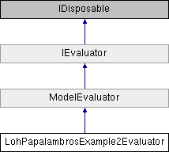

# LohPapalambrosExample2Evaluator Class

**Namespace:** `Phoenix.Optimization.AlgorithmTests.Evaluators`

## Overview

Loh-Papalambros Example 2 function.  
 

## Inheritance



## Declaration

```csharp
class LohPapalambrosExample2Evaluator
```

## Description

Loh-Papalambros Example 2 function.  
 
Example 2 from:

Loh, H. T., and P. Y. Papalambros. 1991. A sequential linearization approach for solving mixed discrete nonlinear design optimization problems. Journal of Mechanical Design 113: 325-334.

```
Number of variables: 2 variables Search domain: 0 <= xi >= 10, i = 1, 2 The global minimum: x* = {1,2}, f(x*) = 8
```

Algorithms that do a local search around the continuous optimum will likely only find the local minimum. Algorithms that do a more global search should find the global minimum. 


## Public Member Functions

|Name|Description|
|-----|-----|
|override void |`addConstraints ()`<br>Adds constraints. |
|override void |`addDesignVariables ()`<br>Adds design variables |
|override void |`addObjectives ()`<br>Adds objectives. |
|override ModelEvaluation |`EvaluateModel (object[] designVariables)`<br>Evaluates function. |
|override bool |`IsDesignAcceptable (object[] design, AreDesignsEqual areDesignsEqual)`<br>Determines whether specified design is a local or global optima. |
| |`LohPapalambrosExample2Evaluator ()`<br>Default constructor assumes evaluator is not used for a unit test |
| |`LohPapalambrosExample2Evaluator (bool useClosedBounds)`<br>Constructor that specifies whether evaluator will be used for a unit test |
|[ModelEvaluation]() |`EvaluateModel (object[] designVariables)`<br>Evaluates the model at the given design point. |
|bool |`IsDesignAcceptable (object[] design, AreDesignsEqual areDesignsEqual)`<br>Determines whether design is an acceptable design. |
|void |`SetStartPoint (object[] startValues)`<br>Sets the starting design for the evaluator. |

### Public Member Functions inherited from [ModelEvaluator]()
|Name|Description|
|-----|-----|
|void |`addConstraint (string name, double `lowerBound`, double upperBound)`<br>Method used to add a constraint |
|virtual void |`addConstraints ()`<br>Method called to specifiy the constraints for the evaluator (by default, not constraints are specified) |
|void |`addDesignVariable (string name, object startValue)`<br>Method used to add design variable |
|void |`addDesignVariable (string name, object `startValue`, DataTable selectedAlphabet)`<br>Method used to add design variable |
|void |`addDesignVariable (string name, object `startValue`, double `lowerBound`, double upperBound)`<br>Method used to add design variable |
|void |`addDesignVariable (string name, object `startValue`, double `lowerBound`, double `upperBound`, DataTable selectedAlphabet)`<br>Method used to add a design variable |
|abstract void |`addDesignVariables ()`<br>Method called to added design variables |
|void |`addObjective (string name, double solveForValue)`<br>Method used to add an objective (assumes solve for objective) |
|void |`addObjective (string name, double `solveForValue`, double weight)`<br>Method used to add an objective (assumes solve for objective) |
|void |`addObjective (string name, Goal goal)`<br>Method used to add an objective |
|void |`addObjective (string name, Goal goal, double weight, double solveForValue)`<br>Method used to add an objective |
|abstract void |`addObjectives ()`<br>Method called to specifiy the objectives for the evaluator |
|void |`Dispose ()`<br>Called to dispose the object. |
|abstract ModelEvaluation |`EvaluateModel (object[] designVariables)`<br>Evaluates the model at the given design point |
|virtual double |`getIGD (List< double[]> `bestDesignObjectives`, string filePath)`<br>Calculates the IGD value for multi-objective problem [The IGD formula is slightly modified to get the nearest possible value to actual IGD] [The actual formula accounts for equal no of optimal & obtained set of objectives, while, we calculate based on the number of objectives obtained] |
|abstract bool |`IsDesignAcceptable (object[] design, AreDesignsEqual areDesignsEqual)`<br>Determines whether design is an acceptable design. |
|void |`SetStartPoint (object[] startValues)`<br>Sets the starting design for the evaluator |

## Properties
|Name|Description|
|-----|-----|
|override object[,] | `GlobalBestDesigns [get]`<br>List of the globally best designs for the evaluator. |
|override bool | `HasFailedRuns [get]`<br>Evaluator does not have failed runs. |
|override bool | `HasNonSmoothResponses [get]`<br>Evaluator has smooth responses. |
|override string | `Name [get]`<br>Name of the Evaluator. |
|override bool | `UsesConstraints [get]`<br>Evaluator uses constraints. |
|override bool | `UsesDiscreteVariables [get]`<br>Evaluator uses discrete variables. |
|override bool | `UsesMinMax [get]`<br>Evaluator does uses minimize/maximize objectives. |
|override bool | `UsesMultipleObjectives [get]`<br>Evaluator does not use multiple objectives. |
|override bool | `UsesSolveFor [get]`<br>Evaluator does not use the `solve for` objective. |

### Properties inherited from [ModelEvaluator]()
|Name|Description|
|-----|-----|
|List< OptConstraint > | `Constraints [get]`<br>Method to get the list of constraints |
|int | `DesignVariableCount [get]`<br>Number of design variables specificed by the evaluator |
|List< DesignVariable > | `DesignVariables [get]`<br>Method to get the list of design variables |
|abstract object[,] | `GlobalBestDesigns [get]`<br>The global best design for the evaluator (a.k.a. "The right answers") |
|abstract bool | `HasFailedRuns [get]`<br>Does the evalutor have failed runs? |
|abstract bool | `HasNonSmoothResponses [get]`<br>Does the evaluator have non-smooth responses |
|abstract string | `Name [get]`<br>Name of the evaluator |
|int | `NumberOfObjectives [get]`<br>Number of objectives specified |
|List< Objective > | `Objectives [get]`<br>Method to get the list of objectives |
|abstract bool | `UsesConstraints [get]`<br>Does the evaluator use constraints? |
|abstract bool | `UsesDiscreteVariables [get]`<br>Does the evaluator use discrete variables? |
|abstract bool | `UsesMinMax [get]`<br>Does the evaluator use a `Minimize/Maximize` objective? |
|abstract bool | `UsesMultipleObjectives [get]`<br>Does the evaluator specify multiple objectives? |
|abstract bool | `UsesSolveFor [get]`<br>Does the evaluator use the `solve for` objective? |

### Properties inherited from [IEvaluator]()
|Name|Description|
|-----|-----|
|List< OptConstraint > | `Constraints [get]`<br>List of constraints defined by the evaluator. |
|int | `DesignVariableCount [get]`<br>Number of design variables specificed by the evaluator. |
|List< DesignVariable > | `DesignVariables [get]`<br>List of design variables defined by the evaluator. |
|object[,] | `GlobalBestDesigns [get]`<br>The global best designs for the evaluator. |
|bool | `HasFailedRuns [get]`<br>Does the evalutor have failed runs? |
|bool | `HasNonSmoothResponses [get]`<br>Does the evaluator have non-smooth responses. |
|string | `Name [get]`<br>Name of the evaluator. |
|int | `NumberOfObjectives [get]`<br>Number of objectives specified. |
|List< Objective > | `Objectives [get]`<br>List of objectives defined by the evaluator. |
|bool | `UsesConstraints [get]`<br>Does the evaluator use constraints? |
|bool | `UsesDiscreteVariables [get]`<br>Does the evaluator use discrete variables? |
|bool | `UsesMinMax [get]`<br>Does the evaluator use a `Minimize/Maximize` objective? |
|bool | `UsesMultipleObjectives [get]`<br>Does the evaluator specify multiple objectives? |
|bool | `UsesSolveFor [get]`<br>Does the evaluator use the `solve for` objective? |

## Additional Inherited Members 

### Protected Member Functions inherited from [ModelEvaluator](ModelEvaluator.md) 
|Name|Description|
|-----|-----|
|virtual void | `Dispose (bool disposing)`<br>Standard disposal. |


## Constructor & Destructor Documentation

### LohPapalambrosExample2Evaluator()
```csharp
LohPapalambrosExample2Evaluator ( )
```

Default constructor assumes evaluator is not used for a unit test

### LohPapalambrosExample2Evaluator()
```csharp
LohPapalambrosExample2Evaluator ( bool useClosedBounds)
```

Constructor that specifies whether evaluator will be used for a unit test Some algorithms do not support NaN for open bounds, so the option to use +/-1e15 exists to these algoritms can still use this function.

**Parameters:**

- `useClosedBounds` - Specifies whether or not to used NaN or +/-1e15 for non-limited bounds.

## Member Function Documentation

### addConstraints
```csharp
override void `addConstraints` ( )
```

Adds constraints. Reimplemented from ModelEvaluator.

### addDesignVariables
```csharp
override void `addDesignVariables` ( )
```

Adds design variables

Implements [`ModelEvaluator`](ModelEvaluator.md).

### addObjectives
```csharp
override void `addObjectives` ( )
```

Adds objectives.

Implements [`ModelEvaluator`](ModelEvaluator.md).

### EvaluateModel
```csharp
override ModelEvaluation `EvaluateModel` ( object[] designVariables)
```

Evaluates function.

**Parameters:**

- `designVariables` - Design used to evaluate function.

**Returns:**

- Design results

Implements [`ModelEvaluator`](ModelEvaluator.md).

### IsDesignAcceptable
```csharp
override bool `IsDesignAcceptable` ( object[] design, AreDesignsEqual areDesignsEqual )
```

Determines whether specified design is a local or global optima.

**Parameters:**

- `design` - Design to be tested.
- `areDesignsEqual` - Function delegate to be be used to determine whether two designs are equal.

**Returns:**

- Returns true if the design is a local or global optima; false otherwise.

Implements [`ModelEvaluator`](ModelEvaluator.md).

## Property Documentation

### GlobalBestDesigns
```csharp
override object [,] GlobalBestDesigns
```

List of the globally best designs for the evaluator.

Implements [`IEvaluator`](../../IEvaluator.md).

### HasFailedRuns
```csharp
override bool HasFailedRuns
```

Evaluator does not have failed runs.

Implements [`IEvaluator`](../../IEvaluator.md).

### HasNonSmoothResponses
```csharp
override bool HasNonSmoothResponses
```

Evaluator has smooth responses.

Implements [`IEvaluator`](../../IEvaluator.md).

### Name
```csharp
override string Name
```

Name of the Evaluator.

Implements [`IEvaluator`](../../IEvaluator.md).

### UsesConstraints
```csharp
override bool UsesConstraints
```

Evaluator uses constraints.

Implements [`IEvaluator`](../../IEvaluator.md).

### UsesDiscreteVariables
```csharp
override bool UsesDiscreteVariables
```

Evaluator uses discrete variables.

Implements [`IEvaluator`](../../IEvaluator.md).

### UsesMinMax
```csharp
override bool UsesMinMax
```

Evaluator does uses minimize/maximize objectives.

Implements [`IEvaluator`](../../IEvaluator.md).

### UsesMultipleObjectives
```csharp
override bool UsesMultipleObjectives
```

Evaluator does not use multiple objectives.

Implements [`IEvaluator`](../../IEvaluator.md).

### UsesSolveFor
```csharp
override bool UsesSolveFor
```

Evaluator does not use the `solve for` objective.

Implements [`IEvaluator`](../../IEvaluator.md).

