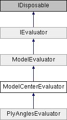

# ModelCenterEvaluator Class

**Namespace:** `Phoenix.Optimization.AlgorithmTests.Evaluators`

## Overview

Abstract class that simplifies adding ModelCenter models as evaluators.  
 

## Inheritance



## Declaration

```csharp
class ModelCenterEvaluator
```

## Description

Abstract class that simplifies adding ModelCenter models as evaluators.  
 


## Public Member Functions

|Name|Description|
|-----|-----|
|override ModelEvaluation |`EvaluateModel (object[] designVariables)`<br>Evaluates the model at the given design point |
|[ModelEvaluation]() |`EvaluateModel (object[] designVariables)`<br>Evaluates the model at the given design point. |
|bool |`IsDesignAcceptable (object[] design, AreDesignsEqual areDesignsEqual)`<br>Determines whether design is an acceptable design. |
|void |`SetStartPoint (object[] startValues)`<br>Sets the starting design for the evaluator. |

### Public Member Functions inherited from [ModelEvaluator]()
|Name|Description|
|-----|-----|
|void |`addConstraint (string name, double `lowerBound`, double upperBound)`<br>Method used to add a constraint |
|virtual void |`addConstraints ()`<br>Method called to specifiy the constraints for the evaluator (by default, not constraints are specified) |
|void |`addDesignVariable (string name, object startValue)`<br>Method used to add design variable |
|void |`addDesignVariable (string name, object `startValue`, DataTable selectedAlphabet)`<br>Method used to add design variable |
|void |`addDesignVariable (string name, object `startValue`, double `lowerBound`, double upperBound)`<br>Method used to add design variable |
|void |`addDesignVariable (string name, object `startValue`, double `lowerBound`, double `upperBound`, DataTable selectedAlphabet)`<br>Method used to add a design variable |
|abstract void |`addDesignVariables ()`<br>Method called to added design variables |
|void |`addObjective (string name, double solveForValue)`<br>Method used to add an objective (assumes solve for objective) |
|void |`addObjective (string name, double `solveForValue`, double weight)`<br>Method used to add an objective (assumes solve for objective) |
|void |`addObjective (string name, Goal goal)`<br>Method used to add an objective |
|void |`addObjective (string name, Goal goal, double weight, double solveForValue)`<br>Method used to add an objective |
|abstract void |`addObjectives ()`<br>Method called to specifiy the objectives for the evaluator |
|void |`Dispose ()`<br>Called to dispose the object. |
|abstract ModelEvaluation |`EvaluateModel (object[] designVariables)`<br>Evaluates the model at the given design point |
|virtual double |`getIGD (List< double[]> `bestDesignObjectives`, string filePath)`<br>Calculates the IGD value for multi-objective problem [The IGD formula is slightly modified to get the nearest possible value to actual IGD] [The actual formula accounts for equal no of optimal & obtained set of objectives, while, we calculate based on the number of objectives obtained] |
|abstract bool |`IsDesignAcceptable (object[] design, AreDesignsEqual areDesignsEqual)`<br>Determines whether design is an acceptable design. |
|void |`SetStartPoint (object[] startValues)`<br>Sets the starting design for the evaluator |

## Properties
|Name|Description|
|-----|-----|
|abstract string | `ModelFile [get]`<br>Property that containts the relative path to the assembiles location. |
|virtual bool | `RequiresAnalysisServer [get]`<br>Property which tells if the evaluator will requires Analysis Server to be launched. |

### Properties inherited from [ModelEvaluator]()
|Name|Description|
|-----|-----|
|List< OptConstraint > | `Constraints [get]`<br>Method to get the list of constraints |
|int | `DesignVariableCount [get]`<br>Number of design variables specificed by the evaluator |
|List< DesignVariable > | `DesignVariables [get]`<br>Method to get the list of design variables |
|abstract object[,] | `GlobalBestDesigns [get]`<br>The global best design for the evaluator (a.k.a. "The right answers") |
|abstract bool | `HasFailedRuns [get]`<br>Does the evalutor have failed runs? |
|abstract bool | `HasNonSmoothResponses [get]`<br>Does the evaluator have non-smooth responses |
|abstract string | `Name [get]`<br>Name of the evaluator |
|int | `NumberOfObjectives [get]`<br>Number of objectives specified |
|List< Objective > | `Objectives [get]`<br>Method to get the list of objectives |
|abstract bool | `UsesConstraints [get]`<br>Does the evaluator use constraints? |
|abstract bool | `UsesDiscreteVariables [get]`<br>Does the evaluator use discrete variables? |
|abstract bool | `UsesMinMax [get]`<br>Does the evaluator use a `Minimize/Maximize` objective? |
|abstract bool | `UsesMultipleObjectives [get]`<br>Does the evaluator specify multiple objectives? |
|abstract bool | `UsesSolveFor [get]`<br>Does the evaluator use the `solve for` objective? |

### Properties inherited from [IEvaluator]()
|Name|Description|
|-----|-----|
|List< OptConstraint > | `Constraints [get]`<br>List of constraints defined by the evaluator. |
|int | `DesignVariableCount [get]`<br>Number of design variables specificed by the evaluator. |
|List< DesignVariable > | `DesignVariables [get]`<br>List of design variables defined by the evaluator. |
|object[,] | `GlobalBestDesigns [get]`<br>The global best designs for the evaluator. |
|bool | `HasFailedRuns [get]`<br>Does the evalutor have failed runs? |
|bool | `HasNonSmoothResponses [get]`<br>Does the evaluator have non-smooth responses. |
|string | `Name [get]`<br>Name of the evaluator. |
|int | `NumberOfObjectives [get]`<br>Number of objectives specified. |
|List< Objective > | `Objectives [get]`<br>List of objectives defined by the evaluator. |
|bool | `UsesConstraints [get]`<br>Does the evaluator use constraints? |
|bool | `UsesDiscreteVariables [get]`<br>Does the evaluator use discrete variables? |
|bool | `UsesMinMax [get]`<br>Does the evaluator use a `Minimize/Maximize` objective? |
|bool | `UsesMultipleObjectives [get]`<br>Does the evaluator specify multiple objectives? |
|bool | `UsesSolveFor [get]`<br>Does the evaluator use the `solve for` objective? |

## Member Function Documentation

### Dispose
```csharp
override void Dispose ( bool disposing)
```

Closes and releases the ModelCenter instance if it has been created. Reimplemented from ModelEvaluator.

**Parameters:**

- `disposing` - True if called by Dispose(), false otherwise.

### EvaluateModel
```csharp
override ModelEvaluation `EvaluateModel` ( object[] designVariables)
```

Evaluates the model at the given design point Requires a ModelCenter license. The first time that `EvaluateModel` is called, an instance of ModelCenter is created and the model specified in ModelFile is loaded.

**Parameters:**

- `designVariables` - Values of the design variables in the order specified

**Returns:**

- Model evaluation at the specified design point

Implements [`ModelEvaluator`](ModelEvaluator.md).

## Property Documentation 

### ModelFile
```csharp
abstract string ModelFile
```

Property that containts the relative path to the assembiles location.

### RequiresAnalysisServer
```csharp
virtual bool RequiresAnalysisServer
```

Property which tells if the evaluator will requires Analysis Server to be launched.

