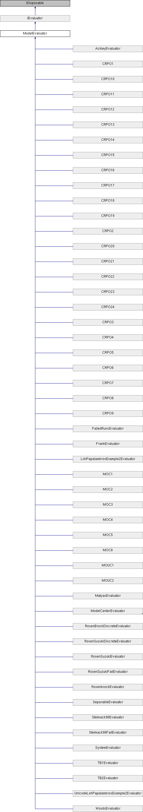

# ModelEvaluator Class

**Namespace:** `Phoenix.Optimization.AlgorithmTests.Evaluators`

## Overview

Abstract class that implements common code for evaluators  
 

## Inheritance



## Declaration

```csharp
class ModelEvaluatorabstract
```

## Description

Abstract class that implements common code for evaluators  
 


## Public Member Functions

|Name|Description|
|-----|-----|
|void |`addConstraint (string name, double lowerBound, double upperBound)`<br>Method used to add a constraint |
|virtual void |`addConstraints ()`<br>Method called to specifiy the constraints for the evaluator (by default, not constraints are specified) |
|void |`addDesignVariable (string name, object startValue)`<br>Method used to add design variable |
|void |`addDesignVariable (string name, object startValue, DataTable selectedAlphabet)`<br>Method used to add design variable |
|void |`addDesignVariable (string name, object startValue, double lowerBound, double upperBound)`<br>Method used to add design variable |
|void |`addDesignVariable (string name, object startValue, double lowerBound, double upperBound, DataTable selectedAlphabet)`<br>Method used to add a design variable |
|abstract void |`addDesignVariables ()`<br>Method called to added design variables |
|void |`addObjective (string name, double solveForValue)`<br>Method used to add an objective (assumes solve for objective) |
|void |`addObjective (string name, double solveForValue, double weight)`<br>Method used to add an objective (assumes solve for objective) |
|void |`addObjective (string name, Goal goal)`<br>Method used to add an objective |
|void |`addObjective (string name, Goal goal, double weight, double solveForValue)`<br>Method used to add an objective |
|abstract void |`addObjectives ()`<br>Method called to specifiy the objectives for the evaluator |
|void |`Dispose ()`<br>Called to dispose the object. |
|abstract ModelEvaluation |`EvaluateModel (object[] designVariables)`<br>Evaluates the model at the given design point |
|virtual double |`getIGD (List< double[]> bestDesignObjectives, string filePath)`<br>Calculates the IGD value for multi-objective problem [The IGD formula is slightly modified to get the nearest possible value to actual IGD] [The actual formula accounts for equal no of optimal & obtained set of objectives, while, we calculate based on the number of objectives obtained] |
|abstract bool |`IsDesignAcceptable (object[] design, AreDesignsEqual areDesignsEqual)`<br>Determines whether design is an acceptable design. |
|void |`SetStartPoint (object[] startValues)`<br>Sets the starting design for the evaluator |
|[ModelEvaluation]() |`EvaluateModel (object[] designVariables)`<br>Evaluates the model at the given design point. |
|bool |`IsDesignAcceptable (object[] design, AreDesignsEqual areDesignsEqual)`<br>Determines whether design is an acceptable design. |
|void |`SetStartPoint (object[] startValues)`<br>Sets the starting design for the evaluator. |

## Protected Member Functions  
|Name|Description|
|-----|-----|
|virtual void | `Dispose (bool disposing)`<br>Standard disposal. |


## Properties
|Name|Description|
|-----|-----|
|List< OptConstraint > | `Constraints [get]`<br>Method to get the list of constraints |
|int | `DesignVariableCount [get]`<br>Number of design variables specificed by the evaluator |
|List< DesignVariable > | `DesignVariables [get]`<br>Method to get the list of design variables |
|abstract object[,] | `GlobalBestDesigns [get]`<br>The global best design for the evaluator (a.k.a. "The right answers") |
|abstract bool | `HasFailedRuns [get]`<br>Does the evalutor have failed runs? |
|abstract bool | `HasNonSmoothResponses [get]`<br>Does the evaluator have non-smooth responses |
|abstract string | `Name [get]`<br>Name of the evaluator |
|int | `NumberOfObjectives [get]`<br>Number of objectives specified |
|List< Objective > | `Objectives [get]`<br>Method to get the list of objectives |
|abstract bool | `UsesConstraints [get]`<br>Does the evaluator use constraints? |
|abstract bool | `UsesDiscreteVariables [get]`<br>Does the evaluator use discrete variables? |
|abstract bool | `UsesMinMax [get]`<br>Does the evaluator use a `Minimize/Maximize` objective? |
|abstract bool | `UsesMultipleObjectives [get]`<br>Does the evaluator specify multiple objectives? |
|abstract bool | `UsesSolveFor [get]`<br>Does the evaluator use the `solve for` objective? |

### Properties inherited from [IEvaluator]()
|Name|Description|
|-----|-----|
|List< OptConstraint > | `Constraints [get]`<br>List of constraints defined by the evaluator. |
|int | `DesignVariableCount [get]`<br>Number of design variables specificed by the evaluator. |
|List< DesignVariable > | `DesignVariables [get]`<br>List of design variables defined by the evaluator. |
|object[,] | `GlobalBestDesigns [get]`<br>The global best designs for the evaluator. |
|bool | `HasFailedRuns [get]`<br>Does the evalutor have failed runs? |
|bool | `HasNonSmoothResponses [get]`<br>Does the evaluator have non-smooth responses. |
|string | `Name [get]`<br>Name of the evaluator. |
|int | `NumberOfObjectives [get]`<br>Number of objectives specified. |
|List< Objective > | `Objectives [get]`<br>List of objectives defined by the evaluator. |
|bool | `UsesConstraints [get]`<br>Does the evaluator use constraints? |
|bool | `UsesDiscreteVariables [get]`<br>Does the evaluator use discrete variables? |
|bool | `UsesMinMax [get]`<br>Does the evaluator use a `Minimize/Maximize` objective? |
|bool | `UsesMultipleObjectives [get]`<br>Does the evaluator specify multiple objectives? |
|bool | `UsesSolveFor [get]`<br>Does the evaluator use the `solve for` objective? |

## Member Function Documentation

### addConstraint
```csharp
void `addConstraint` ( string name, double lowerBound, double upperBound )
```

Method used to add a constraint

**Parameters:**

- `name` - Name of constraint
- `lowerBound` - Lower bound of constraint
- `upperBound` - Upper bound of constraint

### addConstraints
```csharp
virtual void `addConstraints` ( )
```

Method called to specifiy the constraints for the evaluator (by default, not constraints are specified). Reimplemented in CRPO1, CRPO10, CRPO11, CRPO12, CRPO13, CRPO14, CRPO15, CRPO16, CRPO17, CRPO18, CRPO19, CRPO2, CRPO20, CRPO21, CRPO22, CRPO23, CRPO24, CRPO3, CRPO4, CRPO5, CRPO6, CRPO7, CRPO8, CRPO9, FrankEvaluator, LohPapalambrosExample2Evaluator, MOC1, MOC2, MOC3, MOC4, MOC5, MOC6, RosenSuzukiDiscreteEvaluator, RosenSuzukiEvaluator, RosenSuzukiFailEvaluator, SeparableEvaluator, Stelmack98Evaluator, Stelmack98FailEvaluator, TB1Evaluator, TB2Evaluator, and UnicodeLohPapalambrosExample2Evaluator.

### addDesignVariable
```csharp
void `addDesignVariable` ( string name, object startValue )
```

Method used to add design variable

**Parameters:**

- `name` - Name of design variable
- `startValue` - Start value of design variable (leave null, if algorithm is to select start point)

### addDesignVariable
```csharp
void `addDesignVariable` ( string name, object startValue, DataTable selectedAlphabet )
```

Method used to add design variable

**Parameters:**

- `name` - Name of design variable
- `startValue` - Start value of design variable (leave null, if algorithm is to select start point)
- `selectedAlphabet` - Allowed values for an enumerated variable

### addDesignVariable
```csharp
void `addDesignVariable` ( string name, object startValue, double lowerBound, double upperBound )
```

Method used to add design variable

**Parameters:**

- `name` - Name of constraint
- `startValue` - Start value of design variable (leave null, if algorithm is to select start point)
- `lowerBound` - Lower bound of constraint
- `upperBound` - Upper bound of constraint

### addDesignVariable
```csharp
void `addDesignVariable` ( string name, object startValue, double lowerBound, double upperBound, DataTable selectedAlphabet )
```

Method used to add a design variable

**Parameters:**

- `name` - Name of constraint
- `startValue` - Start value of design variable (leave null, if algorithm is to select start point)
- `lowerBound` - Lower bound of constraint
- `upperBound` - Upper bound of constraint
- `selectedAlphabet` - Allowed values for an enumerated variable

### addDesignVariables
```csharp
abstract void `addDesignVariables` ( )
```

Method called to added design variables. Implemented in AckleyEvaluator, CRPO1, CRPO10, CRPO11, CRPO12, CRPO13, CRPO14, CRPO15, CRPO16, CRPO17, CRPO18, CRPO19, CRPO2, CRPO20, CRPO21, CRPO22, CRPO23, CRPO24, CRPO3, CRPO4, CRPO5, CRPO6, CRPO7, CRPO8, CRPO9, FailedRunsEvaluator, FrankEvaluator, LohPapalambrosExample2Evaluator, MatyasEvaluator, MOC1, MOC2, MOC3, MOC4, MOC5, MOC6, MOUC1, MOUC2, PlyAnglesEvaluator, RosenBrockDiscreteEvaluator, RosenbrockEvaluator, RosenSuzukiDiscreteEvaluator, RosenSuzukiEvaluator, RosenSuzukiFailEvaluator, SeparableEvaluator, Stelmack98Evaluator, Stelmack98FailEvaluator, SystemEvaluator, TB1Evaluator, TB2Evaluator, UnicodeLohPapalambrosExample2Evaluator, and WoodsEvaluator.

### addObjective
```csharp
void `addObjective` ( string name, double solveForValue )
```

Method used to add an objective (assumes solve for objective)

**Parameters:**

- `name` - Name of objective
- `solveForValue` - Value to solve for

### addObjective
```csharp
void `addObjective` ( string name, double solveForValue, double weight )
```

Method used to add an objective (assumes solve for objective)

**Parameters:**

- `name` - Name of objective
- `solveForValue` - Value to solve for
- `weight` - Objective weighting, if multiobjective

### addObjective
```csharp
void `addObjective` ( string name, Goal goal )
```

Method used to add an objective

**Parameters:**

- `name` - Name of objective
- `goal` - Goal of objective

### addObjective
```csharp
void `addObjective` ( string name, Goal goal, double weight, double solveForValue )
```

Method used to add an objective

**Parameters:**

- `name` - Name of objective
- `goal` - Goal of objective
- `weight` - Objective weighting, if multiobjective
- `solveForValue` - Value to solve for

### addObjectives
```csharp
abstract void `addObjectives` ( )
```

Method called to specifiy the objectives for the evaluator. Implemented in AckleyEvaluator, CRPO1, CRPO10, CRPO11, CRPO12, CRPO13, CRPO14, CRPO15, CRPO16, CRPO17, CRPO18, CRPO19, CRPO2, CRPO20, CRPO21, CRPO22, CRPO23, CRPO24, CRPO3, CRPO4, CRPO5, CRPO6, CRPO7, CRPO8, CRPO9, FailedRunsEvaluator, FrankEvaluator, LohPapalambrosExample2Evaluator, MatyasEvaluator, MOC1, MOC2, MOC3, MOC4, MOC5, MOC6, MOUC1, MOUC2, PlyAnglesEvaluator, RosenBrockDiscreteEvaluator, RosenbrockEvaluator, RosenSuzukiDiscreteEvaluator, RosenSuzukiEvaluator, RosenSuzukiFailEvaluator, SeparableEvaluator, Stelmack98Evaluator, Stelmack98FailEvaluator, SystemEvaluator, TB1Evaluator, TB2Evaluator, UnicodeLohPapalambrosExample2Evaluator, and WoodsEvaluator.

### Dispose
```csharp
void Dispose ( )
```

Called to dispose the object. Sealed to prevent overrides.

### Dispose
```csharp
virtual void Dispose ( bool disposing)
```

Standard disposal. The proper form for implementing this in a derived class is:  `protected override void Dispose(bool disposing) { try { if (disposing) { // dispose managed resources } // dispose unmanaged resources } finally { base.Dispose(disposing); } }`  Note that you don't strictly need the `try-finally` or the `base.Dispose(disposing)` if you're just overriding this class, since the base class implementation doesn't actually do anything. Reimplemented in `ModelCenterEvaluator`.

**Parameters:**

- `disposing` - Whether this function is called from the normal `Dispose()` function (`true`) or from the finalizer (`false`).

### EvaluateModel
```csharp
abstract ModelEvaluation `EvaluateModel` ( object[] designVariables)
```

Evaluates the model at the given design point. Implemented in AckleyEvaluator, CRPO1, CRPO10, CRPO11, CRPO12, CRPO13, CRPO14, CRPO15, CRPO16, CRPO17, CRPO18, CRPO19, CRPO2, CRPO20, CRPO21, CRPO22, CRPO23, CRPO24, CRPO3, CRPO4, CRPO5, CRPO6, CRPO7, CRPO8, CRPO9, FailedRunsEvaluator, FrankEvaluator, LohPapalambrosExample2Evaluator, MatyasEvaluator, MOC1, MOC2, MOC3, MOC4, MOC5, MOC6, ModelCenterEvaluator, MOUC1, MOUC2, RosenBrockDiscreteEvaluator, RosenbrockEvaluator, RosenSuzukiDiscreteEvaluator, RosenSuzukiEvaluator, RosenSuzukiFailEvaluator, SeparableEvaluator, Stelmack98Evaluator, Stelmack98FailEvaluator, SystemEvaluator, TB1Evaluator, TB2Evaluator, UnicodeLohPapalambrosExample2Evaluator, and WoodsEvaluator.

**Parameters:**

- `designVariables` - Values of the design variables in the order specified

**Returns:**

- Model evaluation at the specified design point

Implements [`IEvaluator`](../../IEvaluator.md).

### getIGD
```csharp
virtual double getIGD ( List< double[]> bestDesignObjectives, string filePath )
```

Calculates the IGD value for multi-objective problem [The IGD formula is slightly modified to get the nearest possible value to actual IGD] [The actual formula accounts for equal no of optimal & obtained set of objectives, while, we calculate based on the number of objectives obtained]. Reimplemented in MOC1, MOC2, MOC3, MOC4, MOC5, MOC6, MOUC1, and MOUC2.

**Parameters:**

- `bestDesignObjectives` - 
- `filePath` - 

### IsDesignAcceptable
```csharp
abstract bool `IsDesignAcceptable` ( object[] design, AreDesignsEqual areDesignsEqual )
```

Determines whether design is an acceptable design. Implemented in AckleyEvaluator, CRPO1, CRPO10, CRPO11, CRPO12, CRPO13, CRPO14, CRPO15, CRPO16, CRPO17, CRPO18, CRPO19, CRPO2, CRPO20, CRPO21, CRPO22, CRPO23, CRPO24, CRPO3, CRPO4, CRPO5, CRPO6, CRPO7, CRPO8, CRPO9, FailedRunsEvaluator, FrankEvaluator, LohPapalambrosExample2Evaluator, MatyasEvaluator, MOC1, MOC2, MOC3, MOC4, MOC5, MOC6, MOUC1, MOUC2, PlyAnglesEvaluator, RosenBrockDiscreteEvaluator, RosenbrockEvaluator, RosenSuzukiDiscreteEvaluator, RosenSuzukiEvaluator, RosenSuzukiFailEvaluator, SeparableEvaluator, Stelmack98Evaluator, Stelmack98FailEvaluator, SystemEvaluator, TB1Evaluator, TB2Evaluator, UnicodeLohPapalambrosExample2Evaluator, and WoodsEvaluator.

**Parameters:**

- `design` - Object array with the values of the design variables in the order specified
- `areDesignsEqual` - Delate that compares to designs to see if they are equal

**Returns:**

- Returns true if the given design is either the global best design, or local best design that may confuse some algorithms

Implements [`IEvaluator`](../../IEvaluator.md).

### SetStartPoint
```csharp
void `SetStartPoint` ( object[] startValues)
```

Sets the starting design for the evaluator

**Parameters:**

- `startValues` - An array of values the corresponds to the values of the design variables

Implements [`IEvaluator`](../../IEvaluator.md).

## Property Documentation

### Constraints
```csharp
List<OptConstraint> Constraints
```

Method to get the list of constraints

**Returns:**

- List of contraints

Implements [`IEvaluator`](../../IEvaluator.md).

### DesignVariableCount
```csharp
int DesignVariableCount
```

Number of design variables specificed by the evaluator

Implements [`IEvaluator`](../../IEvaluator.md).

### DesignVariables
```csharp
List<DesignVariable> DesignVariables
```

Method to get the list of design variables

**Returns:**

- List of design varibles

Implements [`IEvaluator`](../../IEvaluator.md).

### GlobalBestDesigns
```csharp
abstract object [,] GlobalBestDesigns
```

The global best design for the evaluator (a.k.a. "The right answers")

Implements [`IEvaluator`](../../IEvaluator.md).

### HasFailedRuns
```csharp
abstract bool HasFailedRuns
```

Does the evalutor have failed runs?

Implements [`IEvaluator`](../../IEvaluator.md).

### HasNonSmoothResponses
```csharp
abstract bool HasNonSmoothResponses
```

Does the evaluator have non-smooth responses

Implements [`IEvaluator`](../../IEvaluator.md).

### Name
```csharp
abstract string Name
```

Name of the evaluator

Implements [`IEvaluator`](../../IEvaluator.md).

### NumberOfObjectives
```csharp
int NumberOfObjectives
```

Number of objectives specified

Implements [`IEvaluator`](../../IEvaluator.md).

### Objectives
```csharp
List<Objective> Objectives
```

Method to get the list of objectives

**Returns:**

- List of objectives

Implements [`IEvaluator`](../../IEvaluator.md).

### UsesConstraints
```csharp
abstract bool UsesConstraints
```

Does the evaluator use constraints?

Implements [`IEvaluator`](../../IEvaluator.md).

### UsesDiscreteVariables
```csharp
abstract bool UsesDiscreteVariables
```

Does the evaluator use discrete variables?

Implements [`IEvaluator`](../../IEvaluator.md).

### UsesMinMax
```csharp
abstract bool UsesMinMax
```

Does the evaluator use a `Minimize/Maximize` objective?

Implements [`IEvaluator`](../../IEvaluator.md).

### UsesMultipleObjectives
```csharp
abstract bool UsesMultipleObjectives
```

Does the evaluator specify multiple objectives?

Implements [`IEvaluator`](../../IEvaluator.md).

### UsesSolveFor
```csharp
abstract bool UsesSolveFor
```

Does the evaluator use the `solve for` objective?

Implements [`IEvaluator`](../../IEvaluator.md).

