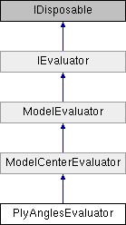

# PlyAnglesEvaluator Class

**Namespace:** `Phoenix.Optimization.AlgorithmTests.Evaluators`

## Overview

Ply lamination optimization problem.  
 

## Inheritance



## Declaration

```csharp
class PlyAnglesEvaluator
```

## Description

Ply lamination optimization problem.  
 


## Public Member Functions

|Name|Description|
|-----|-----|
|override void |`addDesignVariables ()`<br>Adds design variables |
|override void |`addObjectives ()`<br>Adds objectives. |
|override bool |`IsDesignAcceptable (object[] design, AreDesignsEqual areDesignsEqual)`<br>Is the given design an acceptable solution to the problem definition. |
|[ModelEvaluation]() |`EvaluateModel (object[] designVariables)`<br>Evaluates the model at the given design point. |
|bool |`IsDesignAcceptable (object[] design, AreDesignsEqual areDesignsEqual)`<br>Determines whether design is an acceptable design. |
|void |`SetStartPoint (object[] startValues)`<br>Sets the starting design for the evaluator. |

### Public Member Functions inherited from [ModelCenterEvaluator](ModelCenterEvaluator)
|Name|Description|
|-----|-----|
|override ModelEvaluation |`EvaluateModel (object[] designVariables)`<br>Evaluates the model at the given design point |

### Public Member Functions inherited from [ModelEvaluator]()
|Name|Description|
|-----|-----|
|void |`addConstraint (string name, double `lowerBound`, double upperBound)`<br>Method used to add a constraint |
|virtual void |`addConstraints ()`<br>Method called to specifiy the constraints for the evaluator (by default, not constraints are specified) |
|void |`addDesignVariable (string name, object startValue)`<br>Method used to add design variable |
|void |`addDesignVariable (string name, object `startValue`, DataTable selectedAlphabet)`<br>Method used to add design variable |
|void |`addDesignVariable (string name, object `startValue`, double `lowerBound`, double upperBound)`<br>Method used to add design variable |
|void |`addDesignVariable (string name, object `startValue`, double `lowerBound`, double `upperBound`, DataTable selectedAlphabet)`<br>Method used to add a design variable |
|abstract void |`addDesignVariables ()`<br>Method called to added design variables |
|void |`addObjective (string name, double solveForValue)`<br>Method used to add an objective (assumes solve for objective) |
|void |`addObjective (string name, double `solveForValue`, double weight)`<br>Method used to add an objective (assumes solve for objective) |
|void |`addObjective (string name, Goal goal)`<br>Method used to add an objective |
|void |`addObjective (string name, Goal goal, double weight, double solveForValue)`<br>Method used to add an objective |
|abstract void |`addObjectives ()`<br>Method called to specifiy the objectives for the evaluator |
|void |`Dispose ()`<br>Called to dispose the object. |
|abstract ModelEvaluation |`EvaluateModel (object[] designVariables)`<br>Evaluates the model at the given design point |
|virtual double |`getIGD (List< double[]> `bestDesignObjectives`, string filePath)`<br>Calculates the IGD value for multi-objective problem [The IGD formula is slightly modified to get the nearest possible value to actual IGD] [The actual formula accounts for equal no of optimal & obtained set of objectives, while, we calculate based on the number of objectives obtained] |
|abstract bool |`IsDesignAcceptable (object[] design, AreDesignsEqual areDesignsEqual)`<br>Determines whether design is an acceptable design. |
|void |`SetStartPoint (object[] startValues)`<br>Sets the starting design for the evaluator |

## Properties
|Name|Description|
|-----|-----|
|override object[,] | `GlobalBestDesigns [get]`<br>There is a single global best design for the problem definiton. |
|override bool | `HasFailedRuns [get]`<br>Problem definition does not have failed runs. |
|override bool | `HasNonSmoothResponses [get]`<br>All of the design variables are discrete and so the responses do not vary smoothly. |
|override string | `ModelFile [get]`<br>The evaluator uses "Ply Angles.pxc" model file. |
|override string | `Name [get]`<br>Name of evaluator. |
|override bool | `UsesConstraints [get]`<br>The problem definition does not use constraints. |
|override bool | `UsesDiscreteVariables [get]`<br>The problem definition has discrete design variables. |
|override bool | `UsesMinMax [get]`<br>Uses minimize/maximize objectives. |
|override bool | `UsesMultipleObjectives [get]`<br>The problem definition has multiple objectives. |
|override bool | `UsesSolveFor [get]`<br>Problem definition does not use the `solve for` objective. |

### Properties inherited from [ModelCenterEvaluator](ModelCenterEvaluator)
|Name|Description|
|-----|-----|
|abstract string | `ModelFile [get]`<br>Property that containts the relative path to the assembiles location. |
|virtual bool | `RequiresAnalysisServer [get]`<br>Property which tells if the evaluator will requires Analysis Server to be launched. |

### Properties inherited from [ModelEvaluator]()
|Name|Description|
|-----|-----|
|List< OptConstraint > | `Constraints [get]`<br>Method to get the list of constraints |
|int | `DesignVariableCount [get]`<br>Number of design variables specificed by the evaluator |
|List< DesignVariable > | `DesignVariables [get]`<br>Method to get the list of design variables |
|abstract object[,] | `GlobalBestDesigns [get]`<br>The global best design for the evaluator (a.k.a. "The right answers") |
|abstract bool | `HasFailedRuns [get]`<br>Does the evalutor have failed runs? |
|abstract bool | `HasNonSmoothResponses [get]`<br>Does the evaluator have non-smooth responses |
|abstract string | `Name [get]`<br>Name of the evaluator |
|int | `NumberOfObjectives [get]`<br>Number of objectives specified |
|List< Objective > | `Objectives [get]`<br>Method to get the list of objectives |
|abstract bool | `UsesConstraints [get]`<br>Does the evaluator use constraints? |
|abstract bool | `UsesDiscreteVariables [get]`<br>Does the evaluator use discrete variables? |
|abstract bool | `UsesMinMax [get]`<br>Does the evaluator use a `Minimize/Maximize` objective? |
|abstract bool | `UsesMultipleObjectives [get]`<br>Does the evaluator specify multiple objectives? |
|abstract bool | `UsesSolveFor [get]`<br>Does the evaluator use the `solve for` objective? |

### Properties inherited from [IEvaluator]()
|Name|Description|
|-----|-----|
|List< OptConstraint > | `Constraints [get]`<br>List of constraints defined by the evaluator. |
|int | `DesignVariableCount [get]`<br>Number of design variables specificed by the evaluator. |
|List< DesignVariable > | `DesignVariables [get]`<br>List of design variables defined by the evaluator. |
|object[,] | `GlobalBestDesigns [get]`<br>The global best designs for the evaluator. |
|bool | `HasFailedRuns [get]`<br>Does the evalutor have failed runs? |
|bool | `HasNonSmoothResponses [get]`<br>Does the evaluator have non-smooth responses. |
|string | `Name [get]`<br>Name of the evaluator. |
|int | `NumberOfObjectives [get]`<br>Number of objectives specified. |
|List< Objective > | `Objectives [get]`<br>List of objectives defined by the evaluator. |
|bool | `UsesConstraints [get]`<br>Does the evaluator use constraints? |
|bool | `UsesDiscreteVariables [get]`<br>Does the evaluator use discrete variables? |
|bool | `UsesMinMax [get]`<br>Does the evaluator use a `Minimize/Maximize` objective? |
|bool | `UsesMultipleObjectives [get]`<br>Does the evaluator specify multiple objectives? |
|bool | `UsesSolveFor [get]`<br>Does the evaluator use the `solve for` objective? |

### Protected Member Functions inherited from [ModelEvaluator](ModelEvaluator.md) 
|Name|Description|
|-----|-----|
|virtual void | `Dispose (bool disposing)`<br>Standard disposal. |

## Member Function Documentation

### addDesignVariables
```csharp
override void `addDesignVariables` ( )
```

Adds design variables Adds 24 design variables: orientation and materialName for each of the 12 layers.

Implements [`ModelEvaluator`](ModelEvaluator.md).

### addObjectives
```csharp
override void `addObjectives` ( )
```

Adds objectives. Adds two objectives: to minimize the laminate weigth and maximize the buckling load factor.

Implements [`ModelEvaluator`](ModelEvaluator.md).

### IsDesignAcceptable
```csharp
override bool `IsDesignAcceptable` ( object[] design, AreDesignsEqual areDesignsEqual )
```

Is the given design an acceptable solution to the problem definition. The only acceptable solution to the problem definition is the global best desgin.

**Parameters:**

- `design` - Design to be tested.
- `areDesignsEqual` - Design comparison function from the algorithm.

**Returns:**

- True if the given design is the global best design.

Implements [`ModelEvaluator`](ModelEvaluator.md).

## Property Documentation

### GlobalBestDesigns
```csharp
override object [,] GlobalBestDesigns
```

There is a single global best design for the problem definiton. Best Design: Layer 1: 45, Graphite-Epoxy Layer 2: 45, Kevlar-Epoxy Layer 3: 45, Kevlar-Epoxy Layer 4: 45, Kevlar-Epoxy Layer 5: 45, Kevlar-Epoxy Layer 6: 45, Kevlar-Epoxy Layer 7: 90, Kevlar-Epoxy Layer 8: 45, Kevlar-Epoxy Layer 9: 45, Kevlar-Epoxy Layer 10: 45, Kevlar-Epoxy Layer 11: 45, Kevlar-Epoxy Layer 12: 0, Kevlar-Epoxy

Implements [`IEvaluator`](../../IEvaluator.md).

### HasFailedRuns
```csharp
override bool HasFailedRuns
```

Problem definition does not have failed runs.

Implements [`IEvaluator`](../../IEvaluator.md).

### HasNonSmoothResponses
```csharp
override bool HasNonSmoothResponses
```

All of the design variables are discrete and so the responses do not vary smoothly.

Implements [`IEvaluator`](../../IEvaluator.md).

### ModelFile
```csharp
override string ModelFile
```

The evaluator uses "Ply Angles.pxc" model file.

### Name
```csharp
override string Name
```

Name of evaluator.

Implements [`IEvaluator`](../../IEvaluator.md).

### UsesConstraints
```csharp
override bool UsesConstraints
```

The problem definition does not use constraints.

Implements [`IEvaluator`](../../IEvaluator.md).

### UsesDiscreteVariables
```csharp
override bool UsesDiscreteVariables
```

The problem definition has discrete design variables.

Implements [`IEvaluator`](../../IEvaluator.md).

### UsesMinMax
```csharp
override bool UsesMinMax
```

Uses minimize/maximize objectives.

Implements [`IEvaluator`](../../IEvaluator.md).

### UsesMultipleObjectives
```csharp
override bool UsesMultipleObjectives
```

The problem definition has multiple objectives.

Implements [`IEvaluator`](../../IEvaluator.md).

### UsesSolveFor
```csharp
override bool UsesSolveFor
```

Problem definition does not use the `solve for` objective.

Implements [`IEvaluator`](../../IEvaluator.md).

