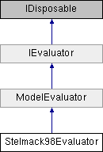

# Stelmack98Evaluator Class

**Namespace:** `Phoenix.Optimization.AlgorithmTests.Evaluators`

## Overview

Implementation of the Stelmack 98 function  
 

## Inheritance



## Declaration

```csharp
class Stelmack98Evaluator
```

## Description

Implementation of the Stelmack 98 function  
 
Stelmack MA, Nakashima N, Batill SM. Genetic algortihms for mixed discrete/continuous optimization in multidisciplinary design. 38th AIAA/ ASME/ ASCE/AHS/ ASC Structures, Structural Dynamics and Materials Conference, AIAA Paper No. 1998-2033. Long Beach, California; 1998.

Number of variables: 3 variables (1 discrete, 2 categorical)

mixed continuous/discrete plus constraints 


## Public Member Functions

|Type|Name|Description|
|-----|-----|-----|
|override void |`addConstraints ()` |Adds constraints. |
|override void |`addDesignVariables ()` |Adds design variables |
|override void |`addObjectives ()` |Adds objectives. |
|override ModelEvaluation |`EvaluateModel (object[] designVariables)` |Evaluates function. |
|override bool |`IsDesignAcceptable (object[] design, AreDesignsEqual areDesignsEqual)` |Determines whether specified design is a local or global optima. |
|[ModelEvaluation]() |`EvaluateModel (object[] designVariables)` |Evaluates the model at the given design point. |
|bool |`IsDesignAcceptable (object[] design, AreDesignsEqual areDesignsEqual)` |Determines whether design is an acceptable design. |
|void |`SetStartPoint (object[] startValues)` |Sets the starting design for the evaluator. |

### Public Member Functions inherited from [ModelEvaluator]()
|Type|Name|Description|
|-----|-----|-----|
|void|`addConstraint (string name, double `lowerBound`, double upperBound)`|Method used to add a constraint|
|virtual void|`addConstraints ()`|Method called to specifiy the constraints for the evaluator (by default, not constraints are specified)|
|void|`addDesignVariable (string name, object startValue)`|Method used to add design variable|
|void|`addDesignVariable (string name, object `startValue`, DataTable selectedAlphabet)`|Method used to add design variable|
|void|`addDesignVariable (string name, object `startValue`, double `lowerBound`, double upperBound)`|Method used to add design variable|
|void|`addDesignVariable (string name, object `startValue`, double `lowerBound`, double `upperBound`, DataTable selectedAlphabet)`|Method used to add a design variable|
|abstract void|`addDesignVariables ()`|Method called to added design variables|
|void|`addObjective (string name, double solveForValue)`|Method used to add an objective (assumes solve for objective)|
|void|`addObjective (string name, double `solveForValue`, double weight)`|Method used to add an objective (assumes solve for objective)|
|void|`addObjective (string name, Goal goal)`|Method used to add an objective|
|void|`addObjective (string name, Goal goal, double weight, double solveForValue)`|Method used to add an objective|
|abstract void|`addObjectives ()`|Method called to specifiy the objectives for the evaluator|
|void|`Dispose ()`|Called to dispose the object.|
|abstract ModelEvaluation|`EvaluateModel (object[] designVariables)`|Evaluates the model at the given design point|
|virtual double|`getIGD (List< double[]> `bestDesignObjectives`, string filePath)`|Calculates the IGD value for multi-objective problem [The IGD formula is slightly modified to get the nearest possible value to actual IGD] [The actual formula accounts for equal no of optimal & obtained set of objectives, while, we calculate based on the number of objectives obtained]|
|abstract bool|`IsDesignAcceptable (object[] design, AreDesignsEqual areDesignsEqual)`|Determines whether design is an acceptable design.|
|void|`SetStartPoint (object[] startValues)`|Sets the starting design for the evaluator|

## Properties
|Type|Name|Description|
|-----|-----|-----|
|override object[,] |`GlobalBestDesigns [get]` |Global best designs for the evaluator. |
|override bool |`HasFailedRuns [get]` |Evaluator does not have failed runs. |
|override bool |`HasNonSmoothResponses [get]` |Evaluator has smooth responses. |
|override string |`Name [get]` |Name of the Evaluator. |
|override bool |`UsesConstraints [get]` |Evaluator uses constraints. |
|override bool |`UsesDiscreteVariables [get]` |Evaluator uses discrete variables. |
|override bool |`UsesMinMax [get]` |Evaluator does uses minimize/maximize objectives. |
|override bool |`UsesMultipleObjectives [get]` |Evaluator does not use multiple objectives. |
|override bool |`UsesSolveFor [get]` |Evaluator does not use the `solve for` objective. |

### Properties inherited from [ModelEvaluator]()
|Type|Name|Description|
|-----|-----|-----|
|List< OptConstraint > |`Constraints [get]` |Method to get the list of constraints |
|int |`DesignVariableCount [get]` |Number of design variables specificed by the evaluator |
|List< DesignVariable > |`DesignVariables [get]` |Method to get the list of design variables |
|abstract object[,] |`GlobalBestDesigns [get]` |The global best design for the evaluator (a.k.a. "The right answers") |
|abstract bool |`HasFailedRuns [get]` |Does the evalutor have failed runs? |
|abstract bool |`HasNonSmoothResponses [get]` |Does the evaluator have non-smooth responses |
|abstract string |`Name [get]` |Name of the evaluator |
|int |`NumberOfObjectives [get]` |Number of objectives specified |
|List< Objective > |`Objectives [get]` |Method to get the list of objectives |
|abstract bool |`UsesConstraints [get]` |Does the evaluator use constraints? |
|abstract bool |`UsesDiscreteVariables [get]` |Does the evaluator use discrete variables? |
|abstract bool |`UsesMinMax [get]` |Does the evaluator use a `Minimize/Maximize` objective? |
|abstract bool |`UsesMultipleObjectives [get]` |Does the evaluator specify multiple objectives? |
|abstract bool |`UsesSolveFor [get]` |Does the evaluator use the `solve for` objective? |

### Properties inherited from [IEvaluator]()
|Type|Name|Description|
|-----|-----|-----|
|List< OptConstraint > |`Constraints [get]` |List of constraints defined by the evaluator. |
|int |`DesignVariableCount [get]` |Number of design variables specificed by the evaluator. |
|List< DesignVariable > |`DesignVariables [get]` |List of design variables defined by the evaluator. |
|object[,] |`GlobalBestDesigns [get]` |The global best designs for the evaluator. |
|bool |`HasFailedRuns [get]` |Does the evalutor have failed runs? |
|bool |`HasNonSmoothResponses [get]` |Does the evaluator have non-smooth responses. |
|string |`Name [get]` |Name of the evaluator. |
|int |`NumberOfObjectives [get]` |Number of objectives specified. |
|List< Objective > |`Objectives [get]` |List of objectives defined by the evaluator. |
|bool |`UsesConstraints [get]` |Does the evaluator use constraints? |
|bool |`UsesDiscreteVariables [get]` |Does the evaluator use discrete variables? |
|bool |`UsesMinMax [get]` |Does the evaluator use a `Minimize/Maximize` objective? |
|bool |`UsesMultipleObjectives [get]` |Does the evaluator specify multiple objectives? |
|bool |`UsesSolveFor [get]` |Does the evaluator use the `solve for` objective? |

### Protected Member Functions inherited from [ModelEvaluator](ModelEvaluator.md) 
|Type|Name|Description|
|-----|-----|-----|
|virtual void |`Dispose (bool disposing)` |Standard disposal. |

## Member Function Documentation

### addConstraints
```csharp
override void `addConstraints` ( )
```

Adds constraints. Reimplemented from ModelEvaluator.

### addDesignVariables
```csharp
override void `addDesignVariables` ( )
```

Adds design variables

Implements [`ModelEvaluator`](ModelEvaluator.md).

### addObjectives
```csharp
override void `addObjectives` ( )
```

Adds objectives.

Implements [`ModelEvaluator`](ModelEvaluator.md).

### EvaluateModel
```csharp
override ModelEvaluation `EvaluateModel` ( object[] designVariables)
```

Evaluates function.

**Parameters:**

- `designVariables` - Design used to evaluate function.

**Returns:**

- Design results

Implements [`ModelEvaluator`](ModelEvaluator.md).

### IsDesignAcceptable
```csharp
override bool `IsDesignAcceptable` ( object[] design, AreDesignsEqual areDesignsEqual )
```

Determines whether specified design is a local or global optima.

**Parameters:**

- `design` - Design to be tested.
- `areDesignsEqual` - Function delegate to be be used to determine whether two designs are equal.

**Returns:**

- Returns true if the design is a local or global optima; false otherwise.

Implements [`ModelEvaluator`](ModelEvaluator.md).

## Property Documentation

### GlobalBestDesigns
```csharp
override object [,] GlobalBestDesigns
```

Global best designs for the evaluator.

Implements [`IEvaluator`](../../IEvaluator.md).

### HasFailedRuns
```csharp
override bool HasFailedRuns
```

Evaluator does not have failed runs.

Implements [`IEvaluator`](../../IEvaluator.md).

### HasNonSmoothResponses
```csharp
override bool HasNonSmoothResponses
```

Evaluator has smooth responses.

Implements [`IEvaluator`](../../IEvaluator.md).

### Name
```csharp
override string Name
```

Name of the Evaluator.

Implements [`IEvaluator`](../../IEvaluator.md).

### UsesConstraints
```csharp
override bool UsesConstraints
```

Evaluator uses constraints.

Implements [`IEvaluator`](../../IEvaluator.md).

### UsesDiscreteVariables
```csharp
override bool UsesDiscreteVariables
```

Evaluator uses discrete variables.

Implements [`IEvaluator`](../../IEvaluator.md).

### UsesMinMax
```csharp
override bool UsesMinMax
```

Evaluator does uses minimize/maximize objectives.

Implements [`IEvaluator`](../../IEvaluator.md).

### UsesMultipleObjectives
```csharp
override bool UsesMultipleObjectives
```

Evaluator does not use multiple objectives.

Implements [`IEvaluator`](../../IEvaluator.md).

### UsesSolveFor
```csharp
override bool UsesSolveFor
```

Evaluator does not use the `solve for` objective.

Implements [`IEvaluator`](../../IEvaluator.md).
