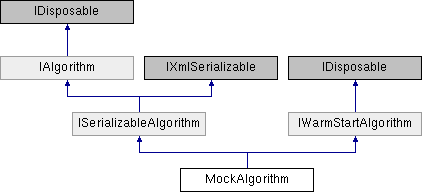

# `MockAlgorithm` Class

**Namespace:** `Phoenix.Optimization.AlgorithmTests.MockObjects`

## Overview

Dummy implementation of `T:Phoenix.Optimization.IAlgorithm`  
 

## Inheritance



## Declaration

```csharp
class `MockAlgorithm`
```

## Description

Dummy implementation of `T:Phoenix.Optimization.IAlgorithm`  
 


## Public Member Functions

|Name|Description|
|-----|-----|
|void |`Dispose ()`<br>Disposes of the resources (other than memory) used by the `MockAlgorithm`. |
|void |`FromXml (string xml)`<br>TODO |
|List< OptConstraint > |`GetConstraints ()`<br>Gets current list of constraints |
|List< DesignVariable > |`GetDesignVariables ()`<br>Gets current list of designVariables |
|List< Objective > |`GetObjectives ()`<br>Gets current list of objectives |
|XmlSchema |`GetSchema ()`<br> |
| |`MockAlgorithm ()`<br>Initializes a new instance of the `MockAlgorithm` class. |
| |`MockAlgorithm (IAlgorithm algorithm)`<br>Initializes a new instance of the `MockAlgorithm` class with the same properties as the given `T:Phoenix.Optimization.IAlgorithm`. |
|void |`ReadXml (XmlReader reader)`<br> |
|void |`RestoreCheckPoint (string saveState)`<br>`RestoreCheckPoint` (not implemented) |
|void |`Run ()`<br>Run |
|void |`SetConstraints (List< OptConstraint > constraints)`<br>SetConstraints |
|void |`SetDesignVariableException (Exception exceptionToThrow)`<br>Sets an exception to be thrown when call the SetDesignVariables method Setting this to null will ensure that no exception is thrown |
|void |`SetDesignVariables (List< DesignVariable > designVariables)`<br>SetDesignVariables |
|void |`SetHost (IAlgorithmHost host)`<br>SetHost |
|void |`SetObjectives (List< Objective > objectives)`<br>SetObjectives |
|bool |`ShowOptionsDialog (IWin32Window owner)`<br>ShowOptionsDialog (not implemented) |
|string |`ToXml ()`<br>TODO |
|void |`WriteXml (XmlWriter writer)`<br> |
|void |`FromXml (string xml)`<br>TODO |
|string |`ToXml ()`<br>TODO |
|void |`RestoreCheckPoint (string saveState)`<br>Restore a specific state of the analysis. |
|void |`Run ()`<br>Initiates execution of the solver. |
|void |`SetConstraints (List< OptConstraint > constraints)`<br>Used by the infrastructure to pass the constraints to the algorithm. |
|void |`SetDesignVariables (List< DesignVariable > designVariables)`<br>Used by the infrastructure to pass the design variables to the algorithm. |
|void |`SetHost (IAlgorithmHost host)`<br>Set the host interface to be used for callbacks. |
|void |`SetObjectives (List< Objective > objectives)`<br>Used by the infrastructure to pass the objectives to the algorithm. |
|bool |`ShowOptionsDialog (IWin32Window owner)`<br>Called to display the algorithms custom options form. |

## Properties
|Name|Description|
|-----|-----|
|string | `Author [get]`<br>Author |
|string | `Description [get]`<br>Desciption (not implemented) |
|string | `DetailsReport [get]`<br>DetailsReport |
|string | `HelpFilePath [get]`<br>HelpFilePath (not implemented) |
|string | `HelpURL [get]`<br>HelpURL (not implemented) |
|string | `IconLocation [get]`<br>IconLocation (not implemented) |
|string | `Id [get]`<br>A unique string to identify this algorithm. |
|string | `Keywords [get]`<br>Keywords (not implemented) |
|string | `LicenseFeature [get, set]`<br>LicenseFeature |
|int | `MaxNumberOfObjectives [get, set]`<br>MaxNumberOfObjectives |
|string | `Name [get, set]`<br>Name |
|AlgorithmNumModelEvaluations | `NumModelEvaluations [get, set]`<br>NumModelEvaluations |
|object | `Options [get, set]`<br>Options |
|string | `ReleaseDate [get, set]`<br>ReleaseDate |
|bool | `RequiresProxy [get, set]`<br>Indicates if ProxiedAlgorithm should wrap this upon deserialization. |
|string | `ResultsReport [get]`<br>ResultsReport |
|FuzzyBoolean | `SupportsConstraints [get, set]`<br>SupportsConstraints |
|FuzzyBoolean | `SupportsDiscreteVariables [get, set]`<br>SupportsDiscreteVariables |
|bool | `SupportsFailedRuns [get, set]`<br>SupportsFailedRuns |
|FuzzyBoolean | `SupportsMinMax [get, set]`<br>SupportsMinMax |
|bool | `SupportsMultipleObjectives [get, set]`<br>SupportsMultipleObjectives |
|FuzzyBoolean | `SupportsNonSmoothResponses [get, set]`<br>SupportsNonSmoothResponses |
|FuzzyBoolean | `SupportsSolveFor [get, set]`<br>SupportsSolveFor |
|string | `Version [get]`<br>Version (not implemented) |
|WarmStartMethod | `WarmStartMethod = WarmStartMethod.AlgorithmControlled [get, set]`<br>The method used to warm-start this algorithm. |

### Properties inherited from [ISerializableAlgorithm]()
|Name|Description|
|-----|-----|
|string | `Id [get]`<br>A unique string to identify this algorithm. |
|bool | `RequiresProxy [get, set]`<br>Indicates if ProxiedAlgorithm should wrap this upon deserialization. |

### Properties inherited from [IAlgorithm]()
|Name|Description|
|-----|-----|
|string | `Author [get]`<br>String containing the author of the algorithm. |
|string | `Description [get]`<br>String containing the description of the algorithm. |
|string | `DetailsReport [get]`<br>String containing the details report for the problem. |
|string | `HelpFilePath [get]`<br>String containing the relative path to the algorithm's help file. |
|string | `HelpURL [get]`<br>String containing a URL that can be used get further help with the algorithm. |
|string | `IconLocation [get]`<br>String containing the relative path to the algorithm's icon. |
|string | `Keywords [get]`<br>String containing the keywords associated with the algorithm. |
|string | `LicenseFeature [get]`<br>String containing the algorithms FlexLM license feature. |
|int | `MaxNumberOfObjectives [get]`<br>Integer containing the maximum number of objectives supported by the algorithm. |
|string | `Name [get]`<br>String containing the name of the algorithm. |
|AlgorithmNumModelEvaluations | `NumModelEvaluations [get]`<br>AlgorithmNumModelEvaluations indicating how many model evaluations are required for convergence. |
|object | `Options [get, set]`<br>Object containing the options for the algorithm. |
|string | `ReleaseDate [get]`<br>String containing the release date for the algorithm in the format YYYY.MMDD |
|string | `ResultsReport [get]`<br>String containing the results report for the problem. |
|FuzzyBoolean | `SupportsConstraints [get]`<br>FuzzyBoolean stating whether the algorithm supports constraints. |
|FuzzyBoolean | `SupportsDiscreteVariables [get]`<br>FuzzyBoolean stating whether the algorithm supports discrete variables. |
|bool | `SupportsFailedRuns [get]`<br>Boolean stating whether the algorithm is able to handle failed model evaluations. |
|FuzzyBoolean | `SupportsMinMax [get]`<br>FuzzyBoolean stating whether the algorithm supports minimize and maximize objectives. |
|bool | `SupportsMultipleObjectives [get]`<br>Boolean stating whether or not the algorithm supports multiple objectives. |
|FuzzyBoolean | `SupportsNonSmoothResponses [get]`<br>FuzzyBoolean stating whether the algorithm supports non-smooth responses (objectives and constraints). |
|FuzzyBoolean | `SupportsSolveFor [get]`<br>FuzzyBoolean stating whether the algorithm supports the solve for value objective. |
|string | `Version [get]`<br>String containing the version of the algorithm. |

### Properties inherited from [IWarmStartAlgorithm]()
|Name|Description|
|-----|-----|
|WarmStartMethod | `WarmStartMethod [get]`<br>The method used to warm-start this algorithm. |

## Constructor & Destructor Documentation

### `MockAlgorithm`()
```csharp
MockAlgorithm ( )
```

Initializes a new instance of the `MockAlgorithm` class.

### `MockAlgorithm`()
```csharp
MockAlgorithm ( IAlgorithm algorithm)
```

Initializes a new instance of the `MockAlgorithm` class with the same properties as the given `T:Phoenix.Optimization.IAlgorithm`.

**Parameters:**

- `algorithm` - The `T:Phoenix.Optimization.IAlgorithm` whose properties should be copied.

## Member Function Documentation

### Dispose
```csharp
void Dispose ( )
```

Disposes of the resources (other than memory) used by the `MockAlgorithm`.

### FromXml
```csharp
void FromXml ( string xml)
```

Implements [ISerializableAlgorithm](../../ISerializableAlgorithm.md).

### GetConstraints
```csharp
List< OptConstraint > GetConstraints ( )
```

Gets current list of constraints

### GetDesignVariables
```csharp
List< DesignVariable > GetDesignVariables ( )
```

Gets current list of designVariables

### GetObjectives
```csharp
List< Objective > GetObjectives ( )
```

Gets current list of objectives

**Returns:**

- Current list of objectives

### RestoreCheckPoint
```csharp
void RestoreCheckPoint ( string saveState)
```

RestoreCheckPoint (not implemented)

**Parameters:**

- `saveState` - Save state.

Implements [IAlgorithm](../../IAlgorithm.md).

### Run
```csharp
void Run ( )
```

Run Uses values set in the Options to update properties

Implements [IAlgorithm](../../IAlgorithm.md).

### SetConstraints
```csharp
void SetConstraints ( List< OptConstraint > constraints)
```

SetConstraints

**Parameters:**

- `constraints` - Constraints

Implements [IAlgorithm](../../IAlgorithm.md).

### SetDesignVariableException
```csharp
void SetDesignVariableException ( Exception exceptionToThrow)
```

Sets an exception to be thrown when call the `SetDesignVariables` method. Setting this to null will ensure that no exception is thrown

**Parameters:**

- `exceptionToThrow` - The exception to throw when calling. See `alsoSetDesignVariables`

### SetDesignVariables
```csharp
void SetDesignVariables ( List< DesignVariable > designVariables)
```

SetDesignVariables

**Parameters:**

- `designVariables` - Design Variables

Implements [IAlgorithm](../../IAlgorithm.md).

### SetHost
```csharp
void SetHost ( [IAlgorithmHost]() host)
```

SetHost

**Parameters:**

- `host` - Algorithm host

Implements [IAlgorithm](../../IAlgorithm.md).

### SetObjectives
```csharp
void SetObjectives ( List< Objective > objectives)
```

SetObjectives

**Parameters:**

- `objectives` - Objectives

Implements [IAlgorithm](../../IAlgorithm.md).

### ShowOptionsDialog
```csharp
bool ShowOptionsDialog ( IWin32Window owner)
```

ShowOptionsDialog (not implemented)

**Parameters:**

- `owner` - Parent for options dialog.

**Returns:**

- Returns true if the options dialog was handled by the algorithm; false otherwise.

Implements [IAlgorithm](../../IAlgorithm.md).

### ToXml
```csharp
string ToXml ( )
```

Implements [ISerializableAlgorithm](../../ISerializableAlgorithm.md).

## Property Documentation

### Author
```csharp
string Author
```

Author

Implements [IAlgorithm](../../IAlgorithm.md).

### Description
```csharp
string Description
```

Description (not implemented)

Implements [IAlgorithm](../../IAlgorithm.md).

### DetailsReport
```csharp
string DetailsReport
```

DetailsReport

Implements [IAlgorithm](../../IAlgorithm.md).

### HelpFilePath
```csharp
string HelpFilePath
```

HelpFilePath (not implemented)

Implements [IAlgorithm](../../IAlgorithm.md).

### HelpURL
```csharp
string HelpURL
```

HelpURL (not implemented)

Implements [IAlgorithm](../../IAlgorithm.md).

### IconLocation
```csharp
string IconLocation
```

IconLocation (not implemented)

Implements [IAlgorithm](../../IAlgorithm.md).

### Id
```csharp
string Id
```

A unique string to identify this algorithm.

Implements [ISerializableAlgorithm](../../ISerializableAlgorithm.md).

### Keywords
```csharp
string Keywords
```

Keywords (not implemented)

Implements [IAlgorithm](../../IAlgorithm.md).

### LicenseFeature
```csharp
string LicenseFeature
```

LicenseFeature. This property is writable for ` T:Phoenix.Optimization.AlgorithmTests.MockObjects.MockAlgorithm`

Implements [IAlgorithm](../../IAlgorithm.md).

### MaxNumberOfObjectives
```csharp
int MaxNumberOfObjectives
```

MaxNumberOfObjectives. This property is writable for ` T:Phoenix.Optimization.AlgorithmTests.MockObjects.MockAlgorithm`

Implements [IAlgorithm](../../IAlgorithm.md).

### Name
```csharp
string Name
```

Name. This property is writable for ` T:Phoenix.Optimization.AlgorithmTests.MockObjects.MockAlgorithm`

Implements [IAlgorithm](../../IAlgorithm.md).

### NumModelEvaluations
```csharp
AlgorithmNumModelEvaluations NumModelEvaluations
```

NumModelEvaluations. This property is writable for ` T:Phoenix.Optimization.AlgorithmTests.MockObjects.MockAlgorithm`

Implements [IAlgorithm](../../IAlgorithm.md).

### Options
```csharp
object Options
```

Options This will return an empty object if it has not been set previously as opposed to null

Implements [IAlgorithm](../../IAlgorithm.md).

### ReleaseDate
```csharp
string ReleaseDate
```

ReleaseDate. This property is writable for ` T:Phoenix.Optimization.AlgorithmTests.MockObjects.MockAlgorithm`

Implements [IAlgorithm](../../IAlgorithm.md).

### RequiresProxy
```csharp
bool RequiresProxy
```

Indicates if `ProxiedAlgorithm` should wrap this upon deserialization.

Implements [ISerializableAlgorithm](../../ISerializableAlgorithm.md).

### ResultsReport
```csharp
string ResultsReport
```

ResultsReport

Implements [IAlgorithm](../../IAlgorithm.md).

### SupportsConstraints
```csharp
FuzzyBoolean SupportsConstraints
```

SupportsConstraints. This property is writable for ` T:Phoenix.Optimization.AlgorithmTests.MockObjects.MockAlgorithm`

Implements [IAlgorithm](../../IAlgorithm.md).

### SupportsDiscreteVariables
```csharp
FuzzyBoolean SupportsDiscreteVariables
```

SupportsDiscreteVariables. This property is writable for ` T:Phoenix.Optimization.AlgorithmTests.MockObjects.MockAlgorithm`

Implements [IAlgorithm](../../IAlgorithm.md).

### SupportsFailedRuns
```csharp
bool SupportsFailedRuns
```

SupportsFailedRuns. This property is writable for ` T:Phoenix.Optimization.AlgorithmTests.MockObjects.MockAlgorithm`

Implements [IAlgorithm](../../IAlgorithm.md).

### SupportsMinMax
```csharp
FuzzyBoolean SupportsMinMax
```

SupportsMinMax. This property is writable for ` T:Phoenix.Optimization.AlgorithmTests.MockObjects.MockAlgorithm`

Implements [IAlgorithm](../../IAlgorithm.md).

### SupportsMultipleObjectives
```csharp
bool SupportsMultipleObjectives
```

SupportsMultipleObjectives. This property is writable for ` T:Phoenix.Optimization.AlgorithmTests.MockObjects.MockAlgorithm`

Implements [IAlgorithm](../../IAlgorithm.md).

### SupportsNonSmoothResponses
```csharp
FuzzyBoolean SupportsNonSmoothResponses
```

SupportsNonSmoothResponses. This property is writable for ` T:Phoenix.Optimization.AlgorithmTests.MockObjects.MockAlgorithm`

Implements [IAlgorithm](../../IAlgorithm.md).

### SupportsSolveFor
```csharp
FuzzyBoolean SupportsSolveFor
```

SupportsSolveFor. This property is writable for ` T:Phoenix.Optimization.AlgorithmTests.MockObjects.MockAlgorithm`

Implements [IAlgorithm](../../IAlgorithm.md).

### Version
```csharp
string Version
```

Version (not implemented)

Implements [IAlgorithm](../../IAlgorithm.md).

### WarmStartMethod
```csharp
WarmStartMethod WarmStartMethod = WarmStartMethod.AlgorithmControlled
```

The method used to warm-start this algorithm.

Implements [IWarmStartAlgorithm](../../IWarmStartAlgorithm.md).

