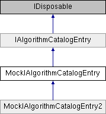

# MockIAlgorithmCatalogEntry Class

**Namespace:** `Phoenix.Optimization.AlgorithmTests.MockObjects`

## Overview

A mock implementation of [`IAlgorithmCatalogEntry`](../../IAlgorithmCatalogEntry.md) for use in automated tests.  
 

## Inheritance



## Declaration

```csharp
class MockIAlgorithmCatalogEntry
```

## Description

A mock implementation of [`IAlgorithmCatalogEntry`](../../IAlgorithmCatalogEntry.md) for use in automated tests.  
 


## Public Member Functions

|Name|Description|
|-----|-----|
|[ISerializableAlgorithm]() |`DeserializeAlgorithm (string xml)`<br>Given the XML tag for an [`ISerializableAlgorithm`](../../ISerializableAlgorithm.md), deserialize the tag and return the result. |
|void |`DeserializeAlgorithmToUserInteractionInstance (string xml)`<br>Given the XML tag for an [`ISerializableAlgorithm`](../../ISerializableAlgorithm.md), deserialize the tag and save it in this instance's `UserInteractionInstance`. |
|void |`DeserializeOptionsToUserInteractionInstance (string innerXML)`<br>Given the XML tag for an options object, deserialize the tag to the `IAlgorithm.Options` property of `UserInteractionInstance`. |
|void |`Dispose ()`<br> |
|object |`GetCurrentOptionsForDialog ()`<br>Returns a clone of the `UserInteractionInstance` `IAlgorithm.Options` property for use in the default options dialog. The `UserInteractionInstance` should be prepared to accept this object being passed as the value to set the `IAlgorithm.Options` property, which indicates that the user clicked "OK" and wants to set the modified version of the object. |
|object |`GetDefaultOptionsForDialog ()`<br>Returns a default version of the object this algorithm uses for options.The `UserInteractionInstance` should be prepared to accept this object being passed as the value to set the `IAlgorithm.Options` property, which indicates that the user clicked "OK" and wants to set the modified version of the object. |
|[ISerializableAlgorithm]() |`GetOutOfProcessAlgorithm ()`<br>Create an out-of-process instance of the algorithm suitable for running the algorithm.Before running, the Optimization Tool will set the problem definition and options object currently in use on the `UserInteractionInstance`. The caller of this method owns the returned IAlgorithm and is responsible for disposing it. |
| |`MockIAlgorithmCatalogEntry (IAlgorithm algorithm)`<br>Constructor. |
|[ISerializableAlgorithm]() |`DeserializeAlgorithm (string xml)`<br>Given the XML tag for an [`ISerializableAlgorithm`](../../ISerializableAlgorithm.md), deserialize the tag and return the result. |
|void |`DeserializeAlgorithmToUserInteractionInstance (string xml)`<br>Given the XML tag for an [`ISerializableAlgorithm`](../../ISerializableAlgorithm.md), deserialize the tag and save it in this instance's `UserInteractionInstance`. |
|void |`DeserializeOptionsToUserInteractionInstance (string innerXML)`<br>Given the XML tag for an options object, deserialize the tag to the `IAlgorithm.Options` property of `UserInteractionInstance`. |
|object |`GetCurrentOptionsForDialog ()`<br>Returns a clone of the `UserInteractionInstance` `IAlgorithm.Options` property for use in the default options dialog. |
|object |`GetDefaultOptionsForDialog ()`<br>Returns a default version of the object this algorithm uses for options. |
|[ISerializableAlgorithm]() |`GetOutOfProcessAlgorithm ()`<br>Create an out-of-process instance of the algorithm suitable for running the algorithm. |

## Protected Member Functions 
|Name|Description|
|-----|-----|
|virtual void  |`Setup (IAlgorithm algorithm)` <br>Initialization method used by contructors to set up the wrapped `IAlgorithm`. |
 
## Protected Attributes 
|Name|Description|
|-----|-----|
|`IAlgorithm` | `_algorithm` <br> The mock `IAlgorithm` object. | 

## Properties
|Name|Description|
|-----|-----|
|string | `Id [get]`<br>The ID for this algorithm entry. This is sometimes used to relocate an algorithm in the overall catalog. This property should be the same as the key associated with this entry in the dictionary returned by `[IDynamicAlgorithmProvider]().LoadAlgorithms`. |
|[IAlgorithm]() | `UserInteractionInstance [get]`<br>This instance is intended for the Opt Tool to present to the user when configuring the algorithm and optimization tool. The instance is owned by the catalog entry and should be disposed when it is disposed. |

### Properties inherited from [IAlgorithmCatalogEntry]()
|Name|Description|
|-----|-----|
|string | `Id [get]`<br>The ID for this algorithm entry. |
|[IAlgorithm]() | `UserInteractionInstance [get]`<br>This instance is intended for the Opt Tool to present to the user when configuring the algorithm and optimization tool. |

## Constructor & Destructor Documentation

### MockIAlgorithmCatalogEntry()
```csharp
MockIAlgorithmCatalogEntry ( IAlgorithm algorithm)
```

Constructor.

**Parameters:**

- `algorithm` - The IAlgorithm to mock wrap here (see MockAlgorithm)

## Member Function Documentation

### DeserializeAlgorithm
```csharp
ISerializableAlgorithm DeserializeAlgorithm ( string xml)
```

Given the XML tag for an [`ISerializableAlgorithm`](../../ISerializableAlgorithm.md), deserialize the tag and return the result.

**Parameters:**

- `xml` - 

Implements [`IAlgorithmCatalogEntry`](../../IAlgorithmCatalogEntry.md).

### DeserializeAlgorithmToUserInteractionInstance
```csharp
void DeserializeAlgorithmToUserInteractionInstance ( string xml)
```

Given the XML tag for an [`ISerializableAlgorithm`](../../ISerializableAlgorithm.md), deserialize the tag and save it in this instance's `UserInteractionInstance`.

**Parameters:**

- `xml` - The content of the XML tag.

Implements [`IAlgorithmCatalogEntry`](../../IAlgorithmCatalogEntry.md).

### DeserializeOptionsToUserInteractionInstance
```csharp
void DeserializeOptionsToUserInteractionInstance ( string innerXML)
```

Given the XML tag for an options object, deserialize the tag to the `IAlgorithm.Options` property of `UserInteractionInstance`.

**Parameters:**

- `innerXML` - The content of the XML tag.

Implements [`IAlgorithmCatalogEntry`](../../IAlgorithmCatalogEntry.md).

### GetCurrentOptionsForDialog
```csharp
object GetCurrentOptionsForDialog ( )
```

Returns a clone of the `UserInteractionInstance` `IAlgorithm.Options` property for use in the default options dialog.The `UserInteractionInstance` should be prepared to accept this object being passed as the value to set the `IAlgorithm.Options` property, which indicates that the user clicked "OK" and wants to set the modified version of the object.

Implements [`IAlgorithmCatalogEntry`](../../IAlgorithmCatalogEntry.md).

### GetDefaultOptionsForDialog
```csharp
object GetDefaultOptionsForDialog ( )
```

Returns a default version of the object this algorithm uses for options. The `UserInteractionInstance` should be prepared to accept this object being passed as the value to set the `IAlgorithm.Options` property, which indicates that the user clicked "OK" and wants to set the modified version of the object.

Implements [`IAlgorithmCatalogEntry`](../../IAlgorithmCatalogEntry.md).

### GetOutOfProcessAlgorithm
```csharp
ISerializableAlgorithm GetOutOfProcessAlgorithm ( )
```

Create an out-of-process instance of the algorithm suitable for running the algorithm. Before running, the Optimization Tool will set the problem definition and options object currently in use on the `UserInteractionInstance`. The caller of this method owns the returned IAlgorithm and is responsible for disposing it.

Implements [`IAlgorithmCatalogEntry`](../../IAlgorithmCatalogEntry.md).

### Setup
```csharp
virtual void Setup ( IAlgorithm algorithm)
```

Initialization method used by contructors to set up the wrapped `IAlgorithm`.

**Parameters:**

- `algorithm` - 

## Member Data Documentation 

### _algorithm
```csharp
IAlgorithm _algorithm
```

The mock `IAlgorithm` object.

## Property Documentation

### Id
```csharp
string Id
```

The ID for this algorithm entry.This is sometimes used to relocate an algorithm in the overall catalog. This property should be the same as the key associated with this entry in the dictionary returned by `[IDynamicAlgorithmProvider]().LoadAlgorithms`.

Implements [`IAlgorithmCatalogEntry`](../../IAlgorithmCatalogEntry.md).

### `UserInteractionInstance`
```csharp
IAlgorithm `UserInteractionInstance`
```

This instance is intended for the Opt Tool to present to the user when configuring the algorithm and optimization tool. The instance is owned by the catalog entry and should be disposed when it is disposed.

Implements [`IAlgorithmCatalogEntry`](../../IAlgorithmCatalogEntry.md).
