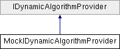

# MockIDynamicAlgorithmProvider Class

**Namespace:** `Phoenix.Optimization.AlgorithmTests.MockObjects`

## Overview

A mock implementation of [[`IDynamicAlgorithmProvider`](../../IDynamicAlgorithmProvider.md)] for use in automated tests.  
 

## Inheritance



## Declaration

```csharp
class MockIDynamicAlgorithmProvider
```

## Description

A mock implementation of [[`IDynamicAlgorithmProvider`](../../IDynamicAlgorithmProvider.md)] for use in automated tests.  
 


## Public Member Functions

|Name|Description|
|-----|-----|
|`IDictionary< string, [IAlgorithmCatalogEntry]() >` |`LoadAlgorithms ()`<br>Generate [IAlgorithmCatalogEntry]() instances for all the algorithms this provider knows how to load.The keys in the dictionary should be some unique identifier for the algorithm. Note that this dictionary will be combined with dictionaries from other `[IDynamicAlgorithmProvider]()` implementations, so there should be a reasonable degree of certainty that the identifier is globally unique. Additionally, the identifiers should be stable between runs, so that the Optimization Tool can reload its state from a saved file. |
| |`MockIDynamicAlgorithmProvider ()`<br>Constructor. |
|`IDictionary< string, [IAlgorithmCatalogEntry]() >` |`LoadAlgorithms ()`<br>Generate [IAlgorithmCatalogEntry]() instances for all the algorithms this provider knows how to load. |

## Constructor & Destructor Documentation

### MockIDynamicAlgorithmProvider()
```csharp
MockIDynamicAlgorithmProvider ( )
```

Constructor.

## Member Function Documentation

### LoadAlgorithms
```csharp
IDictionary< string, [IAlgorithmCatalogEntry]() > LoadAlgorithms ( )
```

Generate `[IAlgorithmCatalogEntry]()` instances for all the algorithms this provider knows how to load.The keys in the dictionary should be some unique identifier for the algorithm. Note that this dictionary will be combined with dictionaries from other `[IDynamicAlgorithmProvider]()` implementations, so there should be a reasonable degree of certainty that the identifier is globally unique. Additionally, the identifiers should be stable between runs, so that the Optimization Tool can reload its state from a saved file.

Implements [`IDynamicAlgorithmProvider`](../../IDynamicAlgorithmProvider.md).

## Property Documentation

### MockIDynamicAlgorithmProvider()
```csharp
MockIDynamicAlgorithmProvider ( )
```

Constructor.

### LoadAlgorithms()
```csharp
IDictionary< string, [IAlgorithmCatalogEntry]() > LoadAlgorithms ( )
```

Generate [IAlgorithmCatalogEntry]() instances for all the algorithms this provider knows how to load.The keys in the dictionary should be some unique identifier for the algorithm. Note that this dictionary will be combined with dictionaries from other `[IDynamicAlgorithmProvider]()` implementations, so there should be a reasonable degree of certainty that the identifier is globally unique. Additionally, the identifiers should be stable between runs, so that the Optimization Tool can reload its state from a saved file.

Implements [`IDynamicAlgorithmProvider`](../../IDynamicAlgorithmProvider.md).
