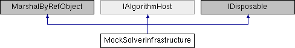

# `MockSolverInfrastructure` Class

**Namespace:** `Phoenix.Optimization.AlgorithmTests.MockObjects`

## Overview

Dummy implementation of `T:Phoenix.Optimization.IAlgorithmHost`.  
 

## Inheritance



## Declaration

```csharp
class `MockSolverInfrastructure`
```

## Description

Dummy implementation of `T:Phoenix.Optimization.IAlgorithmHost`.  
 


## Public Member Functions

|Name|Description|
|-----|-----|
|void |`Dispose ()`<br>Called to dispose the object. |
|ModelEvaluation[] |`EvaluateModel (object[,] designVariables)`<br>Evalutes the model for the given designs in batch mode. |
|[ModelEvaluation]() |`EvaluateModel (object[] designVariables)`<br>Evaluates the model for the given design. |
|void |`InvokeHelp (string helpPath)`<br>Used to open the Optimization Tool's help viewer. |
| |`MockSolverInfrastructure ()`<br>Creates a new instance of `MockSolverInfrastructure`. |
| |`MockSolverInfrastructure (IEvaluator modelEvaluator)`<br>Creates a new instance of `MockSolverInfrastructure` using the given evaluator. |
| |`MockSolverInfrastructure (IEvaluator modelEvaluator, [IFeasibilityProvider]() feasibilityProvider)`<br>Creates a new instance of `MockSolverInfrastructure` using the given evaluator. |
| |`MockSolverInfrastructure (IEvaluator modelEvaluator, int haltAfter)`<br>Creates a new instance of `MockSolverInfrastructure` using the given evaluator and setting `P:Phoenix.Optimization.IAlgorithmHost.Halt` after the specified number of function evaluations. |
|void |`SaveCheckPoint (string checkPointName, string saveState)`<br>Used to save the state of the algorithm for the restart. |
|void |`SetStatusMessage (string statusMessage)`<br>Updates the current status message for the algorithm. |
|void |`SetStatusMessage (string statusMessage, MessageType messageType)`<br>Updates the current status message for the algorithm. |
|void |`UpdateBestDesign (object[] design)`<br>Updates the best design that the algorithm has found so far. |
|ModelEvaluation[] |`EvaluateModel (object[,] designVariables)`<br>Evalutes the model for the given designs in batch mode. |
|[ModelEvaluation]() |`EvaluateModel (object[] designVariables)`<br>Evalutes the model for the given design. |
|void |`InvokeHelp (string helpPath)`<br>Used to open the Optimization Tool's help viewer. |
|void |`SaveCheckPoint (string checkPointName, string saveState)`<br>Used to save the state of the algorithm for the restart. |
|void |`SetStatusMessage (string statusMessage)`<br>Updates the current status message for the algorithm. |
|void |`SetStatusMessage (string statusMessage, MessageType messageType)`<br>Updates the current status message for the algorithm. |
|void |`UpdateBestDesign (object[] design)`<br>Updates the best design that the algorithm has found so far. |

## Properties
|Name|Description|
|-----|-----|
|PHXDesign | `BestDesign [get]`<br>Returns the last best PHXDesign sent by the algorithm. |
|int | `BestDesignCount [get]`<br>Number of best designs sent by the algorithm. |
|List< PHXDesign > | `BestDesigns [get]`<br>Returns the last best PHXDesign sent by the algorithm. |
|Dictionary< int, string > | `CheckPoints [get]`<br>Dictionary of all the check points sent by the algorithm. |
|int | `EvaluationCount [get]`<br>Number of times `EvaluateModel` has been called. |
|int | `EvaluationPerformed [get]`<br>Number of new designs evaluated. |
|List< ModelEvaluation > | `Evaluations [get]`<br>Returns evaluations in a list |
|List< double[]> | `FeasibleDesignObjectives [get]`<br>List of objective values for all designs [Note: Used only for Multi-objective evaluators] |
|bool | `Halt [get, set]`<br>Used to check whether a halt of the algorithm has been requested by ModelCenter. |
|string | `LocaleID [get]`<br>Used to get the local ID for internationalization purposes. |
|DataTable | `Messages [get]`<br>Table of all the messages sent by the algorithm. |
|string | `ModelCenterPath [get]`<br>For internal use only. |
|SortedDictionary< object[], ModelEvaluation > | `ModelEvaluations [get]`<br>Returns the dictionary of Evaluations. |

### Properties inherited from [IAlgorithmHost]()
|Name|Description|
|-----|-----|
|bool | `Halt [get]`<br>Used to check whether a halt of the algorithm has been requested by ModelCenter. |
|string | `LocaleID [get]`<br>Used to get the local ID for internationalization purposes. |
|string | `ModelCenterPath [get]`<br>For internal use only. |


### Events 
|Name|Description|
|-----|-----|
|`Execute OnHostCalled=` | null <br>Event used by `M:Phoenix.Optimization.AlgorithmTests.AlgorithmTestFixture`.detailsReportUpdateDuringRun to request a callback when `host` is called. |
|`Execute OnSaveCheckPointCalled=` | null <br>Event used to request a callback when `SaveCheckPoint` is called. |
|`Execute OnEvaluateModelCalled=` | null <br>Event used to request a callback when `EvaluateModel` is called. | 


## Constructor & Destructor Documentation

### `MockSolverInfrastructure`()
```csharp
MockSolverInfrastructure ( )
```

Creates a new instance of `MockSolverInfrastructure`.

### `MockSolverInfrastructure`()
```csharp
MockSolverInfrastructure ( [IEvaluator]() modelEvaluator)
```

Creates a new instance of `MockSolverInfrastructure` using the given evaluator.

**Parameters:**

- `modelEvaluator` - Evalutor to be used by `MockSolverInfrastructure`.

### `MockSolverInfrastructure`()
```csharp
MockSolverInfrastructure ( [IEvaluator]() modelEvaluator, [IFeasibilityProvider]() feasibilityProvider )
```

Creates a new instance of `MockSolverInfrastructure` using the given evaluator.

**Parameters:**

- `modelEvaluator` - Evalutor to be used by `MockSolverInfrastructure`.
- `feasibilityProvider` - Feasibility provider to be used by `MockSolverInfrastructure`.

### `MockSolverInfrastructure`()
```csharp
MockSolverInfrastructure ( [IEvaluator]() modelEvaluator, int haltAfter )
```

Creates a new instance of `MockSolverInfrastructure` using the given evaluator and setting `P:Phoenix.Optimization.IAlgorithmHost.Halt` after the specified number of function evaluations.

**Parameters:**

- `modelEvaluator` - Evalutor to be used by `MockSolverInfrastructure`.
- `haltAfter` - Number of function evaluations before `Halt` is set.

## Member Function Documentation

### Dispose
```csharp
void Dispose ( )
```

Called to dispose the object. Sealed to prevent overrides.

### EvaluateModel
```csharp
ModelEvaluation[] `EvaluateModel` ( object designVariables[,])
```

Evalutes the model for the given designs in batch mode. The design variables should be in the same order as in the design variable list set by SetDesignVariables.

**Parameters:**

- `designVariables` - multidimensional object array containing the values of the design variables for each of the designs to be evaluated

**Returns:**

- array of ModelEvaluations containing the results of the model evaluations

Implements [`IAlgorithmHost`](../../IAlgorithmHost.md).

### EvaluateModel
```csharp
ModelEvaluation `EvaluateModel` ( object[] designVariables)
```

Evaluates the model for the given design. The design variables should be in the same order as in the design variable list set by `SetDesignVariables`.

**Parameters:**

- `designVariables` - object array containing the values of the design variables

**Returns:**

- ModelEvaluation containing the results of the model evaluation

Implements [`IAlgorithmHost`](../../IAlgorithmHost.md).

### InvokeHelp
```csharp
void InvokeHelp ( string helpPath)
```

Used to open the Optimization Tool's help viewer. Does nothing in this implementation.

**Parameters:**

- `helpPath` - The full path to the help file to open.

Implements [`IAlgorithmHost`](../../IAlgorithmHost.md).

### SaveCheckPoint
```csharp
void SaveCheckPoint ( string checkPointName, string saveState )
```

Used to save the state of the algorithm for the restart. This save state can be given to the algorithm using the `M:Phoenix.Optimization.IAlgorithm.RestoreCheckPoint(System.String)` method, to restore the algorithm to the given state to constinue.

**Parameters:**

- `checkPointName` - string containing a unique name used for the checkpoint
- `saveState` - string containing all of the information needed to restore the algorithm to its current state using the algorithm's `RestoreCheckPoint()` method.

Implements [`IAlgorithmHost`](../../IAlgorithmHost.md).

### SetStatusMessage
```csharp
void SetStatusMessage ( string statusMessage)
```

Updates the current status message for the algorithm. For this overload, the MessageType of "Info" is assumed.

**Parameters:**

- `statusMessage` - string containing the message to be displayed

Implements [`IAlgorithmHost`](../../IAlgorithmHost.md).

### SetStatusMessage
```csharp
void SetStatusMessage ( string statusMessage, MessageType messageType )
```

Updates the current status message for the algorithm.

**Parameters:**

- `statusMessage` - string containing the message to be displayed
- `messageType` - MessageType containing the type of the message

Implements [`IAlgorithmHost`](../../IAlgorithmHost.md).

### UpdateBestDesign
```csharp
void UpdateBestDesign ( object[] design)
```

Updates the best design that the algorithm has found so far. The design variables should be in the same order as in the design variable list set by `SetDesignVariables`.

**Parameters:**

- `design` - object array containing the values of the design variables for the new best design.

Implements [`IAlgorithmHost`](../../IAlgorithmHost.md).

## Property Documentation

### BestDesign
```csharp
PHXDesign BestDesign
```

Returns the last best `PHXDesign` sent by the algorithm.

### BestDesignCount
```csharp
int BestDesignCount
```

Number of best designs sent by the algorithm.

### BestDesigns
```csharp
List<PHXDesign> BestDesigns
```

Returns the last best PHXDesign sent by the algorithm.

### CheckPoints
```csharp
Dictionary<int, string> CheckPoints
```

Dictionary of all the check points sent by the algorithm.

### EvaluationCount
```csharp
int EvaluationCount
```

Number of times `EvaluateModel` has been called.

### EvaluationPerformed
```csharp
int EvaluationPerformed
```

Number of new designs evaluated. Evaluated designs are stored in a b-tree and only evaluated the first time. For subsequent evaluation requests, the results are pulled out of the b-tree and returned. This is done to mimic how the Optimization Tool actually works.

### Evaluations
```csharp
List<ModelEvaluation> Evaluations
```

Returns evaluations in a list

### FeasibleDesignObjectives
```csharp
List<double[]> FeasibleDesignObjectives
```

List of objective values for all designs [Note: Used only for Multi-objective evaluators]

### Halt
```csharp
bool Halt
```

Used to check whether a halt of the algorithm has been requested by ModelCenter. Will be `true` when a halt is requested and `false` otherwise. Only set to true when `MockSolverInfrastructure` is created using `M:Phoenix.Optimization.AlgorithmTests.MockObjects.MockSolverInfrastructure.::ctor(Phoenix.Optimization.IEvaluator,System.Int32)`.

Implements [`IAlgorithmHost`](../../IAlgorithmHost.md).

### LocaleID
```csharp
string LocaleID
```

Used to get the local ID for internationalization purposes. The culture name in the format: where `<languagecode2>` is a lowercase two-letter code derived from ISO 639-1 and `<country/regioncode2>` is an uppercase two-letter code derived from ISO 3166.

Implements [`IAlgorithmHost`](../../IAlgorithmHost.md).

### Messages
```csharp
DataTable Messages
```

Table of all the messages sent by the algorithm.

### ModelCenterPath
```csharp
string ModelCenterPath
```

For internal use only. May be deprecated in the future. Used by Java algorithm infrastructure to find a JVM.

Implements [`IAlgorithmHost`](../../IAlgorithmHost.md).

### ModelEvaluations
```csharp
SortedDictionary<object[], ModelEvaluation> ModelEvaluations
```

Returns the dictionary of Evaluations.

## Event Documentation

### null
```csharp
Execute OnHostCalled= null
```

Event used by `M:Phoenix.Optimization.AlgorithmTests.AlgorithmTestFixture.detailsReportUpdateDuringRun` to request a callback `when` host is called.

### null
```csharp
Execute OnSaveCheckPointCalled= null
```

Event used to request a callback when `SaveCheckPoint` is called.

### null
```csharp
Execute OnEvaluateModelCalled= null
```

Event used to request a callback when `EvaluateModel` is called.

