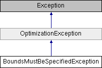

# BoundsMustBeSpecifiedException class

**Namespace:** `Phoenix.Optimization`

## Overview

This can be thrown from the algorithm when the algorithm is passed a problem definition that has an open bound upper or lower bound on the constraints or design variables and the algorithm does not support open bounds.  
 

## Inheritance



## Declaration

```csharp
class BoundsMustBeSpecifiedException
```

## Description

This can be thrown from the algorithm when the algorithm is passed a problem definition that has an open bound upper or lower bound on the constraints or design variables and the algorithm does not support open bounds.  
 


## Public Member Functions

|Name|Description|
|-----|-----|
| |`BoundsMustBeSpecifiedException ()`<br>Initializes a new instance of the `BoundsMustBeSpecifiedException` class. |
| |`BoundsMustBeSpecifiedException (string algorithm, string variables)`<br>Initializes a new instance of the `BoundsMustBeSpecifiedException` class specifing the algorithm throwing the error and the variables that require bounds. |
| |`BoundsMustBeSpecifiedException (string msg)`<br>Initializes a new instance of the `BoundsMustBeSpecifiedException` class with a specified error message. |
| |`BoundsMustBeSpecifiedException (string msg, Exception inner)`<br>Initializes a new instance of the `BoundsMustBeSpecifiedException` class with a specified error message and a reference to the inner exception that is the cause of this exception. |

### Public Member Functions inherited from [OptimizationException]()
|Name|Description|
|-----|-----|
| |`OptimizationException ()`<br>Initializes a new instance of the `OptimizationException` class. |
| |`OptimizationException (string msg)`<br>Initializes a new instance of the `OptimizationException` class with a specified error message. |
| |`OptimizationException (string msg, Exception inner)`<br>Initializes a new instance of the `OptimizationException` class with a specified error message and a reference to the inner exception that is the cause of this exception. |

## Protected Member Functions
|Description|
|------|
|`BoundsNotSupportedException (SerializationInfo info, StreamingContext context)`<br>Initializes a new instance of the `BoundsNotSupportedException` class with serialized data |

### Protected Member Functions inherited from [OptimizationException]() 
|Description|
|------|
|`OptimizationException (SerializationInfo info, StreamingContext context)`<br> Initializes a new instance of the `OptimizationException` class with serialized data. |


## Constructor & Destructor Documentation

### BoundsMustBeSpecifiedException()
```csharp
BoundsMustBeSpecifiedException ( )
```

Initializes a new instance of the `BoundsMustBeSpecifiedException` class.

### BoundsMustBeSpecifiedException()
```csharp
BoundsMustBeSpecifiedException ( string msg)
```

Initializes a new instance of the `BoundsMustBeSpecifiedException` class with a specified error message.

**Parameters:**

- `msg` - Message for the exception

### BoundsMustBeSpecifiedException()
```csharp
BoundsMustBeSpecifiedException ( string algorithm, string variables )
```

Initializes a new instance of the `BoundsMustBeSpecifiedException` class specifing the algorithm throwing the error and the variables that require bounds.

**Parameters:**

- `algorithm` - Name of algorithm throwing exception.
- `variables` - Names of variables that require bounds.

### BoundsMustBeSpecifiedException()
```csharp
BoundsMustBeSpecifiedException ( string msg, Exception inner )
```

Initializes a new instance of the `BoundsMustBeSpecifiedException` class with a specified error message and a reference to the inner exception that is the cause of this exception.

**Parameters:**

- `msg` - The error message that explains the reason for the exception.
- `inner` - The exception that is the cause of the current exception, or a null reference (`Nothing` in Visual Basic) if no inner exception is specified.

### BoundsMustBeSpecifiedException()
```csharp
BoundsMustBeSpecifiedException ( `SerializationInfo` info, `StreamingContext` context )
```

Initializes a new instance of the `BoundsMustBeSpecifiedException` class with serialized data.

**Parameters:**

- `info` - The `SerializationInfo` that holds the serialized object data about the exception being thrown.
- `context` - The `StreamingContext` that contains contextual information about the source or destination.

