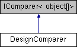

# DesignComparer Class

**Namespace:** `Phoenix.Optimization`

## Overview

Class can be used to compare two designs to each other.  
 

## Inheritance



## Declaration

```csharp
class DesignComparer
```

## Description

Class can be used to compare two designs to each other.  
 


## Public Member Functions

|Name|Description|
|-----|-----|
|int |`Compare (object[] x, object[] y)`<br>Used to perform the comparison between two designs. |

## Member Function Documentation

### Compare
```csharp
int Compare ( object[] x, object[] y )
```

Used to perform the comparison between two designs.

**Parameters:**

- `x` - First Design to compare.
- `y` - Second Design to compare.

**Returns:**

- A value that indicates the relative order of the objects being compared.

|Value| Meaning  |
|-----|-----|
|Less than zero |This instance precedes obj in the sort order.  |
|Zero |This instance occurs in the same position in the sort order as obj.  |
|Greater than zero |This instance follows obj in the sort order.|


