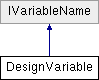

# DesignVariable Class

**Namespace:** `Phoenix.Optimization`

## Overview

Class to hold information about a design variable  
 

## Inheritance



## Declaration

```csharp
class DesignVariable
```

## Description

Class to hold information about a design variable  
 


## Public Member Functions

|Name|Description|
|-----|-----|
|bool |`CheckBounds ()`<br>Check bounds |
|bool |`CheckLowerBoundValue ()`<br>Check Lower bound value |
|bool |`CheckMe (bool doTryToFix=false)`<br>Check design variable for valid state |
|bool |`CheckName (List< DesignVariable > varArr, bool isInMC)`<br> |
|bool |`CheckStartValue ()`<br>Check StartValue |
|bool |`CheckUpperBoundValue ()`<br>Check Upper bound value |
| |`DesignVariable (DesignVariable designVariable)`<br>Copy constructor for a design variable |
| |`DesignVariable (string name)`<br>Creates a new design variable with the given name. |
| |`DesignVariable (string uid, string name)`<br>Creates a new design variable with the given id and name. |
| |`DesignVariable (string uid, string name, DataTable selectedAlphabet)`<br>Creates a new design variable with the given name, start value and selected alphabet. |
| |`DesignVariable (string uid, string name, double lowerBound, double upperBound)`<br>Creates a new design variable with the given name, start value, lower and upper bounds. |
| |`DesignVariable (string uid, string name, object startValue)`<br>Creates a new design variable with the given name and start value. |
| |`DesignVariable (string uid, string name, object startValue, DataTable selectedAlphabet)`<br>Creates a new design variable with the given name, start value and selected alphabet |
| |`DesignVariable (string uid, string name, object startValue, double lowerBound, double upperBound)`<br>Creates a new design variable with the given name, start value, lower and upper bounds. |
| |`DesignVariable (string uid, string name, object startValue, double lowerBound, double upperBound, DataTable selectedAlphabet)`<br>Creates a new design variable with the given name, start value, lower bound, upper bound and selected alphabet. |
| |`DesignVariable (string uid, string name, object startValue, double lowerBound, double upperBound, DataTable selectedAlphabet, DataTable alphabet)`<br>Creates a new design variable with the given name, start value, lower bound, upper bound, selected alphabet and alphabet. |
|bool |`Equals (DesignVariable desVar)`<br>Determines whether the specified DesignVariable is equal to the current DesignVariable. |
|override bool |`Equals (object obj)`<br>Determines whether the specified Object is equal to the current Object. |
|override int |`GetHashCode ()`<br>Serves as a hash function for DesignVariable. |

## Properties
|Name|Description|
|-----|-----|
|DataTable | `Alphabet [get, set]`<br>DataTable containing the full list of name value pairs for discrete design variables. |
|object | `BestDesignValue [get, set]`<br>BestDesignValueGUI /|
|string | `BestDesignValueGUI [get]`<br>LastRunValue can be null /|
|string | `BestLastDesignValueAsXmlAttr [get, set]`<br>Current Model center Value (current at the moment of creating this object) /|
|int | `Index [get, set]`<br> |
|bool | `IsDiscrete [get]`<br>Boolean stating whether or not the design variable is discrete. |
|bool | `IsMarked [get, set]`<br>Internal marker. |
|double | `LowerBound [get, set]`<br>Double containing the lower bound for the design variable or `NaN` if there is no lower bound. |
|string | `LowerBoundErrText [get]`<br>Upper Bound Error text /|
|double | `LowerBoundForCheck [get]`<br>Get lower for checking bound |
|string | `LowerBoundGUI [get, set]`<br>Set get LowerBound as text to/from GUI |
|string | `LowerBoundText [get]`<br>Lower bound as a Text with localization for Nan returns appropriate Nan string |
|object | `ModelCenterValue [get, set]`<br>Current Model center Value (current at the moment of creating this object) /|
|string | `ModelCenterValueGUI [get]`<br>Gets a reference to "Index" /|
|string | `Name [get, set]`<br>Name of the design variable |
|string | `NameErrText [get]`<br>Variable name error text |
|DataTable | `SelectedAlphabet [get, set]`<br>DataTable containing the name value pairs for discrete design variables. |
|object | `StartValue [get]`<br>Object containing the start value for the design variable |
|double | `StartValueAsDouble [get]`<br>Returns Start value as a double if it's possible to convert startValue object to double otherwise returns `NaN` |
|string | `StartValueAsXmlAttr [get, set]`<br>Object containing the raw start value for the design variable |
|StartValueBehaviorEnum | `StartValueBehavior [get, set]`<br>Start Value Behavior |
|object | `StartValueCalcGUI [get]`<br>Object containing the start value for the design variable |
|string | `StartValueErrText [get]`<br>Start Value Error /|
|object | `StartValueGUI [get, set]`<br>Object containing the start value for the design variable |
|object | `StartValueRaw [get, set]`<br>Object containing the raw start value for the design variable it returns string.empty for null value |
|string | `StartValueRawText [get]`<br>string containing the raw start value for the design variable it returns string.empty for null value |
|string | `Uid [get, set]`<br>String with unique identifier of the variable. |
|double | `UpperBound [get, set]`<br>Double containing the upper bound for the design variable or `NaN` if there is no upper bound. |
|string | `UpperBoundErrText [get]`<br>Type of the value /|
|double | `UpperBoundForCheck [get]`<br>Get upper for checking bound |
|string | `UpperBoundGUI [get, set]`<br>Set get UpperBound as text to/from GUI |
|string | `UpperBoundText [get]`<br>Upper bound as a Text with localization for Nan returns appropriate Nan string |
|string | `ValueGUI [get]`<br>Value GUI if there is best design the return best design value, otherewise return modelcenter value |
|Type | `ValueType [get, set]`<br> |

### Properties inherited from [IVariableName]()
|Name|Description|
|-----|-----|
|string | `Name [get]`<br>The name of the variable |

## Constructor & Destructor Documentation

### DesignVariable()
```csharp
DesignVariable ( string name)
```

Creates a new design variable with the given name. Assumes that the variable is continuous and that there are no bounds. The start value will be random. The uid is empty.

**Parameters:**

- `name` - string containing the name of the design variable

### DesignVariable()
```csharp
DesignVariable ( string uid, string name )
```

Creates a new design variable with the given id and name. Assumes that that the variable is continuous and that there are no bounds. The start value will be random.

**Parameters:**

- `uid` - uniqie identifier of the design variable allows to keep track of it
- `name` - string containing the name of the design variable

### DesignVariable()
```csharp
DesignVariable ( string uid, string name, object startValue )
```

Creates a new design variable with the given name and start value. Assumes that that the variable is continuous and that there are no bounds.

**Parameters:**

- `uid` - uniqie identifier of the design variable allows to keep track of it
- `name` - string containing the name of the design variable
- `startValue` - object containing the start value for the design variable

### DesignVariable()
```csharp
DesignVariable ( DesignVariable designVariable)
```

Copy constructor for a design variable

**Parameters:**

- `designVariable` - DesignVariable containing the design variable to be copied.

### DesignVariable()
```csharp
DesignVariable ( string uid, string name, DataTable selectedAlphabet )
```

Creates a new design variable with the given name, start value and selected alphabet. The start value will be random.

**Parameters:**

- `uid` - uniqie identifier of the design variable allows to keep track of it
- `name` - string containing the name of the design variable
- `selectedAlphabet` - DataTable containing the name value pairs associated with the discrete design variable.

### DesignVariable()
```csharp
DesignVariable ( string uid, string name, object startValue, DataTable selectedAlphabet )
```

Creates a new design variable with the given name, start value and selected alphabet

**Parameters:**

- `uid` - uniqie identifier of the design variable allows to keep track of it
- `name` - string containing the name of the design variable
- `startValue` - object containing the start value for the design variable
- `selectedAlphabet` - DataTable containing the name value pairs associated with the discrete design variable.

### DesignVariable()
```csharp
DesignVariable ( string uid, string name, double lowerBound, double upperBound )
```

Creates a new design variable with the given name, start value, lower and upper bounds. The start value will be random.

**Parameters:**

- `uid` - uniqie identifier of the design variable allows to keep track of it
- `name` - string containing the name of the design variable
- `lowerBound` - double containing the lower bound for the design variable or `NaN` if there is no lower bound.
- `upperBound` - double containing the upper bound for the design variable or `NaN` if there is no upper bound.

### DesignVariable()
```csharp
DesignVariable ( string uid, string name, object startValue, double lowerBound, double upperBound )
```

Creates a new design variable with the given name, start value, lower and upper bounds.

**Parameters:**

- `uid` - uniqie identifier of the design variable allows to keep track of it
- `name` - string containing the name of the design variable
- `startValue` - object containing the start value for the design variable.
- `lowerBound` - double containing the lower bound for the design variable or `NaN` if there is no lower bound.
- `upperBound` - double containing the upper bound for the design variable or `NaN` if there is no upper bound.

### DesignVariable()
```csharp
DesignVariable ( string uid, string name, object startValue, double lowerBound, double upperBound, DataTable selectedAlphabet )
```

Creates a new design variable with the given name, start value, lower bound, upper bound and selected alphabet. This constructor is used internally to create design variables. Either bounds or selected alphabet should be specified, but not both.

**Parameters:**

- `uid` - uniqie identifier of the design variable allows to keep track of it
- `name` - string containing the name of the design variable
- `startValue` - object containing the start value for the design variable
- `lowerBound` - double containing the lower bound for the design variable or `NaN` if there is no lower bound.
- `upperBound` - double containing the upper bound for the design variable or `NaN` if there is no upper bound.
- `selectedAlphabet` - DataTable containing the name value pairs associated with the discrete design variable.

### DesignVariable()
```csharp
DesignVariable ( string uid, string name, object startValue, double lowerBound, double upperBound, DataTable selectedAlphabet, DataTable alphabet )
```

Creates a new design variable with the given name, start value, lower bound, upper bound, selected alphabet and alphabet. This constructor is used internally to create design variables. Either bounds or selected alphabet should be specified, but not both.

**Parameters:**

- `uid` - uniqie identifier of the design variable allows to keep track of it
- `name` - string containing the name of the design variable
- `startValue` - object containing the start value for the design variable
- `lowerBound` - double containing the lower bound for the design variable or `NaN` if there is no lower bound.
- `upperBound` - double containing the upper bound for the design variable or `NaN` if there is no upper bound.
- `selectedAlphabet` - DataTable containing the name value pairs associated with the discrete design variable.
- `alphabet` - DataTable containing the full available name value pairs for the discrete design variable.

## Member Function Documentation

### BoundFromString
```csharp
static double BoundFromString ( string boundText)
```

Convert bound from string to double.

**Parameters:**

- `boundText` - Bound as a string.

**Returns:**

- Bound value.

### BoundToString
```csharp
static string BoundToString ( double bound)
```

Convert bound to string.

**Parameters:**

- `bound` - Bound value.

**Returns:**

- Bound as a string.

### CheckBounds
```csharp
bool CheckBounds ( )
```

Check bounds

### CheckLowerBoundValue
```csharp
bool CheckLowerBoundValue ( )
```

Check Lower bound value

### CheckMe
```csharp
bool CheckMe ( bool doTryToFix = false)
```

Check design variable for valid state

**Parameters:**

- `doTryToFix` - 

### CheckStartValue
```csharp
bool CheckStartValue ( )
```

Check StartValue

### CheckUpperBoundValue
```csharp
bool CheckUpperBoundValue ( )
```

Check Upper bound value

### Equals
```csharp
bool Equals ( DesignVariable desVar)
```

Determines whether the specified DesignVariable is equal to the current DesignVariable.

**Parameters:**

- `desVar` - The DesignVariable object to compare with the current DesignVariable.

**Returns:**

- `true` if the specified DesignVariable is equal to the current DesignVariable; otherwise, `false`.

### Equals
```csharp
override bool Equals ( object obj)
```

Determines whether the specified Object is equal to the current Object.

**Parameters:**

- `obj` - The object to compare with the current object.

**Returns:**

- `true` if the specified Object is equal to the current Object; otherwise, `false`.

### FixValue
```csharp
static object FixValue ( object o)
```

Fix the value in case if the value is string which can be parsed as double

**Parameters:**

- `o` - 

### GetHashCode
```csharp
override int GetHashCode ( )
```

Serves as a hash function for `DesignVariable`.

**Returns:**

- A hash code for the current `DesignVariable`.

### IsValueValid
```csharp
static bool IsValueValid ( object value)
```

Return `false` for: "", null, NaN, "NaN". Else returns `true`. Note: UT for this method are under `PHXSolverTest::StaticMethodTests`.

**Parameters:**

- `value` - 

### operator!=
```csharp
static bool operator!= ( DesignVariable a, DesignVariable b )
```

Determines whether the specified `DesignVariable` instances are considered not equal.

**Parameters:**

- `a` - The first `DesignVariable` to compare.
- `b` - The second `DesignVariable` to compare.

**Returns:**

- `true` if the `DesignVariables` are not considered equal; otherwise, `false`.

### operator==
```csharp
static bool operator== ( DesignVariable a, DesignVariable b )
```

Determines whether the specified `DesignVariable` instances are considered equal.

**Parameters:**

- `a` - The first `DesignVariable` to compare.
- `b` - The second `DesignVariable` to compare.

**Returns:**

- `true` if the `DesignVariables` are considered equal; otherwise, `false`.

### TryConvertToDouble
```csharp
static bool TryConvertToDouble ( object o, out double valueDouble )
```

Fix the value in case if the value is string which can be parsed as double. Note: UT for this method are under `PHXSolverTest::StaticMethodTests`.

**Parameters:**

- `o` - 

### ValueFromString
```csharp
static object ValueFromString ( string valueText, Type targetType )
```

Convert value from string in case of double use localization if cannot convert to double then return string as it is.

**Parameters:**

- `valueText` - 

### ValueToString
```csharp
static string ValueToString ( object o)
```

Convert value to string in case of double use localization, return `string.Empty` for double `Nan` or Infinity

**Parameters:**

- `o` - 

## Property Documentation

### Alphabet
```csharp
DataTable Alphabet
```

DataTable containing the full list of name value pairs for discrete design variables. The DataTable has two columns: Name and Value. The Name column contains the alias for the alphabet value and the Value column contains an object with the underlying value.

### BestDesignValue
```csharp
object BestDesignValue
```

BestDesignValueGUI

### BestDesignValueGUI
```csharp
string BestDesignValueGUI
```

LastRunValue can be null

### BestLastDesignValueAsXmlAttr
```csharp
string BestLastDesignValueAsXmlAttr
```

Current Model center Value (current at the moment of creating this object)

### IsDiscrete
```csharp
bool IsDiscrete
```

Boolean stating whether or not the design variable is discrete. True when the design variable is discrete and false otherwise.

### IsMarked
```csharp
bool IsMarked
```

Internal marker.

### LowerBound
```csharp
double LowerBound
```

Double containing the lower bound for the design variable or `NaN` if there is no lower bound.

### LowerBoundErrText
```csharp
string LowerBoundErrText
```

Upper Bound Error text

### LowerBoundForCheck
```csharp
double LowerBoundForCheck
```

Get lower for checking bound

### LowerBoundGUI
```csharp
string LowerBoundGUI
```

Set get LowerBound as text to/from GUI

### LowerBoundText
```csharp
string LowerBoundText
```

Lower bound as a Text with localization for Nan returns appropriate Nan string

### ModelCenterValue
```csharp
object ModelCenterValue
```

Current Model center Value (current at the moment of creating this object)

### ModelCenterValueGUI
```csharp
string ModelCenterValueGUI
```

Gets a reference to "Index"

### Name
```csharp
string Name
```

Name of the design variable

Implements [IVariableName]().

### NameErrText
```csharp
string NameErrText
```

Variable name error text summary>

### SelectedAlphabet
```csharp
DataTable SelectedAlphabet
```

DataTable containing the name value pairs for discrete design variables. The DataTable has two columns: Name and Value. The Name column contains the alias for the alphabet value and the Value column contains an object with the underlying value.

### StartValue
```csharp
object StartValue
```

Object containing the start value for the design variable

### StartValueAsDouble
```csharp
double StartValueAsDouble
```

Returns Start value as a double if it's possible to convert startValue object to double otherwise returns NaN

### StartValueAsXmlAttr
```csharp
string StartValueAsXmlAttr
```

Object containing the raw start value for the design variable

### StartValueBehavior
```csharp
StartValueBehaviorEnum StartValueBehavior
```

Start Value Behavior BestDesignValue

### StartValueCalcGUI
```csharp
object StartValueCalcGUI
```

Object containing the start value for the design variable

### StartValueErrText
```csharp
string StartValueErrText
```

Start Value Error /Lower Bound Error text

### StartValueGUI
```csharp
object StartValueGUI
```

Object containing the start value for the design variable

### StartValueRaw
```csharp
object StartValueRaw
```

Object containing the raw start value for the design variable it returns string.empty for null value

### StartValueRawText
```csharp
string StartValueRawText
```

string containing the raw start value for the design variable it returns string.empty for null value

### Uid
```csharp
string Uid
```

String with unique identifier of the variable.

### UpperBound
```csharp
double UpperBound
```

Double containing the upper bound for the design variable or `NaN` if there is no upper bound.

### UpperBoundErrText
```csharp
string UpperBoundErrText
```

Type of the value

### UpperBoundForCheck
```csharp
double UpperBoundForCheck
```

Get upper for checking bound

### UpperBoundGUI
```csharp
string UpperBoundGUI
```

Set get UpperBound as text to/from GUI

### UpperBoundText
```csharp
string UpperBoundText
```

Upper bound as a Text with localization for Nan returns appropriate Nan string

### ValueGUI
```csharp
string ValueGUI
```

Value GUI if there is best design the return best design value, otherewise return modelcenter value
