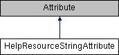

# HelpResourceStringAttribute Class

**Namespace:** `Phoenix.Optimization`

## Overview

Attribute used to specify a location in the help for an option.  
 

## Inheritance



## Declaration

```csharp
class HelpResourceStringAttribute
```

## Description

Attribute used to specify a location in the help for an option.  
 


## Public Member Functions

|Name|Description|
|-----|-----|
| |`HelpResourceStringAttribute (string resourceName, string stringName)`<br>Constructor |

## Properties
|Name|Description|
|-----|-----|
|string | `ResourceName [get, set]`<br>Name of the resource that contains the help file path. |
|string | `StringName [get, set]`<br>Name of the string that contains the help file path. |

## Constructor & Destructor Documentation

### HelpResourceStringAttribute()
```csharp
HelpResourceStringAttribute ( string resourceName, string stringName )
```

Constructor

**Parameters:**

- `resourceName` - Name of the resource that contains the help file path.
- `stringName` - Name of the string that contains the help file path.

## Member Function Documentation

### ResourceName
```csharp
string ResourceName
```

Name of the resource that contains the help file path.

### StringName
```csharp
string StringName
```

Name of the string that contains the help file path.

## Property Documentation

### ResourceName
```csharp
string ResourceName
```

Name of the resource that contains the help file path.

### StringName
```csharp
string StringName
```

Name of the string that contains the help file path.
