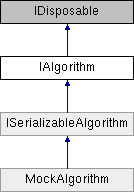

# IAlgorithm Interface

**Namespace:** `Phoenix.Optimization`

## Overview

Interface used to define an algorithm for the Optimization Tool infrastructure.  
 

## Inheritance



## Declaration

```csharp
interface IAlgorithm
```

## Description

Interface used to define an algorithm for the Optimization Tool infrastructure.  
 


## Public Member Functions

|Name|Description|
|-----|-----|
|void |`RestoreCheckPoint (string saveState)`<br>Restore a specific state of the analysis. |
|void |`Run ()`<br>Initiates execution of the solver. |
|void |`SetConstraints (List< OptConstraint > constraints)`<br>Used by the infrastructure to pass the constraints to the algorithm. |
|void |`SetDesignVariables (List< DesignVariable > designVariables)`<br>Used by the infrastructure to pass the design variables to the algorithm. |
|void |`SetHost (IAlgorithmHost host)`<br>Set the host interface to be used for callbacks. |
|void |`SetObjectives (List< Objective > objectives)`<br>Used by the infrastructure to pass the objectives to the algorithm. |
|bool |`ShowOptionsDialog (IWin32Window owner)`<br>Called to display the algorithms custom options form. |

## Properties
|Name|Description|
|-----|-----|
|string | `Author [get]`<br>String containing the author of the algorithm. |
|string | `Description [get]`<br>String containing the description of the algorithm. |
|string | `DetailsReport [get]`<br>String containing the details report for the problem. |
|string | `HelpFilePath [get]`<br>String containing the relative path to the algorithm's help file. |
|string | `HelpURL [get]`<br>String containing a URL that can be used get further help with the algorithm. |
|string | `IconLocation [get]`<br>String containing the relative path to the algorithm's icon. |
|string | `Keywords [get]`<br>String containing the keywords associated with the algorithm. |
|string | `LicenseFeature [get]`<br>String containing the algorithms FlexLM license feature. |
|int | `MaxNumberOfObjectives [get]`<br>Integer containing the maximum number of objectives supported by the algorithm. |
|string | `Name [get]`<br>String containing the name of the algorithm. |
|AlgorithmNumModelEvaluations | `NumModelEvaluations [get]`<br>AlgorithmNumModelEvaluations indicating how many model evaluations are required for convergence. |
|object | `Options [get, set]`<br>Object containing the options for the algorithm. |
|string | `ReleaseDate [get]`<br>String containing the release date for the algorithm in the format YYYY.MMDD |
|string | `ResultsReport [get]`<br>String containing the results report for the problem. |
|FuzzyBoolean | `SupportsConstraints [get]`<br>FuzzyBoolean stating whether the algorithm supports constraints. |
|FuzzyBoolean | `SupportsDiscreteVariables [get]`<br>FuzzyBoolean stating whether the algorithm supports discrete variables. |
|bool | `SupportsFailedRuns [get]`<br>Boolean stating whether the algorithm is able to handle failed model evaluations. |
|FuzzyBoolean | `SupportsMinMax [get]`<br>FuzzyBoolean stating whether the algorithm supports minimize and maximize objectives. |
|bool | `SupportsMultipleObjectives [get]`<br>Boolean stating whether or not the algorithm supports multiple objectives. |
|FuzzyBoolean | `SupportsNonSmoothResponses [get]`<br>FuzzyBoolean stating whether the algorithm supports non-smooth responses (objectives and constraints). |
|FuzzyBoolean | `SupportsSolveFor [get]`<br>FuzzyBoolean stating whether the algorithm supports the solve for value objective. |
|string | `Version [get]`<br>String containing the version of the algorithm. |

## Member Function Documentation

### RestoreCheckPoint
```csharp
void RestoreCheckPoint ( string saveState)
```

Restore a specific state of the analysis. This save state is provided to the infrastructure by the algorithm using the M:Phoenix.Optimization.IAlgorithmHost.SaveCheckPoint(System.String,System.String) method. Implemented in MockAlgorithm.

**Parameters:**

- `saveState` - String containing the information needed to restore the algorithm to a specific state.

### Run
```csharp
void Run ( )
```

Initiates execution of the solver. The solver should throw an exception if for any reason it fails to find an optimum value. Implemented in MockAlgorithm.

### SetConstraints
```csharp
void SetConstraints ( List< OptConstraint > constraints)
```

Used by the infrastructure to pass the constraints to the algorithm. Implemented in MockAlgorithm.

**Parameters:**

- `constraints` - List of PHXConstraints in the problem definition.

### SetDesignVariables
```csharp
void SetDesignVariables ( List< DesignVariable > designVariables)
```

Used by the infrastructure to pass the design variables to the algorithm. Implemented in MockAlgorithm.

**Parameters:**

- `designVariables` - List of PHXDesignVariables in the problem definition.

### SetHost
```csharp
void SetHost ( [IAlgorithmHost]() host)
```

Set the host interface to be used for callbacks. A typical implementation would look like: Implemented in MockAlgorithm.

**Parameters:**

- `host` - T:Phoenix.Optimization.IAlgorithmHost to be used by the algorithm for model evaluations

### SetObjectives
```csharp
void SetObjectives ( List< Objective > objectives)
```

Used by the infrastructure to pass the objectives to the algorithm. Implemented in MockAlgorithm.

**Parameters:**

- `objectives` - List of PHXObjectives in the problem definition.

### ShowOptionsDialog
```csharp
bool ShowOptionsDialog ( IWin32Window owner)
```

Called to display the algorithms custom options form. If an algorithm displays a custom options form, it is responsible for saving the options back into the algorithm. When the options for is displayed, it should be displayed using the ShowDialog method passing in the owner as an argument. If an algorithm wishes to use the default PropertyGrid options dialog, it should implement the method to simply return false. Implemented in MockAlgorithm.

**Parameters:**

- `owner` - Any object that implements IWin32Window that represents the top-level window that will own the modal dialog box.

**Returns:**

- Returns true if the algorithm displayed a custom form, false if the default property grid form should be displayed.

### Author
```csharp
string Author
```

String containing the author of the algorithm. Implemented in MockAlgorithm.

### Description
```csharp
string Description
```

String containing the description of the algorithm. Implemented in MockAlgorithm.

### DetailsReport
```csharp
string DetailsReport
```

String containing the details report for the problem. The details report should contain information about the execution of the algorithm that can be used to troubleshoot it's execution. The resutls report can either be formatted text or HTML. Implemented in MockAlgorithm.

### HelpFilePath
```csharp
string HelpFilePath
```

String containing the relative path to the algorithm's help file. The base directory used with the relative path it the assembly location. Implemented in MockAlgorithm.

### HelpURL
```csharp
string HelpURL
```

String containing a URL that can be used get further help with the algorithm. Implemented in MockAlgorithm.

### IconLocation
```csharp
string IconLocation
```

String containing the relative path to the algorithm's icon. The base directory used with the relative path it the assembly location. Implemented in MockAlgorithm.

### Keywords
```csharp
string Keywords
```

String containing the keywords associated with the algorithm. Implemented in MockAlgorithm.

### LicenseFeature
```csharp
string LicenseFeature
```

String containing the algorithms FlexLM license feature. If the algorithm does not use FlexLM licensing, LicenseFeature should be an empty string. Implemented in MockAlgorithm.

### MaxNumberOfObjectives
```csharp
int MaxNumberOfObjectives
```

Integer containing the maximum number of objectives supported by the algorithm. If there is no limit to the number of objectives, this property should be set to -1. Implemented in MockAlgorithm.

### Name
```csharp
string Name
```

String containing the name of the algorithm. Implemented in MockAlgorithm.

### NumModelEvaluations
```csharp
AlgorithmNumModelEvaluations NumModelEvaluations
```

AlgorithmNumModelEvaluations indicating how many model evaluations are required for convergence. Implemented in MockAlgorithm.

### Options
```csharp
object Options
```

Object containing the options for the algorithm. Options should be public properties of the object. Implemented in MockAlgorithm.

### ReleaseDate
```csharp
string ReleaseDate
```

String containing the release date for the algorithm in the format YYYY.MMDD Implemented in MockAlgorithm.

### ResultsReport
```csharp
string ResultsReport
```

String containing the results report for the problem. The results report can either be formatted text or HTML. Implemented in MockAlgorithm.

### SupportsConstraints
```csharp
FuzzyBoolean SupportsConstraints
```

FuzzyBoolean stating whether the algorithm supports constraints. Implemented in MockAlgorithm.

### SupportsDiscreteVariables
```csharp
FuzzyBoolean SupportsDiscreteVariables
```

FuzzyBoolean stating whether the algorithm supports discrete variables. Implemented in MockAlgorithm.

### SupportsFailedRuns
```csharp
bool SupportsFailedRuns
```

Boolean stating whether the algorithm is able to handle failed model evaluations. Implemented in MockAlgorithm.

### SupportsMinMax
```csharp
FuzzyBoolean SupportsMinMax
```

FuzzyBoolean stating whether the algorithm supports minimize and maximize objectives. Implemented in MockAlgorithm.

### SupportsMultipleObjectives
```csharp
bool SupportsMultipleObjectives
```

Boolean stating whether or not the algorithm supports multiple objectives. Implemented in MockAlgorithm.

### SupportsNonSmoothResponses
```csharp
FuzzyBoolean SupportsNonSmoothResponses
```

FuzzyBoolean stating whether the algorithm supports non-smooth responses (objectives and constraints). If the algorithm supports small discontinuities set capability to 'Maybe' If the algorithm supports both small and large discontinuities set capability to 'True If the algorithm does not support any discontinuities set capability to 'False' Implemented in MockAlgorithm.

### SupportsSolveFor
```csharp
FuzzyBoolean SupportsSolveFor
```

FuzzyBoolean stating whether the algorithm supports the solve for value objective. Implemented in MockAlgorithm.

### Version
```csharp
string Version
```

String containing the version of the algorithm. Implemented in MockAlgorithm.

## Property Documentation

### Author
```csharp
string Author
```

String containing the author of the algorithm. Implemented in MockAlgorithm.

### Description
```csharp
string Description
```

String containing the description of the algorithm. Implemented in MockAlgorithm.

### DetailsReport
```csharp
string DetailsReport
```

String containing the details report for the problem. The details report should contain information about the execution of the algorithm that can be used to troubleshoot it's execution. The resutls report can either be formatted text or HTML. Implemented in MockAlgorithm.

### HelpFilePath
```csharp
string HelpFilePath
```

String containing the relative path to the algorithm's help file. The base directory used with the relative path it the assembly location. Implemented in MockAlgorithm.

### HelpURL
```csharp
string HelpURL
```

String containing a URL that can be used get further help with the algorithm. Implemented in MockAlgorithm.

### IconLocation
```csharp
string IconLocation
```

String containing the relative path to the algorithm's icon. The base directory used with the relative path it the assembly location. Implemented in MockAlgorithm.

### Keywords
```csharp
string Keywords
```

String containing the keywords associated with the algorithm. Implemented in MockAlgorithm.

### LicenseFeature
```csharp
string LicenseFeature
```

String containing the algorithms FlexLM license feature. If the algorithm does not use FlexLM licensing, LicenseFeature should be an empty string. Implemented in MockAlgorithm.

### MaxNumberOfObjectives
```csharp
int MaxNumberOfObjectives
```

Integer containing the maximum number of objectives supported by the algorithm. If there is no limit to the number of objectives, this property should be set to -1. Implemented in MockAlgorithm.

### Name
```csharp
string Name
```

String containing the name of the algorithm. Implemented in MockAlgorithm.

### NumModelEvaluations
```csharp
AlgorithmNumModelEvaluations NumModelEvaluations
```

AlgorithmNumModelEvaluations indicating how many model evaluations are required for convergence. Implemented in MockAlgorithm.

### Options
```csharp
object Options
```

Object containing the options for the algorithm. Options should be public properties of the object. Implemented in MockAlgorithm.

### ReleaseDate
```csharp
string ReleaseDate
```

String containing the release date for the algorithm in the format YYYY.MMDD Implemented in MockAlgorithm.

### ResultsReport
```csharp
string ResultsReport
```

String containing the results report for the problem. The results report can either be formatted text or HTML. Implemented in MockAlgorithm.

### SupportsConstraints
```csharp
FuzzyBoolean SupportsConstraints
```

FuzzyBoolean stating whether the algorithm supports constraints. Implemented in MockAlgorithm.

### SupportsDiscreteVariables
```csharp
FuzzyBoolean SupportsDiscreteVariables
```

FuzzyBoolean stating whether the algorithm supports discrete variables. Implemented in MockAlgorithm.

### SupportsFailedRuns
```csharp
bool SupportsFailedRuns
```

Boolean stating whether the algorithm is able to handle failed model evaluations. Implemented in MockAlgorithm.

### SupportsMinMax
```csharp
FuzzyBoolean SupportsMinMax
```

FuzzyBoolean stating whether the algorithm supports minimize and maximize objectives. Implemented in MockAlgorithm.

### SupportsMultipleObjectives
```csharp
bool SupportsMultipleObjectives
```

Boolean stating whether or not the algorithm supports multiple objectives. Implemented in MockAlgorithm.

### SupportsNonSmoothResponses
```csharp
FuzzyBoolean SupportsNonSmoothResponses
```

FuzzyBoolean stating whether the algorithm supports non-smooth responses (objectives and constraints). If the algorithm supports small discontinuities set capability to 'Maybe' If the algorithm supports both small and large discontinuities set capability to 'True If the algorithm does not support any discontinuities set capability to 'False' Implemented in MockAlgorithm.

### SupportsSolveFor
```csharp
FuzzyBoolean SupportsSolveFor
```

FuzzyBoolean stating whether the algorithm supports the solve for value objective. Implemented in MockAlgorithm.

### Version
```csharp
string Version
```

String containing the version of the algorithm. Implemented in MockAlgorithm.
