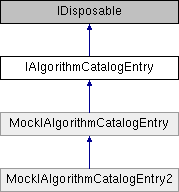

# IAlgorithmCatalogEntry Interface

**Namespace:** `Phoenix.Optimization`

## Overview

Implementations of this interface are designed to allow an [IDynamicAlgorithmProvider]() as well as the rest of the optimization tool to load and work with metadata about an optimization algorithm while avoiding having to actually instantiate or even load the corresponding IAlgorithm implementation.  
 

## Inheritance



## Declaration

```csharp
interface IAlgorithmCatalogEntry
```

## Description

Implementations of this interface are designed to allow an [IDynamicAlgorithmProvider]() as well as the rest of the optimization tool to load and work with metadata about an optimization algorithm while avoiding having to actually instantiate or even load the corresponding IAlgorithm implementation.  
 


## Public Member Functions

|Name|Description|
|-----|-----|
|[ISerializableAlgorithm]() |`DeserializeAlgorithm (string xml)`<br>Given the XML tag for an ISerializableAlgorithm, deserialize the tag and return the result. |
|void |`DeserializeAlgorithmToUserInteractionInstance (string xml)`<br>Given the XML tag for an ISerializableAlgorithm, deserialize the tag and save it in this instance's UserInteractionInstance. |
|void |`DeserializeOptionsToUserInteractionInstance (string innerXML)`<br>Given the XML tag for an options object, deserialize the tag to the IAlgorithm.Options property of UserInteractionInstance. |
|object |`GetCurrentOptionsForDialog ()`<br>Returns a clone of the UserInteractionInstance IAlgorithm.Options property for use in the default options dialog. |
|object |`GetDefaultOptionsForDialog ()`<br>Returns a default version of the object this algorithm uses for options. |
|[ISerializableAlgorithm]() |`GetOutOfProcessAlgorithm ()`<br>Create an out-of-process instance of the algorithm suitable for running the algorithm. |

## Properties
|Name|Description|
|-----|-----|
|string | `Id [get]`<br>The ID for this algorithm entry. |
|[IAlgorithm]() | `UserInteractionInstance [get]`<br>This instance is intended for the Opt Tool to present to the user when configuring the algorithm and optimization tool. |

## Member Function Documentation

### DeserializeAlgorithm
```csharp
ISerializableAlgorithm DeserializeAlgorithm ( string xml)
```

Given the XML tag for an ISerializableAlgorithm, deserialize the tag and return the result. Implemented in MockIAlgorithmCatalogEntry.

**Parameters:**

- `xml` - 

### DeserializeAlgorithmToUserInteractionInstance
```csharp
void DeserializeAlgorithmToUserInteractionInstance ( string xml)
```

Given the XML tag for an ISerializableAlgorithm, deserialize the tag and save it in this instance's UserInteractionInstance. Implemented in MockIAlgorithmCatalogEntry.

**Parameters:**

- `xml` - The content of the XML tag.

### DeserializeOptionsToUserInteractionInstance
```csharp
void DeserializeOptionsToUserInteractionInstance ( string innerXML)
```

Given the XML tag for an options object, deserialize the tag to the IAlgorithm.Options property of UserInteractionInstance. Implemented in MockIAlgorithmCatalogEntry.

**Parameters:**

- `innerXML` - The content of the XML tag.

### GetCurrentOptionsForDialog
```csharp
object GetCurrentOptionsForDialog ( )
```

Returns a clone of the UserInteractionInstance IAlgorithm.Options property for use in the default options dialog. The UserInteractionInstance should be prepared to accept this object being passed as the value to set the IAlgorithm.Options property, which indicates that the user clicked "OK" and wants to set the modified version of the object. This method may go unimplemented if the algorithm in question supplies a custom options dialog. Throw a NotImplementedException with a message for clarity. Implemented in MockIAlgorithmCatalogEntry.

### GetDefaultOptionsForDialog
```csharp
object GetDefaultOptionsForDialog ( )
```

Returns a default version of the object this algorithm uses for options. The UserInteractionInstance should be prepared to accept this object being passed as the value to set the IAlgorithm.Options property, which indicates that the user clicked "OK" and wants to set the modified version of the object. This method may go unimplemented if the algorithm in question supplies a custom options dialog. Throw a NotImplementedException with a message for clarity. Implemented in MockIAlgorithmCatalogEntry.

### GetOutOfProcessAlgorithm
```csharp
ISerializableAlgorithm GetOutOfProcessAlgorithm ( )
```

Create an out-of-process instance of the algorithm suitable for running the algorithm. Before running, the Optimization Tool will set the problem definition and options object currently in use on the UserInteractionInstance. The caller of this method owns the returned IAlgorithm and is responsible for disposing it. Implemented in MockIAlgorithmCatalogEntry.

**Returns:**

- An instance of the algorithm suitable for running it out of process.

### Id
```csharp
string Id
```

The ID for this algorithm entry. This is sometimes used to relocate an algorithm in the overall catalog. This property should be the same as the key associated with this entry in the dictionary returned by IDynamicAlgorithmProvider.LoadAlgorithms. Implemented in MockIAlgorithmCatalogEntry.

### UserInteractionInstance
```csharp
IAlgorithm UserInteractionInstance
```

This instance is intended for the Opt Tool to present to the user when configuring the algorithm and optimization tool. The instance is owned by the catalog entry and should be disposed when it is disposed. Implemented in MockIAlgorithmCatalogEntry.

## Property Documentation

### Id
```csharp
string Id
```

The ID for this algorithm entry. This is sometimes used to relocate an algorithm in the overall catalog. This property should be the same as the key associated with this entry in the dictionary returned by IDynamicAlgorithmProvider.LoadAlgorithms. Implemented in MockIAlgorithmCatalogEntry.

### UserInteractionInstance
```csharp
IAlgorithm UserInteractionInstance
```

This instance is intended for the Opt Tool to present to the user when configuring the algorithm and optimization tool. The instance is owned by the catalog entry and should be disposed when it is disposed. Implemented in MockIAlgorithmCatalogEntry.
