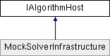

# IAlgorithmHost Interface

**Namespace:** `Phoenix.Optimization`

## Overview

Interface used by the algorithm to communicate with the solver and request model evaluations.  
 

## Inheritance



## Declaration

```csharp
interface IAlgorithmHost
```

## Description

Interface used by the algorithm to communicate with the solver and request model evaluations.  
 


## Public Member Functions

|Name|Description|
|-----|-----|
|ModelEvaluation[] |`EvaluateModel (object[,] designVariables)`<br>Evalutes the model for the given designs in batch mode. |
|[ModelEvaluation]() |`EvaluateModel (object[] designVariables)`<br>Evalutes the model for the given design. |
|void |`InvokeHelp (string helpPath)`<br>Used to open the Optimization Tool's help viewer. |
|void |`SaveCheckPoint (string checkPointName, string saveState)`<br>Used to save the state of the algorithm for the restart. |
|void |`SetStatusMessage (string statusMessage)`<br>Updates the current status message for the algorithm. |
|void |`SetStatusMessage (string statusMessage, MessageType messageType)`<br>Updates the current status message for the algorithm. |
|void |`UpdateBestDesign (object[] design)`<br>Updates the best design that the algorithm has found so far. |

## Properties
|Name|Description|
|-----|-----|
|bool | `Halt [get]`<br>Used to check whether a halt of the algorithm has been requested by ModelCenter. |
|string | `LocaleID [get]`<br>Used to get the local ID for internationalization purposes. |
|string | `ModelCenterPath [get]`<br>For internal use only. |

## Member Function Documentation

### EvaluateModel
```csharp
ModelEvaluation[] `EvaluateModel` ( object designVariables[,])
```

Evalutes the model for the given designs in batch mode. The design variables should be in the same order as in the design variable list set by SetDesignVariables. For algorithms that support warm start (i.e. implement the Phoenix.Optimization.IWarmStartAlgorithm class), the SaveCheckPoint method must always be called immediately before this method is called. 
 That includes cases where a checkpoint has just been restored. Otherwise, this method may return incorrect results. Implemented in MockSolverInfrastructure.

**Parameters:**

- `designVariables` - multidimensional object array containing the values of the design variables for each of the designs to be evaluated

**Returns:**

- array of ModelEvaluations containing the results of the model evaluations

### EvaluateModel
```csharp
ModelEvaluation `EvaluateModel` ( object[] designVariables)
```

Evalutes the model for the given design. The design variables should be in the same order as in the design variable list set by SetDesignVariables. For algorithms that support warm start (i.e. implement the Phoenix.Optimization.IWarmStartAlgorithm class), the SaveCheckPoint method must always be called immediately before this method is called. 
 That includes cases where a checkpoint has just been restored. Otherwise, this method may return incorrect results. Implemented in MockSolverInfrastructure.

**Parameters:**

- `designVariables` - object array containing the values of the design variables

**Returns:**

- ModelEvaluation containing the results of the model evaluation

### InvokeHelp
```csharp
void InvokeHelp ( string helpPath)
```

Used to open the Optimization Tool's help viewer. This method can be used by custom options dialogs to open the algorithm's help file. Implemented in MockSolverInfrastructure.

**Parameters:**

- `helpPath` - The full path to the help file to open.

### SaveCheckPoint
```csharp
void SaveCheckPoint ( string checkPointName, string saveState )
```

Used to save the state of the algorithm for the restart. This save state can be given to the algorithm using the M:Phoenix.Optimization.IAlgorithm.RestoreCheckPoint(System.String) method, to restore the algorithm to the given state to constinue. The first time that this method is called after doing a resume, this method will not save a check point but will set itself to save check points the next time it is called. Therefore, for algorithms that support warm start (i.e. implement the Phoenix.Optimization.IWarmStartAlgorithm class), this method must be called before each call to EvaluateModel(object[,]). That includes cases where a checkpoint has just been restored. Otherwise, the `EvaluateModel` method may return incorrect results. Implemented in MockSolverInfrastructure.

**Parameters:**

- `checkPointName` - string containing a unique name used for the checkpoint
- `saveState` - string containing all of the information needed to restore the algorithm to it's current state using the algorithm's RestoreCheckPoint() method.

### SetStatusMessage
```csharp
void SetStatusMessage ( string statusMessage)
```

Updates the current status message for the algorithm. For this overload, the MessageType of Info is assumed. Implemented in MockSolverInfrastructure.

**Parameters:**

- `statusMessage` - string containing the message to be displayed

### SetStatusMessage
```csharp
void SetStatusMessage ( string statusMessage, MessageType messageType )
```

Updates the current status message for the algorithm. Implemented in MockSolverInfrastructure.

**Parameters:**

- `statusMessage` - string containing the message to be displayed
- `messageType` - MessageType containing the type of the message

### UpdateBestDesign
```csharp
void UpdateBestDesign ( object[] design)
```

Updates the best design that the algorithm has found so far. The design variables should be in the same order as in the design variable list set by SetDesignVariables. Implemented in MockSolverInfrastructure.

**Parameters:**

- `design` - object array containing the values of the design variables for the new best design.

### Halt
```csharp
bool Halt
```

Used to check whether a halt of the algorithm has been requested by ModelCenter. Will be true when a halt is requested and false otherwise. Implemented in MockSolverInfrastructure.

### LocaleID
```csharp
string LocaleID
```

Used to get the local ID for internationalization purposes. The culture name in the format: where <languagecode2> is a lowercase two-letter code derived from ISO 639-1 and <country/regioncode2> is an uppercase two-letter code derived from ISO 3166. Implemented in MockSolverInfrastructure.

### ModelCenterPath
```csharp
string ModelCenterPath
```

For internal use only. May be deprecated in the future. Used by Java algorithm infrastructure to find a JVM. Implemented in MockSolverInfrastructure.

## Property Documentation

### Halt
```csharp
bool Halt
```

Used to check whether a halt of the algorithm has been requested by ModelCenter. Will be true when a halt is requested and false otherwise. Implemented in MockSolverInfrastructure.

### LocaleID
```csharp
string LocaleID
```

Used to get the local ID for internationalization purposes. The culture name in the format: where <languagecode2> is a lowercase two-letter code derived from ISO 639-1 and <country/regioncode2> is an uppercase two-letter code derived from ISO 3166. Implemented in MockSolverInfrastructure.

### ModelCenterPath
```csharp
string ModelCenterPath
```

For internal use only. May be deprecated in the future. Used by Java algorithm infrastructure to find a JVM. Implemented in MockSolverInfrastructure.
