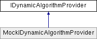

# IDynamicAlgorithmProvider Interface

**Namespace:** `Phoenix.Optimization`

## Overview

This interface is intended to allow extensibility of the way in which the Opt Tool discovers available algorithms, such that [IAlgorithm]() implementations can be generated programatically / dynamically and presented to the Opt Tool as separate algorithms.  
 

## Inheritance



## Declaration

```csharp
interface IDynamicAlgorithmProvider
```

## Description

This interface is intended to allow extensibility of the way in which the Opt Tool discovers available algorithms, such that [IAlgorithm]() implementations can be generated programatically / dynamically and presented to the Opt Tool as separate algorithms.  
 


## Public Member Functions

|Name|Description|
|-----|-----|
|IDictionary< string, [IAlgorithmCatalogEntry]() > |`LoadAlgorithms ()`<br>Generate [IAlgorithmCatalogEntry]() instances for all the algorithms this provider knows how to load. |

## Member Function Documentation

### LoadAlgorithms
```csharp
IDictionary< string, [IAlgorithmCatalogEntry]() > LoadAlgorithms ( )
```

Generate [IAlgorithmCatalogEntry]() instances for all the algorithms this provider knows how to load. The keys in the dictionary should be some unique identifier for the algorithm. Note that this dictionary will be combined with dictionaries from other IDynamicAlgorithmProvider implementations, so there should be a reasonable degree of certainty that the identifier is globally unique. Additionally, the identifiers should be stable between runs, so that the Optimization Tool can reload its state from a saved file. Implemented in MockIDynamicAlgorithmProvider.

**Returns:**

- A catalog of algorithms that are made available by this provider.

## Property Documentation

### LoadAlgorithms()
```csharp
IDictionary< string, [IAlgorithmCatalogEntry]() > LoadAlgorithms ( )
```

Generate [IAlgorithmCatalogEntry]() instances for all the algorithms this provider knows how to load. The keys in the dictionary should be some unique identifier for the algorithm. Note that this dictionary will be combined with dictionaries from other IDynamicAlgorithmProvider implementations, so there should be a reasonable degree of certainty that the identifier is globally unique. Additionally, the identifiers should be stable between runs, so that the Optimization Tool can reload its state from a saved file. Implemented in MockIDynamicAlgorithmProvider.
