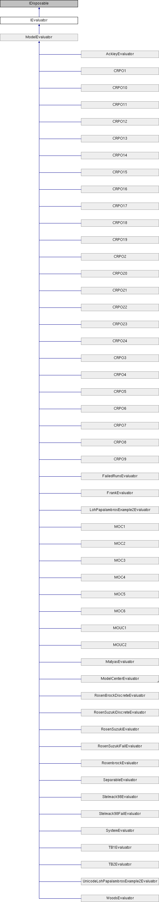

# IEvaluator Interface

**Namespace:** `Phoenix.Optimization`

## Overview

Interface used to define model evaluator used by the test problem infrastructure.  
 

## Inheritance



## Declaration

```csharp
interface IEvaluator
```

## Description

Interface used to define model evaluator used by the test problem infrastructure.  
 


## Public Member Functions

|Name|Description|
|-----|-----|
|[ModelEvaluation]() |`EvaluateModel (object[] designVariables)`<br>Evaluates the model at the given design point. |
|bool |`IsDesignAcceptable (object[] design, AreDesignsEqual areDesignsEqual)`<br>Determines whether design is an acceptable design. |
|void |`SetStartPoint (object[] startValues)`<br>Sets the starting design for the evaluator. |

## Properties
|Name|Description|
|-----|-----|
|List< OptConstraint > | `Constraints [get]`<br>List of constraints defined by the evaluator. |
|int | `DesignVariableCount [get]`<br>Number of design variables specificed by the evaluator. |
|List< DesignVariable > | `DesignVariables [get]`<br>List of design variables defined by the evaluator. |
|object[,] | `GlobalBestDesigns [get]`<br>The global best designs for the evaluator. |
|bool | `HasFailedRuns [get]`<br>Does the evalutor have failed runs? |
|bool | `HasNonSmoothResponses [get]`<br>Does the evaluator have non-smooth responses. |
|string | `Name [get]`<br>Name of the evaluator. |
|int | `NumberOfObjectives [get]`<br>Number of objectives specified. |
|List< Objective > | `Objectives [get]`<br>List of objectives defined by the evaluator. |
|bool | `UsesConstraints [get]`<br>Does the evaluator use constraints? |
|bool | `UsesDiscreteVariables [get]`<br>Does the evaluator use discrete variables? |
|bool | `UsesMinMax [get]`<br>Does the evaluator use a Minimize/Maximize objective? |
|bool | `UsesMultipleObjectives [get]`<br>Does the evaluator specify multiple objectives? |
|bool | `UsesSolveFor [get]`<br>Does the evaluator use the solve for objective? |

## Member Function Documentation

### EvaluateModel
```csharp
ModelEvaluation `EvaluateModel` ( object[] designVariables)
```

Evaluates the model at the given design point. Implemented in AckleyEvaluator, CRPO1, CRPO10, CRPO11, CRPO12, CRPO13, CRPO14, CRPO15, CRPO16, CRPO17, CRPO18, CRPO19, CRPO2, CRPO20, CRPO21, CRPO22, CRPO23, CRPO24, CRPO3, CRPO4, CRPO5, CRPO6, CRPO7, CRPO8, CRPO9, FailedRunsEvaluator, FrankEvaluator, LohPapalambrosExample2Evaluator, MatyasEvaluator, MOC1, MOC2, MOC3, MOC4, MOC5, MOC6, ModelCenterEvaluator, ModelEvaluator, MOUC1, MOUC2, RosenBrockDiscreteEvaluator, RosenbrockEvaluator, RosenSuzukiDiscreteEvaluator, RosenSuzukiEvaluator, RosenSuzukiFailEvaluator, SeparableEvaluator, Stelmack98Evaluator, Stelmack98FailEvaluator, SystemEvaluator, TB1Evaluator, TB2Evaluator, UnicodeLohPapalambrosExample2Evaluator, and WoodsEvaluator.

**Parameters:**

- `designVariables` - Values of the design variables in the order specified.

**Returns:**

- Model evaluation at the specified design point.

### IsDesignAcceptable
```csharp
bool `IsDesignAcceptable` ( object[] design, AreDesignsEqual areDesignsEqual )
```

Determines whether design is an acceptable design. Implemented in AckleyEvaluator, CRPO1, CRPO10, CRPO11, CRPO12, CRPO13, CRPO14, CRPO15, CRPO16, CRPO17, CRPO18, CRPO19, CRPO2, CRPO20, CRPO21, CRPO22, CRPO23, CRPO24, CRPO3, CRPO4, CRPO5, CRPO6, CRPO7, CRPO8, CRPO9, FailedRunsEvaluator, FrankEvaluator, LohPapalambrosExample2Evaluator, MatyasEvaluator, MOC1, MOC2, MOC3, MOC4, MOC5, MOC6, ModelEvaluator, MOUC1, MOUC2, PlyAnglesEvaluator, RosenBrockDiscreteEvaluator, RosenbrockEvaluator, RosenSuzukiDiscreteEvaluator, RosenSuzukiEvaluator, RosenSuzukiFailEvaluator, SeparableEvaluator, Stelmack98Evaluator, Stelmack98FailEvaluator, SystemEvaluator, TB1Evaluator, TB2Evaluator, UnicodeLohPapalambrosExample2Evaluator, and WoodsEvaluator.

**Parameters:**

- `design` - Object array with the values of the design variables in the order specified.
- `areDesignsEqual` - Delate that compares to designs to see if they are equal.

**Returns:**

- Returns true if the given design is either the global optimia, or local optima.

### SetStartPoint
```csharp
void `SetStartPoint` ( object[] startValues)
```

Sets the starting design for the evaluator. Implemented in ModelEvaluator.

**Parameters:**

- `startValues` - An array of values the corresponds to the values of the design variables.

### Constraints
```csharp
List<OptConstraint> Constraints
```

List of constraints defined by the evaluator. Implemented in ModelEvaluator.

### DesignVariableCount
```csharp
int DesignVariableCount
```

Number of design variables specificed by the evaluator. Implemented in ModelEvaluator.

### DesignVariables
```csharp
List<DesignVariable> DesignVariables
```

List of design variables defined by the evaluator. Implemented in ModelEvaluator.

**Returns:**

- List of design varibles

### GlobalBestDesigns
```csharp
object [,] GlobalBestDesigns
```

The global best designs for the evaluator. Implemented in AckleyEvaluator, CRPO1, CRPO10, CRPO11, CRPO12, CRPO13, CRPO14, CRPO15, CRPO16, CRPO17, CRPO18, CRPO19, CRPO2, CRPO20, CRPO21, CRPO22, CRPO23, CRPO24, CRPO3, CRPO4, CRPO5, CRPO6, CRPO7, CRPO8, CRPO9, FailedRunsEvaluator, FrankEvaluator, LohPapalambrosExample2Evaluator, MatyasEvaluator, MOC1, MOC2, MOC3, MOC4, MOC5, MOC6, ModelEvaluator, MOUC1, MOUC2, PlyAnglesEvaluator, RosenBrockDiscreteEvaluator, RosenbrockEvaluator, RosenSuzukiDiscreteEvaluator, RosenSuzukiEvaluator, RosenSuzukiFailEvaluator, SeparableEvaluator, Stelmack98Evaluator, Stelmack98FailEvaluator, SystemEvaluator, TB1Evaluator, TB2Evaluator, UnicodeLohPapalambrosExample2Evaluator, and WoodsEvaluator.

### HasFailedRuns
```csharp
bool HasFailedRuns
```

Does the evalutor have failed runs? Implemented in AckleyEvaluator, CRPO1, CRPO10, CRPO11, CRPO12, CRPO13, CRPO14, CRPO15, CRPO16, CRPO17, CRPO18, CRPO19, CRPO2, CRPO20, CRPO21, CRPO22, CRPO23, CRPO24, CRPO3, CRPO4, CRPO5, CRPO6, CRPO7, CRPO8, CRPO9, FailedRunsEvaluator, FrankEvaluator, LohPapalambrosExample2Evaluator, MatyasEvaluator, MOC1, MOC2, MOC3, MOC4, MOC5, MOC6, ModelEvaluator, MOUC1, MOUC2, PlyAnglesEvaluator, RosenBrockDiscreteEvaluator, RosenbrockEvaluator, RosenSuzukiDiscreteEvaluator, RosenSuzukiEvaluator, RosenSuzukiFailEvaluator, SeparableEvaluator, Stelmack98Evaluator, Stelmack98FailEvaluator, SystemEvaluator, TB1Evaluator, TB2Evaluator, UnicodeLohPapalambrosExample2Evaluator, and WoodsEvaluator.

### HasNonSmoothResponses
```csharp
bool HasNonSmoothResponses
```

Does the evaluator have non-smooth responses. Implemented in AckleyEvaluator, CRPO1, CRPO10, CRPO11, CRPO12, CRPO13, CRPO14, CRPO15, CRPO16, CRPO17, CRPO18, CRPO19, CRPO2, CRPO20, CRPO21, CRPO22, CRPO23, CRPO24, CRPO3, CRPO4, CRPO5, CRPO6, CRPO7, CRPO8, CRPO9, FailedRunsEvaluator, FrankEvaluator, LohPapalambrosExample2Evaluator, MatyasEvaluator, MOC1, MOC2, MOC3, MOC4, MOC5, MOC6, ModelEvaluator, MOUC1, MOUC2, PlyAnglesEvaluator, RosenBrockDiscreteEvaluator, RosenbrockEvaluator, RosenSuzukiDiscreteEvaluator, RosenSuzukiEvaluator, RosenSuzukiFailEvaluator, SeparableEvaluator, Stelmack98Evaluator, Stelmack98FailEvaluator, SystemEvaluator, TB1Evaluator, TB2Evaluator, UnicodeLohPapalambrosExample2Evaluator, and WoodsEvaluator.

### Name
```csharp
string Name
```

Name of the evaluator. Implemented in AckleyEvaluator, CRPO1, CRPO10, CRPO11, CRPO12, CRPO13, CRPO14, CRPO15, CRPO16, CRPO17, CRPO18, CRPO19, CRPO2, CRPO20, CRPO21, CRPO22, CRPO23, CRPO24, CRPO3, CRPO4, CRPO5, CRPO6, CRPO7, CRPO8, CRPO9, FailedRunsEvaluator, FrankEvaluator, LohPapalambrosExample2Evaluator, MatyasEvaluator, MOC1, MOC2, MOC3, MOC4, MOC5, MOC6, ModelEvaluator, MOUC1, MOUC2, PlyAnglesEvaluator, RosenBrockDiscreteEvaluator, RosenbrockEvaluator, RosenSuzukiDiscreteEvaluator, RosenSuzukiEvaluator, RosenSuzukiFailEvaluator, SeparableEvaluator, Stelmack98Evaluator, Stelmack98FailEvaluator, SystemEvaluator, TB1Evaluator, TB2Evaluator, UnicodeLohPapalambrosExample2Evaluator, and WoodsEvaluator.

### NumberOfObjectives
```csharp
int NumberOfObjectives
```

Number of objectives specified. Implemented in ModelEvaluator.

### Objectives
```csharp
List<Objective> Objectives
```

List of objectives defined by the evaluator. Implemented in ModelEvaluator.

### UsesConstraints
```csharp
bool UsesConstraints
```

Does the evaluator use constraints? Implemented in AckleyEvaluator, CRPO1, CRPO10, CRPO11, CRPO12, CRPO13, CRPO14, CRPO15, CRPO16, CRPO17, CRPO18, CRPO19, CRPO2, CRPO20, CRPO21, CRPO22, CRPO23, CRPO24, CRPO3, CRPO4, CRPO5, CRPO6, CRPO7, CRPO8, CRPO9, FailedRunsEvaluator, FrankEvaluator, LohPapalambrosExample2Evaluator, MatyasEvaluator, MOC1, MOC2, MOC3, MOC4, MOC5, MOC6, ModelEvaluator, MOUC1, MOUC2, PlyAnglesEvaluator, RosenBrockDiscreteEvaluator, RosenbrockEvaluator, RosenSuzukiDiscreteEvaluator, RosenSuzukiEvaluator, RosenSuzukiFailEvaluator, SeparableEvaluator, Stelmack98Evaluator, Stelmack98FailEvaluator, SystemEvaluator, TB1Evaluator, TB2Evaluator, UnicodeLohPapalambrosExample2Evaluator, and WoodsEvaluator.

### UsesDiscreteVariables
```csharp
bool UsesDiscreteVariables
```

Does the evaluator use discrete variables? Implemented in AckleyEvaluator, CRPO1, CRPO10, CRPO11, CRPO12, CRPO13, CRPO14, CRPO15, CRPO16, CRPO17, CRPO18, CRPO19, CRPO2, CRPO20, CRPO21, CRPO22, CRPO23, CRPO24, CRPO3, CRPO4, CRPO5, CRPO6, CRPO7, CRPO8, CRPO9, FailedRunsEvaluator, FrankEvaluator, LohPapalambrosExample2Evaluator, MatyasEvaluator, MOC1, MOC2, MOC3, MOC4, MOC5, MOC6, ModelEvaluator, MOUC1, MOUC2, PlyAnglesEvaluator, RosenBrockDiscreteEvaluator, RosenbrockEvaluator, RosenSuzukiDiscreteEvaluator, RosenSuzukiEvaluator, RosenSuzukiFailEvaluator, SeparableEvaluator, Stelmack98Evaluator, Stelmack98FailEvaluator, SystemEvaluator, TB1Evaluator, TB2Evaluator, UnicodeLohPapalambrosExample2Evaluator, and WoodsEvaluator.

### UsesMinMax
```csharp
bool UsesMinMax
```

Does the evaluator use a Minimize/Maximize objective? Implemented in AckleyEvaluator, CRPO1, CRPO10, CRPO11, CRPO12, CRPO13, CRPO14, CRPO15, CRPO16, CRPO17, CRPO18, CRPO19, CRPO2, CRPO20, CRPO21, CRPO22, CRPO23, CRPO24, CRPO3, CRPO4, CRPO5, CRPO6, CRPO7, CRPO8, CRPO9, FailedRunsEvaluator, FrankEvaluator, LohPapalambrosExample2Evaluator, MatyasEvaluator, MOC1, MOC2, MOC3, MOC4, MOC5, MOC6, ModelEvaluator, MOUC1, MOUC2, PlyAnglesEvaluator, RosenBrockDiscreteEvaluator, RosenbrockEvaluator, RosenSuzukiDiscreteEvaluator, RosenSuzukiEvaluator, RosenSuzukiFailEvaluator, SeparableEvaluator, Stelmack98Evaluator, Stelmack98FailEvaluator, SystemEvaluator, TB1Evaluator, TB2Evaluator, UnicodeLohPapalambrosExample2Evaluator, and WoodsEvaluator.

### UsesMultipleObjectives
```csharp
bool UsesMultipleObjectives
```

Does the evaluator specify multiple objectives? Implemented in AckleyEvaluator, CRPO1, CRPO10, CRPO11, CRPO12, CRPO13, CRPO14, CRPO15, CRPO16, CRPO17, CRPO18, CRPO19, CRPO2, CRPO20, CRPO21, CRPO22, CRPO23, CRPO24, CRPO3, CRPO4, CRPO5, CRPO6, CRPO7, CRPO8, CRPO9, FailedRunsEvaluator, FrankEvaluator, LohPapalambrosExample2Evaluator, MatyasEvaluator, MOC1, MOC2, MOC3, MOC4, MOC5, MOC6, ModelEvaluator, MOUC1, MOUC2, PlyAnglesEvaluator, RosenBrockDiscreteEvaluator, RosenbrockEvaluator, RosenSuzukiDiscreteEvaluator, RosenSuzukiEvaluator, RosenSuzukiFailEvaluator, SeparableEvaluator, Stelmack98Evaluator, Stelmack98FailEvaluator, SystemEvaluator, TB1Evaluator, TB2Evaluator, UnicodeLohPapalambrosExample2Evaluator, and WoodsEvaluator.

### UsesSolveFor
```csharp
bool UsesSolveFor
```

Does the evaluator use the solve for objective? Implemented in AckleyEvaluator, CRPO1, CRPO10, CRPO11, CRPO12, CRPO13, CRPO14, CRPO15, CRPO16, CRPO17, CRPO18, CRPO19, CRPO2, CRPO20, CRPO21, CRPO22, CRPO23, CRPO24, CRPO3, CRPO4, CRPO5, CRPO6, CRPO7, CRPO8, CRPO9, FailedRunsEvaluator, FrankEvaluator, LohPapalambrosExample2Evaluator, MatyasEvaluator, MOC1, MOC2, MOC3, MOC4, MOC5, MOC6, ModelEvaluator, MOUC1, MOUC2, PlyAnglesEvaluator, RosenBrockDiscreteEvaluator, RosenbrockEvaluator, RosenSuzukiDiscreteEvaluator, RosenSuzukiEvaluator, RosenSuzukiFailEvaluator, SeparableEvaluator, Stelmack98Evaluator, Stelmack98FailEvaluator, SystemEvaluator, TB1Evaluator, TB2Evaluator, UnicodeLohPapalambrosExample2Evaluator, and WoodsEvaluator.

## Property Documentation

### Constraints
```csharp
List<OptConstraint> Constraints
```

List of constraints defined by the evaluator. Implemented in ModelEvaluator.

### DesignVariableCount
```csharp
int DesignVariableCount
```

Number of design variables specificed by the evaluator. Implemented in ModelEvaluator.

### DesignVariables
```csharp
List<DesignVariable> DesignVariables
```

List of design variables defined by the evaluator. Implemented in ModelEvaluator.

### GlobalBestDesigns
```csharp
object [,] GlobalBestDesigns
```

The global best designs for the evaluator. Implemented in AckleyEvaluator, CRPO1, CRPO10, CRPO11, CRPO12, CRPO13, CRPO14, CRPO15, CRPO16, CRPO17, CRPO18, CRPO19, CRPO2, CRPO20, CRPO21, CRPO22, CRPO23, CRPO24, CRPO3, CRPO4, CRPO5, CRPO6, CRPO7, CRPO8, CRPO9, FailedRunsEvaluator, FrankEvaluator, LohPapalambrosExample2Evaluator, MatyasEvaluator, MOC1, MOC2, MOC3, MOC4, MOC5, MOC6, ModelEvaluator, MOUC1, MOUC2, PlyAnglesEvaluator, RosenBrockDiscreteEvaluator, RosenbrockEvaluator, RosenSuzukiDiscreteEvaluator, RosenSuzukiEvaluator, RosenSuzukiFailEvaluator, SeparableEvaluator, Stelmack98Evaluator, Stelmack98FailEvaluator, SystemEvaluator, TB1Evaluator, TB2Evaluator, UnicodeLohPapalambrosExample2Evaluator, and WoodsEvaluator.

### HasFailedRuns
```csharp
bool HasFailedRuns
```

Does the evalutor have failed runs? Implemented in AckleyEvaluator, CRPO1, CRPO10, CRPO11, CRPO12, CRPO13, CRPO14, CRPO15, CRPO16, CRPO17, CRPO18, CRPO19, CRPO2, CRPO20, CRPO21, CRPO22, CRPO23, CRPO24, CRPO3, CRPO4, CRPO5, CRPO6, CRPO7, CRPO8, CRPO9, FailedRunsEvaluator, FrankEvaluator, LohPapalambrosExample2Evaluator, MatyasEvaluator, MOC1, MOC2, MOC3, MOC4, MOC5, MOC6, ModelEvaluator, MOUC1, MOUC2, PlyAnglesEvaluator, RosenBrockDiscreteEvaluator, RosenbrockEvaluator, RosenSuzukiDiscreteEvaluator, RosenSuzukiEvaluator, RosenSuzukiFailEvaluator, SeparableEvaluator, Stelmack98Evaluator, Stelmack98FailEvaluator, SystemEvaluator, TB1Evaluator, TB2Evaluator, UnicodeLohPapalambrosExample2Evaluator, and WoodsEvaluator.

### HasNonSmoothResponses
```csharp
bool HasNonSmoothResponses
```

Does the evaluator have non-smooth responses. Implemented in AckleyEvaluator, CRPO1, CRPO10, CRPO11, CRPO12, CRPO13, CRPO14, CRPO15, CRPO16, CRPO17, CRPO18, CRPO19, CRPO2, CRPO20, CRPO21, CRPO22, CRPO23, CRPO24, CRPO3, CRPO4, CRPO5, CRPO6, CRPO7, CRPO8, CRPO9, FailedRunsEvaluator, FrankEvaluator, LohPapalambrosExample2Evaluator, MatyasEvaluator, MOC1, MOC2, MOC3, MOC4, MOC5, MOC6, ModelEvaluator, MOUC1, MOUC2, PlyAnglesEvaluator, RosenBrockDiscreteEvaluator, RosenbrockEvaluator, RosenSuzukiDiscreteEvaluator, RosenSuzukiEvaluator, RosenSuzukiFailEvaluator, SeparableEvaluator, Stelmack98Evaluator, Stelmack98FailEvaluator, SystemEvaluator, TB1Evaluator, TB2Evaluator, UnicodeLohPapalambrosExample2Evaluator, and WoodsEvaluator.

### Name
```csharp
string Name
```

Name of the evaluator. Implemented in AckleyEvaluator, CRPO1, CRPO10, CRPO11, CRPO12, CRPO13, CRPO14, CRPO15, CRPO16, CRPO17, CRPO18, CRPO19, CRPO2, CRPO20, CRPO21, CRPO22, CRPO23, CRPO24, CRPO3, CRPO4, CRPO5, CRPO6, CRPO7, CRPO8, CRPO9, FailedRunsEvaluator, FrankEvaluator, LohPapalambrosExample2Evaluator, MatyasEvaluator, MOC1, MOC2, MOC3, MOC4, MOC5, MOC6, ModelEvaluator, MOUC1, MOUC2, PlyAnglesEvaluator, RosenBrockDiscreteEvaluator, RosenbrockEvaluator, RosenSuzukiDiscreteEvaluator, RosenSuzukiEvaluator, RosenSuzukiFailEvaluator, SeparableEvaluator, Stelmack98Evaluator, Stelmack98FailEvaluator, SystemEvaluator, TB1Evaluator, TB2Evaluator, UnicodeLohPapalambrosExample2Evaluator, and WoodsEvaluator.

### NumberOfObjectives
```csharp
int NumberOfObjectives
```

Number of objectives specified. Implemented in ModelEvaluator.

### Objectives
```csharp
List<Objective> Objectives
```

List of objectives defined by the evaluator. Implemented in ModelEvaluator.

### UsesConstraints
```csharp
bool UsesConstraints
```

Does the evaluator use constraints? Implemented in AckleyEvaluator, CRPO1, CRPO10, CRPO11, CRPO12, CRPO13, CRPO14, CRPO15, CRPO16, CRPO17, CRPO18, CRPO19, CRPO2, CRPO20, CRPO21, CRPO22, CRPO23, CRPO24, CRPO3, CRPO4, CRPO5, CRPO6, CRPO7, CRPO8, CRPO9, FailedRunsEvaluator, FrankEvaluator, LohPapalambrosExample2Evaluator, MatyasEvaluator, MOC1, MOC2, MOC3, MOC4, MOC5, MOC6, ModelEvaluator, MOUC1, MOUC2, PlyAnglesEvaluator, RosenBrockDiscreteEvaluator, RosenbrockEvaluator, RosenSuzukiDiscreteEvaluator, RosenSuzukiEvaluator, RosenSuzukiFailEvaluator, SeparableEvaluator, Stelmack98Evaluator, Stelmack98FailEvaluator, SystemEvaluator, TB1Evaluator, TB2Evaluator, UnicodeLohPapalambrosExample2Evaluator, and WoodsEvaluator.

### UsesDiscreteVariables
```csharp
bool UsesDiscreteVariables
```

Does the evaluator use discrete variables? Implemented in AckleyEvaluator, CRPO1, CRPO10, CRPO11, CRPO12, CRPO13, CRPO14, CRPO15, CRPO16, CRPO17, CRPO18, CRPO19, CRPO2, CRPO20, CRPO21, CRPO22, CRPO23, CRPO24, CRPO3, CRPO4, CRPO5, CRPO6, CRPO7, CRPO8, CRPO9, FailedRunsEvaluator, FrankEvaluator, LohPapalambrosExample2Evaluator, MatyasEvaluator, MOC1, MOC2, MOC3, MOC4, MOC5, MOC6, ModelEvaluator, MOUC1, MOUC2, PlyAnglesEvaluator, RosenBrockDiscreteEvaluator, RosenbrockEvaluator, RosenSuzukiDiscreteEvaluator, RosenSuzukiEvaluator, RosenSuzukiFailEvaluator, SeparableEvaluator, Stelmack98Evaluator, Stelmack98FailEvaluator, SystemEvaluator, TB1Evaluator, TB2Evaluator, UnicodeLohPapalambrosExample2Evaluator, and WoodsEvaluator.

### UsesMinMax
```csharp
bool UsesMinMax
```

Does the evaluator use a Minimize/Maximize objective? Implemented in AckleyEvaluator, CRPO1, CRPO10, CRPO11, CRPO12, CRPO13, CRPO14, CRPO15, CRPO16, CRPO17, CRPO18, CRPO19, CRPO2, CRPO20, CRPO21, CRPO22, CRPO23, CRPO24, CRPO3, CRPO4, CRPO5, CRPO6, CRPO7, CRPO8, CRPO9, FailedRunsEvaluator, FrankEvaluator, LohPapalambrosExample2Evaluator, MatyasEvaluator, MOC1, MOC2, MOC3, MOC4, MOC5, MOC6, ModelEvaluator, MOUC1, MOUC2, PlyAnglesEvaluator, RosenBrockDiscreteEvaluator, RosenbrockEvaluator, RosenSuzukiDiscreteEvaluator, RosenSuzukiEvaluator, RosenSuzukiFailEvaluator, SeparableEvaluator, Stelmack98Evaluator, Stelmack98FailEvaluator, SystemEvaluator, TB1Evaluator, TB2Evaluator, UnicodeLohPapalambrosExample2Evaluator, and WoodsEvaluator.

### UsesMultipleObjectives
```csharp
bool UsesMultipleObjectives
```

Does the evaluator specify multiple objectives? Implemented in AckleyEvaluator, CRPO1, CRPO10, CRPO11, CRPO12, CRPO13, CRPO14, CRPO15, CRPO16, CRPO17, CRPO18, CRPO19, CRPO2, CRPO20, CRPO21, CRPO22, CRPO23, CRPO24, CRPO3, CRPO4, CRPO5, CRPO6, CRPO7, CRPO8, CRPO9, FailedRunsEvaluator, FrankEvaluator, LohPapalambrosExample2Evaluator, MatyasEvaluator, MOC1, MOC2, MOC3, MOC4, MOC5, MOC6, ModelEvaluator, MOUC1, MOUC2, PlyAnglesEvaluator, RosenBrockDiscreteEvaluator, RosenbrockEvaluator, RosenSuzukiDiscreteEvaluator, RosenSuzukiEvaluator, RosenSuzukiFailEvaluator, SeparableEvaluator, Stelmack98Evaluator, Stelmack98FailEvaluator, SystemEvaluator, TB1Evaluator, TB2Evaluator, UnicodeLohPapalambrosExample2Evaluator, and WoodsEvaluator.

### UsesSolveFor
```csharp
bool UsesSolveFor
```

Does the evaluator use the solve for objective? Implemented in AckleyEvaluator, CRPO1, CRPO10, CRPO11, CRPO12, CRPO13, CRPO14, CRPO15, CRPO16, CRPO17, CRPO18, CRPO19, CRPO2, CRPO20, CRPO21, CRPO22, CRPO23, CRPO24, CRPO3, CRPO4, CRPO5, CRPO6, CRPO7, CRPO8, CRPO9, FailedRunsEvaluator, FrankEvaluator, LohPapalambrosExample2Evaluator, MatyasEvaluator, MOC1, MOC2, MOC3, MOC4, MOC5, MOC6, ModelEvaluator, MOUC1, MOUC2, PlyAnglesEvaluator, RosenBrockDiscreteEvaluator, RosenbrockEvaluator, RosenSuzukiDiscreteEvaluator, RosenSuzukiEvaluator, RosenSuzukiFailEvaluator, SeparableEvaluator, Stelmack98Evaluator, Stelmack98FailEvaluator, SystemEvaluator, TB1Evaluator, TB2Evaluator, UnicodeLohPapalambrosExample2Evaluator, and WoodsEvaluator.
