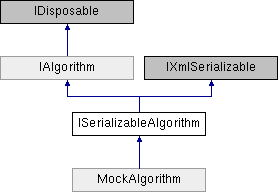

# ISerializableAlgorithm Interface

**Namespace:** `Phoenix.Optimization`

## Overview

Interface that serves as a combination of IAlgorithm and IXmlSerializable to define an Optimization Tool algorithm which provides methods for XML serialization.  
 

## Inheritance



## Declaration

```csharp
interface ISerializableAlgorithm
```

## Description

Interface that serves as a combination of IAlgorithm and IXmlSerializable to define an Optimization Tool algorithm which provides methods for XML serialization.  
 


## Public Member Functions

|Name|Description|
|-----|-----|
|void |`FromXml (string xml)`<br>TODO |
|string |`ToXml ()`<br>TODO |

### Public Member Functions inherited from [IAlgorithm]()
|Name|Description|
|-----|-----|
|void |`RestoreCheckPoint (string saveState)`<br>Restore a specific state of the analysis. |
|void |`Run ()`<br>Initiates execution of the solver. |
|void |`SetConstraints (List< OptConstraint > constraints)`<br>Used by the infrastructure to pass the constraints to the algorithm. |
|void |`SetDesignVariables (List< DesignVariable > designVariables)`<br>Used by the infrastructure to pass the design variables to the algorithm. |
|void |`SetHost (IAlgorithmHost host)`<br>Set the host interface to be used for callbacks. |
|void |`SetObjectives (List< Objective > objectives)`<br>Used by the infrastructure to pass the objectives to the algorithm. |
|bool |`ShowOptionsDialog (IWin32Window owner)`<br>Called to display the algorithms custom options form. |

## Properties
|Name|Description|
|-----|-----|
|string | `Id [get]`<br>A unique string to identify this algorithm. |
|bool | `RequiresProxy [get, set]`<br>Indicates if ProxiedAlgorithm should wrap this upon deserialization. |

### Properties inherited from [IAlgorithm]()
|Name|Description|
|-----|-----|
|string | `Author [get]`<br>String containing the author of the algorithm. |
|string | `Description [get]`<br>String containing the description of the algorithm. |
|string | `DetailsReport [get]`<br>String containing the details report for the problem. |
|string | `HelpFilePath [get]`<br>String containing the relative path to the algorithm's help file. |
|string | `HelpURL [get]`<br>String containing a URL that can be used get further help with the algorithm. |
|string | `IconLocation [get]`<br>String containing the relative path to the algorithm's icon. |
|string | `Keywords [get]`<br>String containing the keywords associated with the algorithm. |
|string | `LicenseFeature [get]`<br>String containing the algorithms FlexLM license feature. |
|int | `MaxNumberOfObjectives [get]`<br>Integer containing the maximum number of objectives supported by the algorithm. |
|string | `Name [get]`<br>String containing the name of the algorithm. |
|AlgorithmNumModelEvaluations | `NumModelEvaluations [get]`<br>AlgorithmNumModelEvaluations indicating how many model evaluations are required for convergence. |
|object | `Options [get, set]`<br>Object containing the options for the algorithm. |
|string | `ReleaseDate [get]`<br>String containing the release date for the algorithm in the format YYYY.MMDD |
|string | `ResultsReport [get]`<br>String containing the results report for the problem. |
|FuzzyBoolean | `SupportsConstraints [get]`<br>FuzzyBoolean stating whether the algorithm supports constraints. |
|FuzzyBoolean | `SupportsDiscreteVariables [get]`<br>FuzzyBoolean stating whether the algorithm supports discrete variables. |
|bool | `SupportsFailedRuns [get]`<br>Boolean stating whether the algorithm is able to handle failed model evaluations. |
|FuzzyBoolean | `SupportsMinMax [get]`<br>FuzzyBoolean stating whether the algorithm supports minimize and maximize objectives. |
|bool | `SupportsMultipleObjectives [get]`<br>Boolean stating whether or not the algorithm supports multiple objectives. |
|FuzzyBoolean | `SupportsNonSmoothResponses [get]`<br>FuzzyBoolean stating whether the algorithm supports non-smooth responses (objectives and constraints). |
|FuzzyBoolean | `SupportsSolveFor [get]`<br>FuzzyBoolean stating whether the algorithm supports the solve for value objective. |
|string | `Version [get]`<br>String containing the version of the algorithm. |

## Member Function Documentation

### FromXml
```csharp
void FromXml ( string xml)
```

TODO Implemented in MockAlgorithm.

### ToXml
```csharp
string ToXml ( )
```

TODO Implemented in MockAlgorithm.

### Id
```csharp
string Id
```

A unique string to identify this algorithm. Implemented in MockAlgorithm.

### RequiresProxy
```csharp
bool RequiresProxy
```

Indicates if ProxiedAlgorithm should wrap this upon deserialization. Implemented in MockAlgorithm.

## Property Documentation

### Id
```csharp
string Id
```

A unique string to identify this algorithm. Implemented in MockAlgorithm.

### RequiresProxy
```csharp
bool RequiresProxy
```

Indicates if ProxiedAlgorithm should wrap this upon deserialization. Implemented in MockAlgorithm.
