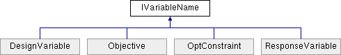

# IVariableName Interface

**Namespace:** `Phoenix.Optimization`

## Overview

Defines an object that has a variable name  
 

## Inheritance



## Declaration

```csharp
interface IVariableName
```

## Description

Defines an object that has a variable name  
 


## Properties
|Name|Description|
|-----|-----|
|string | `Name [get]`<br>The name of the variable |

## Member Function Documentation

### Name
```csharp
string Name
```

The name of the variable Implemented in DesignVariable, Objective, OptConstraint, and ResponseVariable.

## Property Documentation

### Name
```csharp
string Name
```

The name of the variable Implemented in DesignVariable, Objective, OptConstraint, and ResponseVariable.
