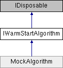

# IWarmStartAlgorithm Interface

**Namespace:** `Phoenix.Optimization`

## Overview

Interface used to implement warm start functionality for an algorithm for the Optimization Tool infrastructure.  
 

## Inheritance



## Declaration

```csharp
interface IWarmStartAlgorithm
```

## Description

Interface used to implement warm start functionality for an algorithm for the Optimization Tool infrastructure.  
 


## Properties
|Name|Description|
|-----|-----|
|WarmStartMethod | `WarmStartMethod [get]`<br>The method used to warm-start this algorithm. |

## Member Function Documentation

### WarmStartMethod
```csharp
WarmStartMethod WarmStartMethod
```

The method used to warm-start this algorithm. Implemented in MockAlgorithm.

## Property Documentation

### WarmStartMethod
```csharp
WarmStartMethod WarmStartMethod
```

The method used to warm-start this algorithm. Implemented in MockAlgorithm.
