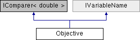

# Objective Class

**Namespace:** `Phoenix.Optimization`

## Overview

Class to hold information about an objective  
 

## Inheritance



## Declaration

```csharp
class Objective
```

## Description

Class to hold information about an objective  
 


## Public Member Functions

|Name|Description|
|-----|-----|
|int |`Compare (double x, double y)`<br>Compares two points with respect to the objective. |
|Objective |`ConvertSolverForToMinMax ()`<br>If this objective is a solvefor value, returns a new equivalent objective using an equation and minimize. |
|override bool |`Equals (object obj)`<br>Determines whether the specified Object is equal to the current Object. |
|bool |`Equals (Objective obj)`<br>Determines whether the specified Objective is equal to the current Objective. |
|override int |`GetHashCode ()`<br>Serves as a hash function for Objective. |
| |`Objective (Objective objective)`<br>Copy constructor |
| |`Objective (string name, double solveForValue)`<br>Creates a new objective with the given name and solve for value |
| |`Objective (string name, double solveForValue, double weight)`<br>Creates a new objective with the given name, solve for value and weight. |
| |`Objective (string name, Goal goal)`<br>Creates a new objective with the given name and goal. |
| |`Objective (string name, Goal goal, double weight)`<br>Creates a new objective with the given name, goal and weight. |
| |`Objective (string name, Goal goal, double weight, double solveForValue)`<br>Creates a new objective with the given name, goal, weight and solve for value. |

## Properties
|Name|Description|
|-----|-----|
|Goal | `Goal [get]`<br>Goal containing the goal of the objeictive. |
|string | `Name [get]`<br>String containing the name of the objective. |
|double | `SolveForValue [get]`<br>Double containing the value to be solved for for the `Goal.SolveFor` goal. |
|double | `Weight [get]`<br>Goal containing the relative weight of the objective. |

### Properties inherited from [IVariableName]()
|Name|Description|
|-----|-----|
|string | `Name [get]`<br>The name of the variable |

## Constructor & Destructor Documentation

### Objective()
```csharp
Objective ( string name, Goal goal )
```

Creates a new objective with the given name and goal. Assumes that the weight of the objective should be 1.0.

**Parameters:**

- `name` - string containing the name of the objective.
- `goal` - Goal containing the goal of the objective.

### Objective()
```csharp
Objective ( Objective objective)
```

Copy constructor

**Parameters:**

- `objective` - Objective to be copied

### Objective()
```csharp
Objective ( string name, double solveForValue )
```

Creates a new objective with the given name and solve for value

**Parameters:**

- `name` - string containing the name of the objective.
- `solveForValue` - double containing the solve for value for the objective.

### Objective()
```csharp
Objective ( string name, double solveForValue, double weight )
```

Creates a new objective with the given name, solve for value and weight. Assumes a goal of `Goal.SolveFor`.

**Parameters:**

- `name` - string containing the name of the objective.
- `solveForValue` - double containing the solve for value for the objective.
- `weight` - double containing the relative weight for the objective.

### Objective()
```csharp
Objective ( string name, Goal goal, double weight )
```

Creates a new objective with the given name, goal and weight.

**Parameters:**

- `name` - string containing the name of the objective.
- `goal` - Goal containing the goal of the objective.
- `weight` - double containing the relative weight for the objective.

### Objective()
```csharp
Objective ( string name, Goal goal, double weight, double solveForValue )
```

Creates a new objective with the given name, goal, weight and solve for value.

**Parameters:**

- `name` - string containing the name of the objective.
- `goal` - Goal containing the goal of the objective.
- `weight` - double containing the relative weight for the objective.
- `solveForValue` - double containing the solve for value for the objective.

## Member Function Documentation

### Compare
```csharp
int Compare ( double x, double y )
```

Compares two points with respect to the objective.

**Parameters:**

- `x` - Test value 1
- `y` - Test value 2

**Returns:**

- `-1` if `x` is better w/r/t the goal. `0` if they are the same w/r/t goal. `1` if `y` is better

### ConvertSolverForToMinMax
```csharp
Objective ConvertSolverForToMinMax ( )
```

If this objective is a `solvefor` value, returns a new equivalent objective using an equation and minimize. Otherwise just returns self.

**Returns:**

- Converted objective

### ConvertToSingleObjective
```csharp
static Objective ConvertToSingleObjective ( List< Objective > objectives)
```

Takes a list of objectives and collapses them down into a single objective using the weights.

**Parameters:**

- `objectives` - A list of objectives

**Returns:**

- A new collapsed Objective, or null if the list is empty

### Equals
```csharp
override bool Equals ( object obj)
```

Determines whether the specified Object is equal to the current Object.

**Parameters:**

- `obj` - The object to compare with the current object.

**Returns:**

- `true` if the specified Object is equal to the current Object; otherwise, `false`.

### Equals
```csharp
bool Equals ( Objective obj)
```

Determines whether the specified Objective is equal to the current Objective.

**Parameters:**

- `obj` - The Objective object to compare with the current Objective.

**Returns:**

- `true` if the specified Objective is equal to the current Objective; otherwise, `false`.

### GetHashCode
```csharp
override int GetHashCode ( )
```

Serves as a hash function for Objective.

**Returns:**

- A hash code for the current Objective.

### operator!=
```csharp
static bool operator!= ( Objective a, Objective b )
```

Determines whether the specified Objective instances are considered not equal.

**Parameters:**

- `a` - The first Objective to compare.
- `b` - The second Objective to compare.

**Returns:**

- `true` if the Objectives are not considered equal; otherwise, `false`.

### operator==
```csharp
static bool operator== ( Objective a, Objective b )
```

Determines whether the specified Objective instances are considered equal.

**Parameters:**

- `a` - The first Objective to compare.
- `b` - The second Objective to compare.

**Returns:**

- `true` if the Objectives are considered equal; otherwise, `false`.

### Goal
```csharp
Goal Goal
```

Goal containing the goal of the objeictive.

### Name
```csharp
string Name
```

String containing the name of the objective.

Implements [IVariableName]().

### SolveForValue
```csharp
double SolveForValue
```

Double containing the value to be solved for for the `Goal.SolveFor` goal.

### Weight
```csharp
double Weight
```

Goal containing the relative weight of the objective. Used for multi-objective problems and ignored for single objetive problems.

## Property Documentation

### Goal
```csharp
Goal Goal
```

Goal containing the goal of the objeictive.

### Name
```csharp
string Name
```

String containing the name of the objective.

Implements [IVariableName]().

### SolveForValue
```csharp
double SolveForValue
```

Double containing the value to be solved for for the Goal.SolveFor goal.

### Weight
```csharp
double Weight
```

Goal containing the relative weight of the objective. Used for multi-objective problems and ignored for single objective problems.
