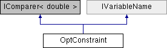

# OptConstraint Class

**Namespace:** `Phoenix.Optimization`

## Overview

Class to hold contraint information  
 

## Inheritance



## Declaration

```csharp
class OptConstraint
```

## Description

Class to hold contraint information  
 


## Public Member Functions

|Name|Description|
|-----|-----|
|int |`Compare (double x, double y)`<br>Compares to values to see which violates the constraint worse. |
|override bool |`Equals (object obj)`<br>Determines whether the specified Object is equal to the current Object. |
|bool |`Equals (OptConstraint constraint)`<br>Determines whether the specified OptConstraint is equal to the current OptConstraint. |
|double |`GetConstraintViolation (double p)`<br>Given a particular value, returns an amount by which the constraint is violated. |
|override int |`GetHashCode ()`<br>Serves as a hash function for OptConstraint. |
| |`OptConstraint (OptConstraint constraint)`<br>Copy constructor to create a new constraint from an existing constraint |
| |`OptConstraint (string name, double lowerBound, double upperBound)`<br>Create a new constraint with the given name, lower and upper bound. |

## Properties
|Name|Description|
|-----|-----|
|double | `LowerBound [get]`<br>Lower bound of the constraint or NaN if no lower bound exists. |
|string | `Name [get]`<br>Name of the constraint |
|double | `UpperBound [get]`<br>Upper bound of constraint or NaN if no upper bound exists. |

### Properties inherited from [IVariableName]()
|Name|Description|
|-----|-----|
|string | `Name [get]`<br>The name of the variable |

## Constructor & Destructor Documentation

### OptConstraint()
```csharp
OptConstraint ( OptConstraint constraint)
```

Copy constructor to create a new constraint from an existing constraint

**Parameters:**

- `constraint` - Constraint to be copied

### OptConstraint()
```csharp
OptConstraint ( string name, double lowerBound, double upperBound )
```

Create a new constraint with the given name, lower and upper bound. At least one bound must be specified. If a bound is not specified, it should be set to NaN.

**Parameters:**

- `name` - Name of the constraint.
- `lowerBound` - Lower bound of the constraint, or NaN if no lower constraint.
- `upperBound` - Upper bound of the constraint, or NaN if no upper constraint.

## Member Function Documentation

### Compare
```csharp
int Compare ( double x, double y )
```

Compares to values to see which violates the constraint worse.

**Parameters:**

- `x` - Test value 1
- `y` - Test value 2

**Returns:** -1 if x violates less, 0 if they violate the same, 1 if x violates it more

### Equals
```csharp
override bool Equals ( object obj)
```

Determines whether the specified Object is equal to the current Object.

**Parameters:**

- `obj` - The object to compare with the current object.

**Returns:**

- true if the specified Object is equal to the current Object; otherwise, false.

### Equals
```csharp
bool Equals ( OptConstraint constraint)
```

Determines whether the specified OptConstraint is equal to the current OptConstraint.

**Parameters:**

- `constraint` - The OptConstraint object to compare with the current OptConstraint.

**Returns:**

- true if the specified OptConstraint is equal to the current OptConstraint; otherwise, false.

### GetConstraintViolation
```csharp
double GetConstraintViolation ( double p)
```

Given a particular value, returns an amount by which the constraint is violated. If the constraint is not violated, returns 0. If it is violated, always returns a positive value.

**Parameters:**

- `p` - The value to test

**Returns:**

- The value of the constraint violation

### GetHashCode
```csharp
override int GetHashCode ( )
```

Serves as a hash function for OptConstraint.

**Returns:**

- A hash code for the current OptConstraint.

### operator!=
```csharp
static bool operator!= ( OptConstraint a, OptConstraint b )
```

Determines whether the specified OptConstraint instances are considered not equal.

**Parameters:**

- `a` - The first OptConstraint to compare.
- `b` - The second OptConstraint to compare.

**Returns:**

- true if the OptConstraints are not considered equal; otherwise, false.

### operator==
```csharp
static bool operator== ( OptConstraint a, OptConstraint b )
```

Determines whether the specified OptConstraint instances are considered equal.

**Parameters:**

- `a` - The first OptConstraint to compare.
- `b` - The second OptConstraint to compare.

**Returns:**

- true if the OptConstraints are considered equal; otherwise, false.

### LowerBound
```csharp
double LowerBound
```

Lower bound of the constraint or NaN if no lower bound exists.

### Name
```csharp
string Name
```

Name of the constraint

Implements IVariableName.

### UpperBound
```csharp
double UpperBound
```

Upper bound of constraint or NaN if no upper bound exists.

## Property Documentation

### LowerBound
```csharp
double LowerBound
```

Lower bound of the constraint or NaN if no lower bound exists.

### Name
```csharp
string Name
```

Name of the constraint

Implements IVariableName.

### UpperBound
```csharp
double UpperBound
```

Upper bound of constraint or NaN if no upper bound exists.
