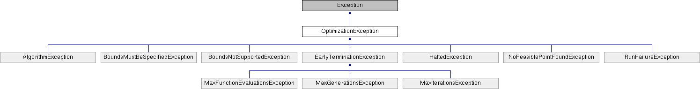

# OptimizationException Class

**Namespace:** `Phoenix.Optimization`

## Overview

Represents an exception that happened in the solver.  
 

## Inheritance



## Declaration

```csharp
class OptimizationException
```

## Description

Represents an exception that happened in the solver.  
 


## Public Member Functions

|Name|Description|
|-----|-----|
| |`OptimizationException ()`<br>Initializes a new instance of the OptimizationException class. |
| |`OptimizationException (string msg)`<br>Initializes a new instance of the OptimizationException class with a specified error message. |
| |`OptimizationException (string msg, Exception inner)`<br>Initializes a new instance of the OptimizationException class with a specified error message and a reference to the inner exception that is the cause of this exception. |

## Constructor & Destructor Documentation

### OptimizationException()
```csharp
OptimizationException ( )
```

Initializes a new instance of the OptimizationException class.

### OptimizationException()
```csharp
OptimizationException ( string msg)
```

Initializes a new instance of the OptimizationException class with a specified error message.

**Parameters:**

- `msg` - Message for the exception

### OptimizationException()
```csharp
OptimizationException ( string msg, Exception inner )
```

Initializes a new instance of the OptimizationException class with a specified error message and a reference to the inner exception that is the cause of this exception.

**Parameters:**

- `msg` - The error message that explains the reason for the exception.
- `inner` - The exception that is the cause of the current exception, or a null reference (Nothing in Visual Basic) if no inner exception is specified.

### OptimizationException()
```csharp
OptimizationException ( `SerializationInfo` info, `StreamingContext` context )
```

Initializes a new instance of the OptimizationException class with serialized data.

**Parameters:**

- `info` - The `SerializationInfo` that holds the serialized object data about the exception being thrown.
- `context` - The `StreamingContext` that contains contextual information about the source or destination.

## Property Documentation

### OptimizationException()
```csharp
OptimizationException ( )
```

Initializes a new instance of the OptimizationException class.

### OptimizationException()
```csharp
OptimizationException ( string msg)
```

Initializes a new instance of the OptimizationException class with a specified error message.

### OptimizationException()
```csharp
OptimizationException ( string msg, Exception inner )
```

Initializes a new instance of the OptimizationException class with a specified error message and a reference to the inner exception that is the cause of this exception.

### OptimizationException()
```csharp
OptimizationException ( `SerializationInfo` info, `StreamingContext` context )
```

Initializes a new instance of the OptimizationException class with serialized data.
