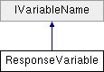

# ResponseVariable Class

**Namespace:** `Phoenix.Optimization`

## Overview

Class to hold information about a design variable  
 

## Inheritance



## Declaration

```csharp
class ResponseVariable
```

## Description

Class to hold information about a design variable  
 


## Public Member Functions

|Name|Description|
|-----|-----|
| |`ResponseVariable (string name, bool isNameInMC, bool isDuplicated, bool isItOutput)`<br>Creates new a variable with the given name and status of presence in MC |
|void |`UpdateMe (string name, bool isNameInMc, bool isItOutput)`<br> |

## Properties
|Name|Description|
|-----|-----|
|string | `ErrText [get]`<br> |
|bool | `HasError [get]`<br> |
|int | `Index [get, set]`<br> |
|bool | `IsDuplicated [get, set]`<br>summary> Gets a value indicating whether the variable "HasError" /summary> |
|bool | `IsItOutput [get, set]`<br> |
|bool | `IsNameInMc [get, set]`<br>summary> Gets a or sets value indicating whether the "IsDuplicated" has a #. |
|bool | `IsSelected [get, set]`<br>summary> Gets or sets a reference to "IsNameInMc" /summary> |
|string | `Name [get, set]`<br>Name of the design variable |

### Properties inherited from [IVariableName]()
|Name|Description|
|-----|-----|
|string | `Name [get]`<br>The name of the variable |

## Constructor & Destructor Documentation

### ResponseVariable()
```csharp
ResponseVariable ( string name, bool isNameInMC, bool isDuplicated, bool isItOutput )
```

Creates new a variable with the given name and status of presence in MC summary> Gets a reference to "Index" /summary>

**Parameters:**

- `name` - name
- `isNameInMC` - does MC has this variable name

## Member Function Documentation

### IsDuplicated
```csharp
bool IsDuplicated
```

summary> Gets a value indicating whether the variable "HasError" /summary>

### IsNameInMc
```csharp
bool IsNameInMc
```

summary> Gets a or sets value indicating whether the "IsDuplicated" has a #. /summary>

### IsSelected
```csharp
bool IsSelected
```

summary> Gets or sets a reference to "IsNameInMc" /summary>

### Name
```csharp
string Name
```

Name of the design variable summary> Gets or sets a reference to "IsSelected" /summary>

Implements IVariableName.

## Property Documentation

### IsDuplicated
```csharp
bool IsDuplicated
```

summary> Gets a value indicating whether the variable "HasError" /summary>

### IsNameInMc
```csharp
bool IsNameInMc
```

summary> Gets a or sets value indicating whether the "IsDuplicated" has a #. /summary>

### IsSelected
```csharp
bool IsSelected
```

summary> Gets or sets a reference to "IsNameInMc" /summary>

### Name
```csharp
string Name
```

Name of the design variable summary> Gets or sets a reference to "IsSelected" /summary>

Implements IVariableName.
