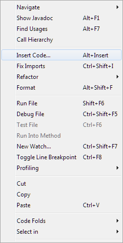

# How to create a Java Algorithm

The following instructions are for creating a Java algorithm using the NetBeans IDE. NetBeans can be downloaded for free from [netbeans.org](http://netbeans.org/downloads/).

## Creating a new Algorithm project using NetBeans

1. Create a new project for the Java algorithm by selecting **File > New Project** from the **NetBeans** menu.

   

2. Under **Categories**, select **Java**. Then under **Projects**, select **Java Class Library**, and then press the **Next** button.

   

3. Enter the name of the project and the save location, and then press the **Finish** button.

   

4. Right-click on **Libraries** and select **Add JAR/Folder**.

   

5. Locate *PHXSolverInfrastructure.jar* in the **Algorithm Developer Tools** directory. Typically: `"C:\Program Files\Phoenix Integration\Algorithm Developer Tools"`

   

6. Right-click on **Source Packages** and select **New > Java Class**.

   

7. Name the algorithm class name and specify its package, then press the **Finish** button.

   

8. In the algorithm file, add:

   ```java
   implements com.phoenix_int.optimizationtool.IAlgorithm
   ```

   after the class name, e.g.,

   

9. Right-click on **IAlgorithm** and select **Insert Code**, then **Implement Method**:

   

   

10. Click the checkbox next to **IAlgorithm** and **IDisposable**, then click the **Generate** button.

    

11. It is recommended that each algorithm have its own **GuidAttribute** to uniquely identify the algorithm. To add a **GuidAttribute** to the algorithm, place attibute before the class definition.

    ```java
    ...
    @GuidAttribute("C247D109-9522-49cd-8597-EB29EA042DFD")
    public class Algorithm : IAlgorithm
    {
    ...
    ```

    

    New GUIDs can be generated using Create a GUID or some other similar tool.

## Conclusion

The base class for the Java algorithm has now been implemented. The rest of the guide is based on .NET, but the major differences for Java are that properties use **get *[property name]()*** and methods start with lowercase letters. Java algorithms install to the same location as the .NET algorithms, and the build file can be modified to move the algorithm to the correct location using the ant copy task.

### Add Manifest File for Algorithm

A manifest file must be added to tell the Optimization Tool which JAR files should be searched for implementations of [`IAlgorithm`](../api/Namespaces/NamespaceList/Phoenix/Optimization/IAlgorithm.md). To add the manifest:

1. Right-click on the project in NetBeans and select **New > Other** from the context menu.

2. Select **Other** under *Categories:* and **Empty File** under *File Types:* and press the **Next** button.

3. Name the file *manifest.phx* and press **Finish**.

4. The file should be created in the project's base directory. Open the manifest file and enter the name of the JAR file output by the algorithm project. A single manifest file can specify multiple files that contain [`IAlgorithm`](../api/Namespaces/NamespaceList/Phoenix/Optimization/IAlgorithm.md) implementations, but only one file name should be specified per line.

### Adding Algorithm Copy to the Java Algorithm Build Process

The algorithm can be moved to a location where the Optimization Tool can locate it automatically by adding the following code to the algorithm's *build.xml*.

```xml
<!-- The following line specifies documents for Windows XP. 
     For Windows Vista and Windows 7, use "${env.USERPROFILE}\Documents". -->
<property name="documents" value="${env.USERPROFILE}\My Documents" />
<!-- Changed SampleAlgorithm below to be the desired project directory name. -->
<property name="algorithmDir" value="${documents}\Optimization Tool\algorithms\SampleAlgorithm" />
<target name="-post-jar" depends="-copy-to-user, -copy-to-artifacts" />
<target name="-copy-to-user"/>
<echo message="Copying dist directory to user algorithms dir" />
<copy overwrite="true" file="${dist.jar}" todir="${algorithmDir}" />
<copy overwrite="true" file="icon.ico" todir="${algorithmDir}" />
<copy overwrite="true" file="manifest.phx" todir="${algorithmDir}" />
<copy overwrite="true" todir="${algorithmDir}\lib" />
<fileset dir="dist\lib" />
</copy>
<copy overwrite="true" todir="${algorithmDir}\help" />
<fileset dir="help" />
</copy>
</target>
```
