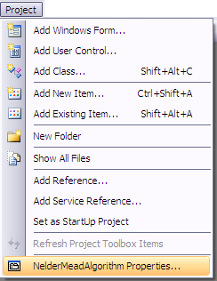
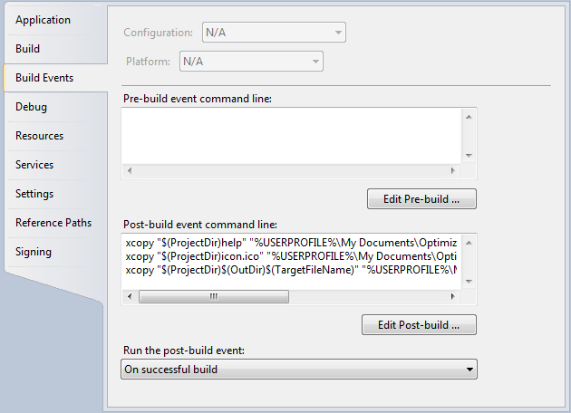

# How to create a .Net Algorithm Project

All that is required of an algorithm by the Optimization Tool is that it implements the [`IAlgorithm`](../api/Namespaces/NamespaceList/Phoenix/Optimization/IAlgorithm.md) interface. Algorithm templates have been included for C#, Visual Basic, and C++ to further simplify the process.

1. Select **File > New > Project** from the **File** menu in Visual Studio, or select **New Project** from the **File** menu in Visual Studio or Visual Studio Express.

1. Select the `PHXAlgorithm` template, enter your algorithm's name, and click the **OK** button.

The project template creates the files and references for an algorithm. The template includes:

- *Algorithm* (.cs, .vb or .cpp, depending on language) - implements the [`IAlgorithm`](../api/Namespaces/NamespaceList/Phoenix/Optimization/IAlgorithm.md) interface

- *manifest.phx* - lists the names of the DLLs containing implementations of [`IAlgorithm`](../api/Namespaces/NamespaceList/Phoenix/Optimization/IAlgorithm.md) in the same directory as the manifest file. Only files specified in the manifest will be loaded. A single manifest file can specify multiple files that contain [`IAlgorithm`](../api/Namespaces/NamespaceList/Phoenix/Optimization/IAlgorithm.md) implementations, but only one file name should be specified per line

- *icon.ico* - which is the icon displayed for the algorithm

- *UIStrings.resx* - which is an empty resource file which can be used for internationalization of the algorithm

- *help/index.html* - which is an empty help file for the algorithm

It is recommended that each algorithm have its own [`GuidAttribute`](https://docs.microsoft.com/en-us/dotnet/api/system.runtime.interopservices.guidattribute) to uniquely identify the algorithm. To add a `GuidAttribute` to the algorithm, place attibute before the class definition.

**C#**

```csharp
...
[System.Runtime.InteropServices.GuidAttribute("C247D109-9522-49cd-8597-EB29EA042DFD")]
public class Algorithm : IAlgorithm
{
...
```

New GUIDs can be generated using **Create GUID** from the **Tools** menu.

## Adding Algorithm Move to Pre-Build Event

1. Select *[algorithm project name] Properties* from the **Project** menu to open that algorithm's project properties.

   

2. Under **Build Events**, add the following to *Post-build event command line*:

   **C#**
   ```batch
   xcopy "$(ProjectDir)$(OutDir)*.*" "%USERPROFILE%\My Documents\Optimization Tool\algorithms\$(ProjectName)" /s /y /i
   xcopy "$(ProjectDir)help" "%USERPROFILE%\My Documents\Optimization Tool\algorithms\$(ProjectName)\help" /s /y /i 
   xcopy "$(ProjectDir)*.ico" "%USERPROFILE%\My Documents\Optimization Tool\algorithms\$(ProjectName)\" /y
   ```

   

3. The next time the Optimization Tool plug-in is invoked, the algorithm will be available for use.

## Add Manifest File for Algorithm

A manifest file must be added to tell the Optimization Tool which `.dll` files should be searched for implementations of [`IAlgorithm`](../api/Namespaces/NamespaceList/Phoenix/Optimization/IAlgorithm.md). To add the manifest:

1. Right-click on the project in NetBeans and select **New > Other** from the context menu.

2. Select **Other** under *Categories:* and **Empty File** under *File Types:* and press the **Next** button.

3. Name the file *manifest.phx* and press **Finish**.

The file should be created in the project's base directory. Open the manifest file and enter the name of the `.dll` file output by the algorithm project. A single manifest file can specify multiple files that contain [`IAlgorithm`](../api/Namespaces/NamespaceList/Phoenix/Optimization/IAlgorithm.md) implementations, but only one file name should be specified per line.
