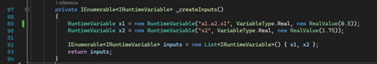
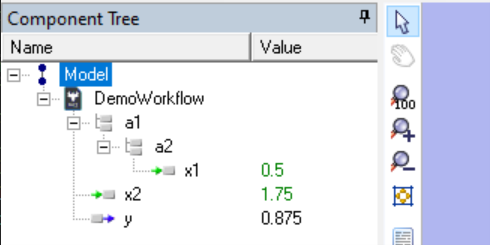
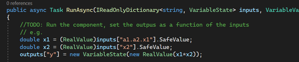
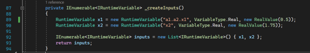
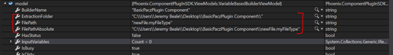
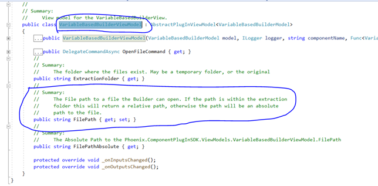
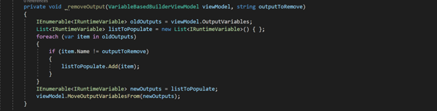

# Frequently asked questions

This page provides answers to frequently asked questions about developing PACZ component plug-ins.

## Variables and data types

### Q1: How do I programmatically define a ModelCenter assembly in the component tree?

**A1:** Write nested variable names using "." separators:



- ModelCenter takes care of assembly creation automatically:  
    
- Then use the same name in the `RunAsync` method to access the nested variable:  
    

### Q2: What characters are allowed for plugin variable names?

**A2:** PACZ variables use the same convention as [Java variables](https://docs.oracle.com/javase/tutorial/java/nutsandbolts/variables.html), except dollar signs are not supported.

- Essentially alphanumeric + underscore, but the first character must be either a letter or underscore
- Periods are only supported as the separator between different levels of a hierarchy
- Spaces, punctuation, and special characters are not allowed

### Q3: How do I access value and default value from the runner context?

**A3:** Access both read-only values as follows:



- Accessing `DefaultValue` is done with integer index rather than name. The user must search (using LINQ or a traditional iterator) through the available indices to find the desired name/DefaultValue. You are technically reading directly from the PACZ file created during the Builder context
- Note that `Value` can only be accessed from the Runner context. There is no access to `Value` from the Builder context
- In the Builder context, only `DefaultValue` can be set, which is later copied to create the variable's `Value`. This copy process is the responsibility of the host process, such as ModelCenter.

### Q4: How do I create an array variable?

**A4:** Using a two-item Boolean array as an example:

```C#
bool[] val = { true, false };  
BooleanArrayValue booleanArrayValue = val;  
RuntimeVariable boolVar = new RuntimeVariable("bool_arr_var", VariableType.BooleanArray, booleanArrayValue);  
```

## File and path handling

### Q5: Is it possible to query relative path from inside the plugin?

**A5:** The plugin's `model` object is aware of both relative and absolute paths:



Note that the `FilePath` property changes depending on whether the path is inside or outside the extraction folder:



## Variable management

### Q6: How do I remove a single input/output variable from the model?

**A6:** Create a function like the following: `_removeOutput(viewModel, "x2");`



```C#
private void _removeOutput(VariableBasedBuilderViewModel viewModel, string outputToRemove)  
{  
    IEnumerable<IRuntimeVariable> oldOutputs = viewModel.OutputVariables;
    List<IRuntimeVariable> listToPopulate = new List<IRuntimeVariable>() { };
    foreach (var item in oldOutputs)
    {
        if (item.Name != outputToRemove)
        {
            listToPopulate.Add(item);
        }
    }
    IEnumerable<IRuntimeVariable> newOutputs = listToPopulate;
    viewModel.MoveOutputVariablesFrom(newOutputs);
}
```

### Q7: How do I define a file as an output variable?

**A7:** During output list construction you would have:

```C#
private IEnumerable<IRuntimeVariable> _createOutputs()
{
    RuntimeVariable y = new RuntimeVariable("y", VariableType.Real, new RealValue(0.01));
    RuntimeVariable outvar = new RuntimeVariable("NASTRANMAP", VariableType.File, FileValue.CreateFromString(null, null, "c:\\thermal\\stress\\case1.txt", null));

    IEnumerable<IRuntimeVariable> outputs = new List<IRuntimeVariable>() { y, outvar };
    return outputs;
}
```

During execution time:

```C#
public async Task RunAsync(IReadOnlyDictionary<string, VariableState> inputs, VariableValueScope outputs, CancellationToken cancellation)
{
    //TODO: Run the component, set the outputs as a function of the inputs
    // e.g.
    double x1 = (RealValue)inputs["a1.a2.x1"].SafeValue;
    double x2 = (RealValue)inputs["x2"].SafeValue;
    outputs["y"] = new VariableState(new RealValue(x1*x2));

    FileValue outvarOld = (FileValue) outputs["NASTRANMAP"].SafeValue; 
    outputs["NASTRANMAP"] = new VariableState(FileValue.ReadFromFile(outvarOld.OriginalFileName));

    await Task.CompletedTask;
}
```

### Q8: How do I determine the type of an input variable at runtime?

**Question:** From the runner context, I can iterate through input variables using `foreach (var key in inputs.Keys)`. I need to determine whether each input is type string or type real. I currently have `(StringValue)inputs[key].SafeValue`. That crashes when it is a real. Is there a way to check what type of input it is?

**A8:** There are several ways, depending on your use case.

The simplest is to just use `SafeValue.VaraibleType`, which is an enumeration of all the possible types (`Integer`, `Real`, `String`, `Boolean`, `File`, `IntegerArray`, `RealArray`, `StringArray`, `BooleanArray`, `FileArray`).

You can also use the safe type conversion capabilities of C# such as `inputs[key].SafeValue As StrinValue`, which returns the converted value
or `null` if it is not the correct type.

### Q9: How do I create a multi-dimensional array?

**A9:** Example using integers:

```C#
long[,] intArr = new long[3, 4] {
   {0, 1, 2, 3} ,   /*  initializers for row indexed by 0 */
   {4, 5, 6, 7} ,   /*  initializers for row indexed by 1 */
   {8, 9, 10, 11}   /*  initializers for row indexed by 2 */
};
IntegerArrayValue intArrVal = new IntegerArrayValue(intArr);
RuntimeVariable x3 = new RuntimeVariable("x3", VariableType.IntegerArray, intArrVal);
```

### Q10: How do I add a description to an `IRuntimeVariable` instance?

**A10:** See the `x3` variable definition in the [BasicPaczPlugin example](examples.md#builder-ui--basicpaczpluginbuilderuics).
