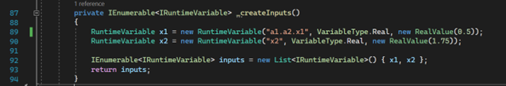

# Frequently Asked Questions

## Q1. How do I programmatically define a ModelCenter assembly in the Component Tree?

**A1.** Write nested variable names using "`.`" separators:


ModelCenter takes care of assembly creation automatically:


Then use the same name in the `RunAsync` method to access the nested variable:


## Q2. What characters are allowed for plugin variable names?

**A2.** ModelCenter variables use the same convention as Java variables, except dollar signs (`$`) are not supported.

Essentially alphanumeric + underscore, but first character must be either a letter or underscore.

Periods are only supported as the separator between different levels of a hierarchy.

Spaces, punctuation, and special characters are not allowed.

For more information, see https://docs.oracle.com/javase/tutorial/java/nutsandbolts/variables.html.

## Q3. How do I access Value and DefaultValue from the Runner context?

**A3.** Access both read-only values as follows:



Accessing `DefaultValue` is done with integer index rather than name. The user must search (LINQ function or traditional iterator) through the available indices to find the desired name / `DefaultValue`. You are technically reading directly from the PACZ file created during the Builder context.

Note that `Value` can only be accessed from the Runner context. There is no access to `Value` from the Builder context. In the Builder context, only `DefaultValue` can be set, which is later copied to create the variable's `Value`. This copy process occurs in ModelCenter’s core process outside the Plug-In environment.

## Q4. How do I create an array variable?

**A4.** Using a two-item boolean array as an example:

```java
bool[] val = { true, false };  
BooleanArrayValue booleanArrayValue = val;  
RuntimeVariable boolVar = new RuntimeVariable("bool_arr_var", VariableType.BooleanArray, booleanArrayValue);  

```

## Q5. Is it possible to query relative path from inside the plugin?

**A5.** The plugin's "model" object is aware of both relative and absolute paths:


Note that the "FilePath" property will change depending on whether the path is inside or outside the extraction folder:


## Q6. How do I remove a single input/output variable from the model?

**A6.** Call the following function as follows: `_removeOutput(viewModel, "x2");`


```java
private void _removeOutput(VariableBasedBuilderViewModel viewModel, string outputToRemove)  
{  
	IEnumerable<IRuntimeVariable> oldOutputs = viewModel.OutputVariables;
	List<IRuntimeVariable> listToPopulate = new 	List<IRuntimeVariable>() { };
	foreach (var item in oldOutputs)
	{
		if (item.Name != outputToRemove)
		{
			listToPopulate.Add(item);
		}
	}
	IEnumerable<IRuntimeVariable> newOutputs = listToPopulate;
	viewModel.MoveOutputVariablesFrom(newOutputs);
}

```

## Q7. How do I define a file as an output variable?

**A7.** During output list construction you would have:

```java
private IEnumerable<IRuntimeVariable> _createOutputs()
{
	RuntimeVariable y = new RuntimeVariable("y", VariableType.Real, new RealValue(0.01));
	RuntimeVariable outvar = new RuntimeVariable("NASTRANMAP", VariableType.File, FileValue.CreateFromString(null, null, "c:\\thermal\\stress\\case1.txt", null));

	IEnumerable<IRuntimeVariable> outputs = new List<IRuntimeVariable>() { y, outvar };
	return outputs;
}

```

During execution time you would have:

```java
public async Task RunAsync(IReadOnlyDictionary<string, VariableState> inputs, VariableValueScope outputs, CancellationToken cancellation)
{
	//TODO: Run the component, set the outputs as a function of the inputs
	// e.g.
	double x1 = (RealValue)inputs["a1.a2.x1"].SafeValue;
	double x2 = (RealValue)inputs["x2"].SafeValue;
	outputs["y"] = new VariableState(new RealValue(x1*x2));

	FileValue outvarOld = (FileValue) outputs["NASTRANMAP"].SafeValue; 
	outputs["NASTRANMAP"] = new VariableState(FileValue.ReadFromFile(outvarOld.OriginalFileName));

	await Task.CompletedTask;
	//throw new NotImplementedException("Run method has not been implemented.");
}

```

## Q8. From the runner context, I can iterate through input variables using `foreach (var key in inputs.Keys)`. I need to determine whether each input is type string or type real. I currently have `(StringValue)inputs[key].SafeValue`. That crashes when it is a real. Is there a way to check what type of input it is?

**A8.** There is a method `SafeValue.GetModelCenterType`. It returns a string which is either "string" or "double".

## Q9. How to create a multi-dimensional ModelCenter array?

**A9.** Example using integers:

```java
long[,] intArr = new long[3, 4] {
   {0, 1, 2, 3} ,   /*  initializers for row indexed by 0 */
   {4, 5, 6, 7} ,   /*  initializers for row indexed by 1 */
   {8, 9, 10, 11}   /*  initializers for row indexed by 2 */
};
IntegerArrayValue intArrVal = new IntegerArrayValue(intArr);
RuntimeVariable x3 = new RuntimeVariable("x3", VariableType.IntegerArray, intArrVal);

```

## Q10. How to add a description to an IRuntimeVariable instance?

**A10.** See "x3" variable definition in the `BasicPaczPlugin` example (provided).