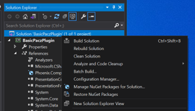
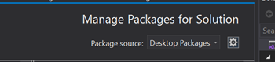
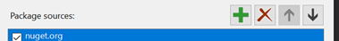
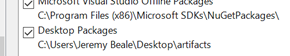
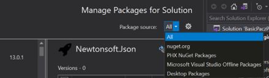
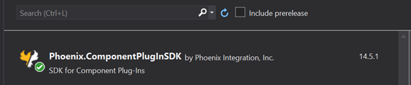

# Getting Started (.NET)

<a id="install_testui"></a>
## Install the TestUI Application

1. Start from the "artifacts" folder in the `CAMpluginSDK` zip file.
1. Move the downloaded zip file to your development machine.
1. Locate the "TestUI" folder which contains the `TestUI.exe` application needed later. This location will later be referred to as `TestUI_Install_Directory`.

```
NOTE: The TestUI is not a production tool. It is meant to be used merely as a testing and troubleshooting tool.
```

## Configure Visual Studio to use Repository

1. Inside Visual Studio 2019, right-click the solution item in Solution Explorer. Then select the option for "Manage NuGet Packages for Solution":<br>

1. Click the gear icon to bring up settings:<br>

1. Click the **+** icon to add a new package source:<br>

1. Change the *Source* text field to point to the "artifacts" folder in the `CAMpluginSDK` zip file. Also change the name to "Desktop Packages" (or any other name).<br>

1. After accepting changes, you should now see "Desktop Packages" as an option in the Package Source dropdown menu:<br>

1. Click "Install" for `Phoenix.ComponentPlugInSDK` for Visual Studio:<br>


## Install the Component Plug-In Wizard for Visual Studio

```
NOTE: Requires Visual Studio 2019.
```

1. Adjacent to the TestUI folder downloaded in [
Install the TestUI Application](#install_testui) is the `ComponentPlugInSDKTemplate` folder.
1. Double-click the `Phoenix.ComponentPlugInSDKTemplateWizard.vsix` file.
1. Complete the VSIX Installer Wizard.

## Create a Plug-In Project

1. In Visual Studio, create a new Project.
1. On the "Create a new project" page:
    1. Select the template that was installed earlier: "Pacz Plug-In Template".
    1. Click **Next**.
1. On the "Configure your new project" page:
    1. Enter the Project name. This name will be used as the default namespace and plug-in name.<br>This name will be referred to as `Name` throughout this document.
    1. Choose the project location.
    1. For Framework, choose at least *.NET Framework 4.6.2*
    1. Click **Create**.
1. On the "New Pacz Plug-In Project Wizard" dialog:
    1. Choose "Variable Based".
    1. Click **OK**.

Visual Studio will create a new project for you.
```
NOTE: Visual Studio 2019 has a bug where the project may take some time before building as it resolves the package dependencies. If the project references do not show "Phoenix.ComponentPlugInSDK", try the following steps to fix references:
    
    1. Right-click the solution in Solution Explorer.
    2. Choose "Restore NuGet Packages".
    3. Close and reopen the solution.
```