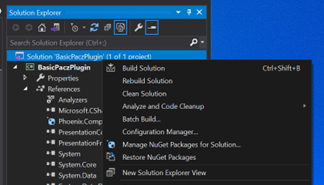
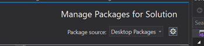
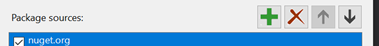
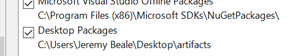
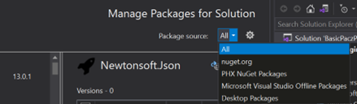
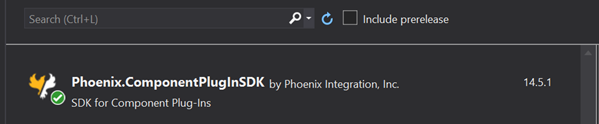

# Getting started

## Overview

This guide walks you through setting up your development environment and creating your first parametric analysis component zipped (PACZ) component plug-in. By the end of this guide, you'll have a working plug-in that you can test and extend.

For terminology used in this guide, please refer to the [Glossary](glossary.md).

## Getting started in .NET

### Install the TestUI application

1. Start from the `artifacts` folder in the `CAMPluginSDK` zip file.
1. Move the downloaded zip file to your development machine.
1. Locate the `TestUI` folder which contains the TestUI.exe application needed later. This location is later referred to as `[TestUI_Install_Directory]`.

**NOTE**: The TestUI is not a production tool. It was written extremely quickly and did not follow the standard software process and as such is funky in a number of ways. However, many people have found it a very useful tool.

### Configure Visual Studio to use the NuGet repository

1. Inside Visual Studio 2019 or 2022, right-click the solution item in Solution Explorer
1. Select "Manage NuGet Packages for Solution…"  
   
1. Click the gear icon to bring up settings  
   
1. Click the + icon to add a new package source  
   
1. Change the Source text field to point to the `artifacts` folder in the `CAMpluginSDK` ZIP file
1. Change the name field to "Desktop Packages" or any other descriptive string  
   
1. After accepting changes, you should now see "Desktop Packages" as an option in the Package Source dropdown menu  
   
1. Click "Install" for `Phoenix.ComponentPlugInSDK`  
   

### Optionally install the PACZ component plug-in wizard for Visual Studio

1. Requires Visual Studio 2019 (not yet supported in Visual Studio 2022)
1. Adjacent to the TestUI folder is the `ComponentPlugInSDKTemplate` folder
1. Double-click the `Phoenix.ComponentPlugInSDKTemplateWizard.vsix` file
1. Complete the VSIX installer wizard

The Wizard creates a stub plug-in project ready to be implemented. If you do not wish to or
cannot use it, copy a [sample plug-in](examples.md)
as a starting place.

### Create a plug-in project

In Visual Studio, create a new project.

**On the "Create a new project" page:**

1. Select the template that was installed earlier: "PACZ Plug-In Template"
1. Press Next

**On the "Configure your new project" page:**

1. Enter the project name (this is used as the default namespace and plug-in name)
1. This name is referred to as `[Name]` throughout this document
1. Choose the project location
1. For Framework, choose at least .NET Framework 4.6.2
1. Press Create

**On the "New PACZ Plug-In Project Wizard" dialog:**

1. Choose "Variable Based"
1. Press OK

Visual Studio creates a new project for you.

**NOTE**: Visual Studio 2019 has a bug where the project may take some time before it builds as it resolves package dependencies. If the project references do not show `Phoenix.ComponentPlugInSDK`, try these steps:

1. Right-click the solution in Solution Explorer
1. Choose "Restore NuGet Packages"
1. Close and reopen the solution

### Debugging with Visual Studio

After building your plug-in and deploying it to ModelCenter or TestUI, you can debug it using Visual Studio:

1. Set breakpoints in your code at key functions like `ConstructAsync`, `RunAsync`, `SetupView`, etc.
1. In Visual Studio, go to Debug → Attach to Process
1. Find and attach to `Phoenix.OutOfProcessBuilderUIHost` or `TestUI` depending on how you are running the plug-in
1. Run your component to trigger breakpoints

**NOTE**: Breakpoints on `ConstructAsync` do not work when running from ModelCenter as it is called
immediately after starting `Phoenix.OutOfProcessBuilderUIHost`, before you can attach to the process.

### Custom icons

To add a custom icon to your plug-in:

1. Create a new folder `Images` at the Visual Studio project root level
1. Copy your icon file to this folder
1. Un-comment and rename `[PlugInIcon("Images/placeholder.ico")]` in the main plug-in class file

## Getting started in Java

TBD - Java plug-in development support is planned for a future release.

## New project overview (.NET)

### Project files

When you create a new plug-in project, two main class files are generated:

#### The runner - `[Name].cs`

This file implements [`IHarnessRunner`](apidocs/Phoenix.ComponentAPI.IHarnessRunner.md):

- **Purpose**: Executes runs of the plug-in
- **Important**: There MUST be no UI associated with this class
- **Key Methods**:
  - [`ConstructAsync`](apidocs/Phoenix.ComponentAPI.IHarnessRunner.ConstructAsync.md#Phoenix_ComponentAPI_IHarnessRunner_ConstructAsync_Phoenix_ComponentAPI_IHarnessRunnerHost_): Always called first. Provides the [`IHarnessRunnerHost`](apidocs/Phoenix.ComponentAPI.IHarnessRunnerHost.md). Use this for initial setup and loading configuration.
  - [`RunAsync`](apidocs/Phoenix.ComponentAPI.IHarnessRunner.RunAsync.md): Executes a single run evaluation. Receives inputs and must populate outputs.

#### The builder UI - `[Name]BuilderUI.cs`

This class extends [`AbstractVariableBasedBuilderUI<[Name]Runner>`](apidocs/Phoenix.ComponentPlugInSDK.AbstractVariableBasedBuilderUI-1.md):

- **Purpose**: Provides the user interface for configuring the plug-in
- **Features**: Builds on a pre-built UI form for allowing a user to select variables from a list of available ones
- **[`ComponentName` Property](apidocs/Phoenix.ComponentPlugInSDK.AbstractBuilderUI-1.ComponentName.md#Phoenix_ComponentPlugInSDK_AbstractBuilderUI_1_ComponentName)**: Override this to provide a display name for the plug-in
- **Methods You Can Override**:
  - [`LoadFromPaczAsync`](apidocs/Phoenix.ComponentPlugInSDK.AbstractModelBasedBuilderUI-2.LoadFromPaczAsync.md): Load the plug-in instance from a PACZ file
  - [`GetTreeProperties`](apidocs/Phoenix.ComponentPlugInSDK.AbstractVariableBasedBuilderUI-2.GetTreeProperties.md): Customize the properties tree
  - [`GetFileLoadProperties`](apidocs/Phoenix.ComponentPlugInSDK.AbstractVariableBasedBuilderUI-2.GetFileLoadProperties.md): Configure the built-in file open feature
  - [`SetupView`](apidocs/Phoenix.ComponentPlugInSDK.AbstractVariableBasedBuilderUI-2.SetupView.md): Add menu items to the main menu
  - [`SaveToPaczAsync`](apidocs/Phoenix.ComponentPlugInSDK.AbstractModelBasedBuilderUI-2.SaveToPaczAsync.md): Save the plug-in instance to a PACZ file

## Useful classes

Some classes and interfaces that you need to work with.

### [`AbstractBuilderUI<RUNNER>`](apidocs/Phoenix.ComponentPlugInSDK.AbstractBuilderUI-1.md)

This base class makes writing your own builder UI easier.

**Properties:**

- [`Host`](apidocs/Phoenix.ComponentPlugInSDK.AbstractBuilderUI-1.Host.md#Phoenix_ComponentPlugInSDK_AbstractBuilderUI_1_Host) of type [`IHarnessBuilderUIHost<RUNNER>`](apidocs/Phoenix.ComponentBuilderAPI.IHarnessBuilderUIHost-1.md)

**Methods:**

- `AddMenuItem()` and `AddAsyncMenuItem()`: Add custom menu items (requires reference to `PresentationCore`)
- `SelectVariables()`: Open the variable selection form
- `SetPaczIcon()`: Set a custom icon on the current PACZ

### [`IHarnessBuilderUIHost<RUNNER>`](apidocs/Phoenix.ComponentBuilderAPI.IHarnessBuilderUIHost-1.md)

This is the host object passed to your builder UI which gives you access to a variety of useful capabilities:

**Properties:**

- [`ExtractedPacz`](apidocs/Phoenix.ComponentBuilderAPI.IHarnessBuilderUIHost-1.ExtractedPacz.md#Phoenix_ComponentBuilderAPI_IHarnessBuilderUIHost_1_ExtractedPacz): The loaded PACZ object and configuration
- [`Logger`](apidocs/Phoenix.ComponentBuilderAPI.IHarnessBuilderUIHost-1.Logger.md): Logging for the plug-in

**Methods:**

- [`CallRunnerAsync<T>()`](apidocs/Phoenix.ComponentBuilderAPI.IHarnessBuilderUIHost-1.CallRunnerAsync.md): Invoke code on the runner
- [`RaiseTestRunEvent()`](apidocs/Phoenix.ComponentBuilderAPI.IHarnessBuilderUIHost-1.RaiseTestRunEvent.md): Cause a run to be requested from the runner
- [`SaveAsync()`](apidocs/Phoenix.ComponentBuilderAPI.IHarnessBuilderUIHost-1.SaveAsync.md): Save the PACZ

### [`VariableBasedBuilderViewModel`](apidocs/Phoenix.ComponentPlugInSDK.ViewModels.VariableBasedBuilderViewModel.md)

This class provides access to the plug-in's variables:

- Provided as an argument after a new file is opened
- Provided to the [`SetupView()`](apidocs/Phoenix.ComponentPlugInSDK.AbstractVariableBasedBuilderUI-2.SetupView.md) method
- Can be made available to custom menu item click handlers
- Provides collections of [`InputVariables`](apidocs/Phoenix.ComponentPlugInSDK.ViewModels.AbstractPlugInViewModel-1.InputVariables.md) and [`OutputVariables`](apidocs/Phoenix.ComponentPlugInSDK.ViewModels.AbstractPlugInViewModel-1.OutputVariables.md)

## Testing the plug-in

### Test with TestUI

1. Build the plug-in project
1. Copy the `Debug` folder (from `[PlugIn Dir]/bin`) to the `Plug-Ins` folder of the TestUI App
1. Run TestUI
1. Create a new component
1. Navigate to `Plug-Ins / Debug / [Name]`
1. The new component wizard appears (same as in ModelCenter)

After making changes:

1. Rebuild the project
1. Replace the directory in the TestUI app
1. Rerun TestUI

**Advanced Tip**: Use `mklink` to create a soft link from the TestUI `Plug-Ins` folder to your project's compile output folder, eliminating manual copying after each build.

**Process Options**: By default, TestUI runs plug-ins in-process, which is useful for debugging. To simulate ModelCenter's out-of-process execution, run TestUI with the `-oop` command line option.

### Test with ModelCenter 14.5+

1. Install ModelCenter version 14.5 or higher
1. Copy the `Debug` folder (from `[PlugIn Dir]/bin`) to the `Plug-Ins` folder of your ModelCenter installation  
   (Typically: `C:\Program Files\Phoenix Integration\ModelCenter 14.5\Plug-Ins`)
1. Open ModelCenter and create a new workflow
1. Locate your plug-in in the Server Browser under `component plug-in / [your plug-in's name]`
1. Drag the plug-in icon into the workflow to launch the new component wizard

## Customizing your plug-in

### Creating the UI

#### Name the plug-in

Override the [`ComponentName`](apidocs/Phoenix.ComponentPlugInSDK.AbstractBuilderUI-1.ComponentName.md#Phoenix_ComponentPlugInSDK_AbstractBuilderUI_1_ComponentName) property in your BuilderUI class:

```csharp
    protected override string ComponentName => "My Custom Plug-In";
```

#### [`LoadFromPaczAsync`](apidocs/Phoenix.ComponentPlugInSDK.AbstractModelBasedBuilderUI-2.LoadFromPaczAsync.md)

Called when the plug-in is first created or loaded. Load state from the [`IExtractedPacz`](apidocs/Phoenix.PaczAPI.IExtractedPacz.md):

- Most state is stored in `Config.Properties` (name-value pairs)
- Files are stored in `Config.InstanceFiles`
- Variables are saved/loaded automatically by the `viewModel`

The [`Model`](apidocs/Phoenix.ComponentPlugInSDK.AbstractModelBasedBuilderUI-2.Model.md)
object (type [`VariableBasedBuilderModel`](apidocs/Phoenix.ComponentPlugInSDK.Models.VariableBasedBuilderModel.md))
is directly accessible and can create variables:

```csharp
protected override async Task LoadFromPaczAsync(IExtractedPacz extractedPacz)
{
    if (Model.InputVariables.Count == 0)
    {
        // Create the initial set of variables for the view
        Model.MoveInputVariablesFrom(_createInputs());
        Model.MoveOutputVariablesFrom(_createOutputs());
    }
    await Task.CompletedTask;
}

private IEnumerable<IRuntimeVariable> _createInputs()
{
    RuntimeVariable x1 = new RuntimeVariable("x1", VariableType.Real, new RealValue(0.5));
    RuntimeVariable x2 = new RuntimeVariable("x2", VariableType.Real, new RealValue(1.75));
    return new List<IRuntimeVariable>() { x1, x2 };
}

private IEnumerable<IRuntimeVariable> _createOutputs()
{
    RuntimeVariable y = new RuntimeVariable("y", VariableType.Real, new RealValue(0.01));
    return new List<IRuntimeVariable>() { y };
}
```

#### `GetFileLoadProperties()`

Override this method to enable a built-in file load dialog:

- Create a `FileLoadProperties` object with an action for when a file is selected
- Specify a file filter for the open dialog
- Copy the selected file to `Host.ExtractedPacz.ExtractionFolder`
- Add it to `Config.InstanceFiles`

**Example Use Case**: Selecting a CAD file, then interrogating it to determine which inputs/outputs to create.

#### `SelectVariables()`

Help users create variables programmatically:

- **Option 1**: Add variables directly to `viewModel.Variable` list
- **Option 2**: Use the `SelectVariables` form for user customization

To use the `SelectVariables` form:

1. Pass lists of available inputs and outputs
1. Call `SelectVariables()` method of the `AbstractBuilderUI` object
1. Users can filter and select which variables to include

#### `GetTreeProperties()`

Allows customization of the variable tree:

- **`componentName`**: Name displayed at the root of the VariableTree
- **`canAddRemove`**: Whether UI controls allow adding/removing variables
- **`hasNamedVariables`**: Whether variables use named variable properties

  - Named variables map to external identifiers (for example, Excel range names)
  - The variable name in the plug-in might be "cost" while mapping to range "B5:B10"

- **`namedVariableDisplayName`**: Label for the named variable field (for example, "Range")
- **`namedVariableToken`**: Alphanumeric token used in the text-based variable editor

#### `SetupView()`

This method is called after the form is created and allow customization. This is typically done by adding menu items to the main Menu. By default, `VariableBasedPlugIns` has an Apply button that saves the plug-in instance. Additional menu items can be added as either buttons or containers of `subItems`.

Use the `AddMenuItem` method of the `AbstractBuilderUI` base class to add items and provide an event handler as the action to perform on click. The `VariableBasedBuilderViewModel` can be made available to use in the event handler if desired.

Common usages of additional menu items are to show an options dialog or a help page for the plug-in. The following code sample shows a simple Windows Form made accessible through a custom options menu item. No further code is required to make a `Form1` object accessible to the user.

```csharp
protected override void SetupView(IExtractedPacz pacz, 
                                   VariableBasedBuilderViewModel viewModel, 
                                   Menu mainMenu)
{
    AddMenuItem(parent: mainMenu, 
                header: "Options", 
                imageType: ImageType.OPTIONS,
                hasDownArrow: false, 
                eventHandler: (s, e) => _editOptions(viewModel));
}

private void _editOptions(VariableBasedBuilderViewModel viewModel)
{
    Form1 form1 = new Form1();
    form1.Show();
}
```

**Common Uses**: Options dialogs, help pages, custom wizards

#### `SaveToPaczAsync()`

Save plug-in state to the PACZ file:

- Store settings as name-value pairs in `pacz.Config.Properties`
- Update instance files if needed
- Variables are saved automatically by the `ViewModel` - typically no action is needed

## Creating the runner

### `ConstructAsync()`

Always called first - use for initialization:

- Capture the `IHarnessRunnerHost` for later use
- Load configuration
- If using resource-intensive applications, consider delaying load until first run

```csharp
private IHarnessRunnerHost _host;

private VariableBasedBuilderModel _model;

public async Task ConstructAsync(IHarnessRunnerHost host)
{
    _host = host;

    _model = new VariableBasedBuilderModel();
    await _model.FromPaczAsync(_host.ExtractedPacz);

    //TODO: _model.FilePathAbsolute will now contain the full path to the file the use chose 
    // when building the pacz, or null if the pacz is uninitialized.
}
```

### `RunAsync()`

Execute a single run evaluation:

- Input variables are passed with values and validity flags
- Use `SafeValue` to ensure all inputs are valid (throws if invalid)
- Update the `outputs` dictionary with new `VariableState` for each output

```csharp
public async Task RunAsync(IReadOnlyDictionary<string, VariableState> inputs, 
                          VariableValueScope outputs, 
                          CancellationToken cancellation)
{
    // Get input values
    double x1 = (RealValue)inputs["x1"].SafeValue;
    double x2 = (RealValue)inputs["x2"].SafeValue;
    
    // Perform computation
    double result = x1 * x2;
    
    // Set output values
    outputs["y"] = new VariableState(new RealValue(result));
    
    await Task.CompletedTask;
}
```

## Next steps

Now that you have a working plug-in:

- Explore the [FAQ](faq.md) for answers to common questions
- Review the [Threading](threading.md) guide for understanding thread safety
- Study the example plug-ins in the repository
- Learn about advanced customization options

For common issues and solutions, see the FAQ page or consult the threading documentation.
