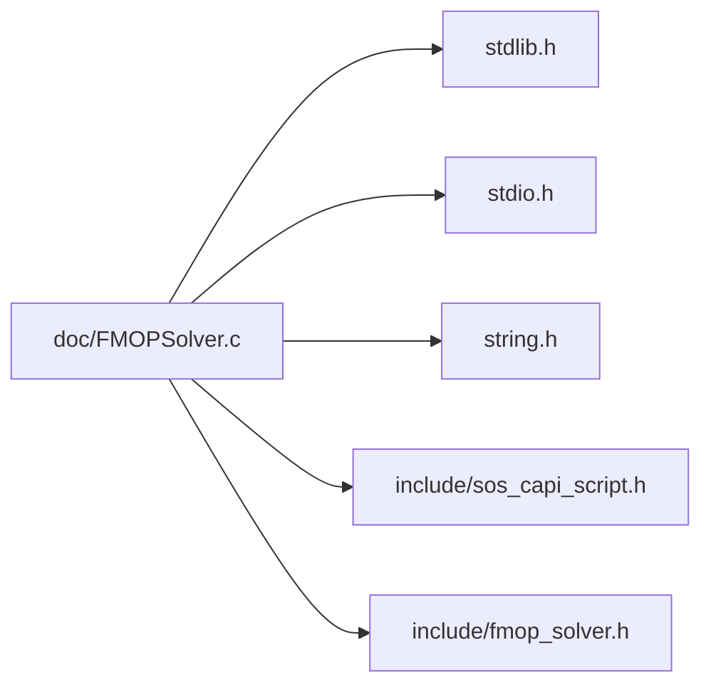

# File FMOPSolver.c


**Location**: `doc/FMOPSolver.c`


## Includes

* <stdlib.h>
* <stdio.h>
* <string.h>
* include/sos_capi_script.h
* include/fmop_solver.h





## Macros

<a id="_f_m_o_p_solver_8c_1ae7c3138bceee1d3e419dadbea1c80fa5"></a>
### Macro REF_NUM_PARAMS

![][public]


```cpp
#define REF_NUM_PARAMS 6
```

## Functions

<a id="_f_m_o_p_solver_8c_1af3ed9c200de85b53c94cd18764b246a2"></a>
### Function main

![][public]


```cpp
int main(int argc, char *const argv[])
```


FMOPSolver interface example using the sos_demo database provided with your oSP3D installation.

**copyright**\
2026, Ansys Austria GmbH

## Example
```cpp

#include <stdlib.h>
#include <stdio.h>
#include <string.h>

#include "include/sos_capi_script.h"
#include "include/fmop_solver.h"

int main ( int argc, char* const argv[] )
{
    FMOP_initializeLibrary();

    // - - - - - - - - - - - -
    // S T A R T: USER INPUT
    // - - - - - - - - - - - -

    int num_errors = 0;

    char user_lic_path[10000];
    strcpy(user_lic_path, argv[0]);
#ifdef MINGW
    char delimit = '\\';
#else
    char delimit = '/';
#endif
    char * last_pos = strrchr( argv[0], delimit ); // pointer to last / or \ in string (after that there is the name of the exe)
    if (last_pos != NULL)
    {
        int count = 0;
        char * counter = argv[0];
        while (counter != last_pos)
        {
            ++counter;
            ++count;
        }
        strncpy(user_lic_path, argv[0], count);
        user_lic_path[count] = '\0'; // manual 0-termination required!
        printf("count: %d\n", count);
    }

    printf("Search for license in dir %s\n", user_lic_path);
    printf("argv: %s\n", argv[0]);

    char* db_path = NULL;
    const char* fmop_ident = "pstrain";

    //
    // \brief FMOP reference number of active parameters
    //
    #define REF_NUM_PARAMS 6
    const double param_values [ REF_NUM_PARAMS ] = { 43341.092, 134.12064, 0.093418892, 0.042747076, 2.7525392e-09, 58.798039 };

    // - - - - - - - - - - - -
    // E N D: USER INPUT
    // - - - - - - - - - - - -

    // Define some further internal global variables

    fmop_license_t feature = fmop_mesh_all;
    fmop_db_handle_t database = NULL;
    fmop_handle_t fmop = NULL;
    char* public_dir = getenv ( "SOS_PUBLIC_DIR" );

    if ( db_path == NULL &&
         public_dir != NULL )
    {
        printf ( "INFO  | Using sos_demo database from public documents dir.\n" );


        const char* db_rel_path = "/examples/sos_demo.sdb";
        db_path = malloc ( strlen (public_dir) + strlen (db_rel_path) + 1 );
        strcpy ( db_path, public_dir );
        strcat ( db_path, db_rel_path );
    }

    {
        printf ( "INFO  | Acquire licenses\n" );

        if ( argv[0] && FMOP_appendLicenseSearchPath ( user_lic_path ) )
//        if ( user_lic_path && FMOP_appendLicenseSearchPath ( user_lic_path ) )
            fprintf ( stderr, "ERROR | Appending an additional license search path. "
                              "The library reports:\n%s\n", FMOP_getLastErrorString () );

        if ( FMOP_acquireLicenses ( feature ) )
        {
            fprintf ( stderr, "FATAL | Acquiring licenses. The library reports:\n%s\n",
                      FMOP_getLastErrorString () );
            return FMOP_getLastErrno ();
        }
    }

    fmop_script_handle_t engine = FMOP_globalScriptEngine();
    if (engine == NULL)
    {
        fprintf ( stderr, "FATAL | Cannot get a hendle to Lua interpeter. The library reports:\n%s\n",
                  FMOP_getLastErrorString () );
        return FMOP_getLastErrno ();
    }

    /*
     We will execute the following code:
     A = tmath.Matrix({{1,2},{3,4}})
     B = tmath.Matrix({{1,0},{0,1}})
     s = 2.0
     c = "Hello"
     c2 = c .. " world!"
     C = A*s+B
     y = C[{0,0}]
     -- print(C)
     -- print(c2)
     -- print(C[{0,0}])
     -- print(y)
    */

    printf ( "INFO  | Start script\n" );
    if (FMOP_script_execute(engine,"print(\"Start script\");\n"))
    {
        fprintf ( stderr, "FATAL | Cannot execute string. The library reports:\n%s\n",
                  FMOP_getLastErrorString () );
        return FMOP_getLastErrno ();
    }

    double A_data[] = {1,3,2,4};
    double B_data[] = {1,0,0,1};
    printf ( "INFO  | Create matrix A\n" );
    if (FMOP_script_createMatrix(engine,"A",2,2,A_data))
    {
        fprintf ( stderr, "FATAL | Cannot create matrix A. The library reports:\n%s\n",
                  FMOP_getLastErrorString () );
        return FMOP_getLastErrno ();
    }
    printf ( "INFO  | Create matrix B\n" );
    if (FMOP_script_createMatrix(engine,"B",2,2,B_data))
    {
        fprintf ( stderr, "FATAL | Cannot create matrix B. The library reports:\n%s\n",
                  FMOP_getLastErrorString () );
        return FMOP_getLastErrno ();
    }
    printf ( "INFO  | Create number s\n" );
    if (FMOP_script_createNumber(engine,"s",2.0))
    {
        fprintf ( stderr, "FATAL | Cannot create number s. The library reports:\n%s\n",
                  FMOP_getLastErrorString () );
        return FMOP_getLastErrno ();
    }
    printf ( "INFO  | Create string c\n" );
    if (FMOP_script_createString(engine,"c","Hello"))
    {
        fprintf ( stderr, "FATAL | Cannot create string c. The library reports:\n%s\n",
                  FMOP_getLastErrorString () );
        return FMOP_getLastErrno ();
    }
    printf ( "INFO  | Execute some script\n" );
    char script[] = "c2 = c .. \" world!\";\n C = A*s+B;\n y = C[{0,0}]; \n";
    if (FMOP_script_execute(engine,script))
    {
        fprintf ( stderr, "FATAL | Cannot execute string. The library reports:\n%s\n",
                  FMOP_getLastErrorString () );
        return FMOP_getLastErrno ();
    }
    printf ( "INFO  | Get matrix C\n" );
    int C_rows = 0;
    int C_cols = 0;
    const double * C_data = NULL;
    if (FMOP_script_getMatrix(engine,"C",&C_rows,&C_cols,&C_data))
    {
        fprintf ( stderr, "FATAL | Cannot get matrix C. The library reports:\n%s\n",
                  FMOP_getLastErrorString () );
        return FMOP_getLastErrno ();
    }

    printf ( "INFO  | Get number y\n" );
    double y_data = 0;
    if (FMOP_script_getNumber(engine,"y",&y_data))
    {
        fprintf ( stderr, "FATAL | Cannot get number y. The library reports:\n%s\n",
                  FMOP_getLastErrorString () );
        return FMOP_getLastErrno ();
    }

    printf ( "INFO  | Get string c2\n" );
    const char * c2_data = NULL;
    if (FMOP_script_getString(engine,"c2",&c2_data))
    {
        fprintf ( stderr, "FATAL | Cannot get string c2. The library reports:\n%s\n",
                  FMOP_getLastErrorString () );
        return FMOP_getLastErrno ();
    }

    if (!FMOP_script_identExists(engine,"y"))
    {
        fprintf ( stderr, "ERROR | The ident y does not exist." );
        ++num_errors;
    }

    {
        printf ( "INFO  | Load the oSP3D demo database\n" );

//        if ( FMOP_loadDbFile ( & database, db_path ) )
        if ( FMOP_loadDbFileWMesh ( & database, db_path ) )
        {
            fprintf ( stderr, "FATAL | Loading the oSP3D demo database. The library reports:\n%s\n",
                      FMOP_getLastErrorString () );
            return FMOP_getLastErrno ();
        }
    }

    {
        printf ( "INFO  | Query FMOP idents and load the '%s' element data FMOP\n", fmop_ident );

        char** fmop_idents = NULL;
        size_t num_idents = 0;

        if ( FMOP_getModelIdents ( database, fmop_node_data, & fmop_idents, & num_idents ) )
            fprintf ( stderr, "ERROR | Querying available node data FMOP model idents. The library reports:\n%s\n",
                      FMOP_getLastErrorString () );

        // Delete and reset fmop_idents before passing it into the next call
        FMOP_releaseIdents ( & fmop_idents, & num_idents );

        if ( FMOP_getModelIdents ( database, fmop_element_data, & fmop_idents, & num_idents ) )
        {
            fprintf ( stderr, "FATAL | Querying available element data FMOP model idents. The library reports:\n%s\n",
                      FMOP_getLastErrorString () );
            return FMOP_getLastErrno ();
        }

        // Delete and reset fmop_idents before passing it into the next call
        FMOP_releaseIdents ( & fmop_idents, & num_idents );

        if ( FMOP_getModelIdentsDim ( database, fmop_element_data, & num_idents ) )
            fprintf ( stderr, "ERROR | Querying dimension of available element data FMOP model idents. The library "
                      "reports:\n%s\n", FMOP_getLastErrorString () );

        const char * ident = NULL;
        size_t i;
        for ( i = 0; i < num_idents; ++i )
        {
            ident = FMOP_getModelIdent ( database, fmop_element_data, i );
            if ( FMOP_getLastErrno() )
                fprintf ( stderr, "ERROR | Querying the %zd. of available element data FMOP model idents. The library "
                          "reports:\n%s\n", i, FMOP_getLastErrorString () );
            fprintf ( stdout, "DEBUG |   fmop_ident [%zd] : %s\n", i, ident );
        }

        if ( FMOP_getModel ( database, fmop_element_data, fmop_ident, & fmop ) )
        {
            fprintf ( stderr, "FATAL | Getting the '%s' FMOP model. The library reports:\n%s\n",
                      fmop_ident, FMOP_getLastErrorString () );
            return FMOP_getLastErrno ();
        }
    }

    {
        printf ( "INFO  | Query properties of '%s' FMOP\n", fmop_ident );

        {
            printf ( "INFO  | Get parameter idents\n" );

            char** param_idents = NULL;
            size_t num_idents = 0;

            if ( FMOP_getModelParamIdents ( fmop, & param_idents, & num_idents ) )
                fprintf ( stderr, "ERROR | Querying parameter idents. The library reports:\n%s\n",
                          FMOP_getLastErrorString () );

            if ( FMOP_getModelParamIdentsDim ( fmop, & num_idents ) )
                fprintf ( stderr, "ERROR | Querying dimension of parameter idents. The library reports:\n%s\n",
                          FMOP_getLastErrorString () );

            const char* param_ident = NULL;
            size_t i;
            for ( i = 0; i < num_idents; ++i )
            {
                param_ident = FMOP_getModelParamIdent ( fmop, i );
                if ( FMOP_getLastErrno() )
                    fprintf ( stderr, "ERROR | Querying the %zd. parameter ident. The library reports:\n%s\n",
                              i, FMOP_getLastErrorString () );
                fprintf ( stdout, "DEBUG |   param_ident [%zd] : %s\n", i, param_ident );
            }
        }

        {
            fprintf(stdout,  "INFO | Test mesh connectivity\n" );
            unsigned int i=0;

            unsigned int num_elements_at;
            if (FMOP_getNumElementsAtNode ( fmop, 100, & num_elements_at ) )
            {
                fprintf ( stderr, "FATAL | Error querying connectivity. The library reports:\n%s\n",
                          FMOP_getLastErrorString () );
                return FMOP_getLastErrno ();
            }
            unsigned int * elements_at = NULL;
            elements_at = malloc( sizeof(unsigned int)*(num_elements_at+1));
            if (FMOP_getElementsAtNode ( fmop, 100, elements_at ) )
            {
                fprintf ( stderr, "FATAL | Error querying connectivity. The library reports:\n%s\n",
                          FMOP_getLastErrorString () );
                return FMOP_getLastErrno ();
            }
            for (i=0; i<num_elements_at; ++i)
                fprintf ( stdout, "element #i %d: %d\n", i, elements_at[i]);
            unsigned test_elem = elements_at[0];
            free(elements_at);

            unsigned int num_nodes_at;
            if (FMOP_getNumNodesAtElement( fmop, test_elem, & num_nodes_at ) )
            {
                fprintf ( stderr, "FATAL | Error querying connectivity. The library reports:\n%s\n",
                          FMOP_getLastErrorString () );
                return FMOP_getLastErrno ();
            }
            unsigned int * nodes_at = NULL;
            nodes_at = malloc( sizeof(unsigned int)*(num_nodes_at+1));
            if (FMOP_getElementsAtNode ( fmop, test_elem, nodes_at ) )
            {
                fprintf ( stderr, "FATAL | Error querying connectivity. The library reports:\n%s\n",
                          FMOP_getLastErrorString () );
                return FMOP_getLastErrno ();
            }
            for (i= 0; i<num_nodes_at; ++i)
                fprintf ( stdout, "node #i %d: %d\n", i, nodes_at[i]);
            free(nodes_at);

            const char * element_ident = FMOP_getElementTypeIdent(fmop, test_elem);
            if (element_ident == NULL)
            {
                fprintf ( stderr, "FATAL | Error querying connectivity. The library reports:\n%s\n",
                          FMOP_getLastErrorString () );
                return FMOP_getLastErrno ();
            }
            fprintf(stdout, "Element ident of element #%d: %s\n", test_elem, element_ident );

        }


        {
            printf ( "INFO  | Query active scalar input parameter boundaries defined by the applied DOE\n" );

            double bounds [ REF_NUM_PARAMS ];
            if ( FMOP_getParamLowerBounds ( fmop, bounds ) )
                fprintf ( stderr, "ERROR | Querying lower boundary values of active scalar input parameters. "
                                  "The library reports:\n%s\n", FMOP_getLastErrorString () );

            if ( FMOP_getParamUpperBounds ( fmop, bounds ) )
                fprintf ( stderr, "ERROR | Querying upper boundary values of active scalar input parameters. "
                                  "The library reports:\n%s\n", FMOP_getLastErrorString () );

            size_t i;
            for ( i = 0; i < REF_NUM_PARAMS; ++i )
                printf ( "INFO  | %02lu : %G\n", i, bounds [i] );
        }

        {
            printf ( "INFO  | Query FCoP values of active scalar input parameters\n" );

            double fcop = 0.;
            if ( FMOP_getModelTotalAvgFCoP ( fmop, & fcop ) )
                fprintf ( stderr, "ERROR | Querying the total average FCoP value. The library reports:\n%s\n",
                          FMOP_getLastErrorString () );

            double fcops [ REF_NUM_PARAMS ];
            if ( FMOP_getModelAvgFCoP ( fmop, fcops ) )
                fprintf ( stderr, "ERROR | Querying average FCoP values per active scalar input parameter. The library "
                                  "reports:\n%s\n", FMOP_getLastErrorString () );
        }
    }

    {
        printf ( "INFO  | Approximate field\n" );

        size_t num_mesh_items = 0;
        if ( FMOP_getModelDim ( fmop, & num_mesh_items ) )
        {
            fprintf ( stderr, "FATAL | Querying number of mesh idents. The library reports:\n%s\n",
                      FMOP_getLastErrorString () );
            return FMOP_getLastErrno ();
        }

        printf ( "INFO  |   Number of mesh items : %lu\n", num_mesh_items );

        unsigned int * part_ids = NULL;
        unsigned int item_ids [ num_mesh_items ];

        if ( FMOP_getDataPointIndices ( fmop, part_ids, item_ids ) )
            fprintf ( stderr, "ERROR |   Querying data point indices. The library reports:\n%s\n", FMOP_getLastErrorString () );

        double x_coors [ num_mesh_items ];

        if ( FMOP_getDataPointCoors ( fmop, 0, x_coors ) )
            fprintf ( stderr, "ERROR |   Querying data point x-coordinates. The library reports:\n%s\n",
                      FMOP_getLastErrorString () );

        double coors [ 3 * num_mesh_items ];

        if ( FMOP_getDataPointCoors ( fmop, 3, coors ) )
            fprintf ( stderr, "ERROR |   Querying data point coordinates. The library reports:\n%s\n",
                      FMOP_getLastErrorString () );

        double approx_field [ num_mesh_items ];

        if ( FMOP_approxField ( fmop, param_values, approx_field ) )
            fprintf ( stderr, "ERROR | Approximating the field for a given set of scalar input parameters. The library "
                      "reports:\n%s\n", FMOP_getLastErrorString () );

    }

    {
        printf ( "INFO  | Change log level\n" );
        FMOP_setLogLevel (4) //4: log all messages
    }

    {
        printf ( "INFO  | Release data and licenses\n" );

        if ( FMOP_releaseModel ( & fmop ) )
            fprintf ( stderr, "ERROR | Releasing FMOP model. The library reports:\n%s\n", FMOP_getLastErrorString () );
        if ( FMOP_releaseDb ( & database ) )
            fprintf ( stderr, "ERROR | Releasing database. The library reports:\n%s\n", FMOP_getLastErrorString () );
        if ( FMOP_releaseLicenses () )
            fprintf ( stderr, "ERROR | Releasing licenses. The library reports:\n%s\n", FMOP_getLastErrorString () );
    }

    {
        printf ( "INFO  | Miscellaneous\n" );

        const char* version_string = FMOP_getVersionString();
        if ( version_string == NULL )
            fprintf ( stderr, "ERROR | Error querying version string.\n" );
        else
            printf ( "INFO  | %s\n", version_string );
    }

    {
        printf ( "INFO | Unload library\n");

        FMOP_unloadLibrary();
    }

    return num_errors;
}

// (c) 2019, Ansys Austria GmbH (proprietary license)
```


[C++]: https://img.shields.io/badge/language-C%2B%2B-blue (C++)
[public]: https://img.shields.io/badge/-public-brightgreen (public)