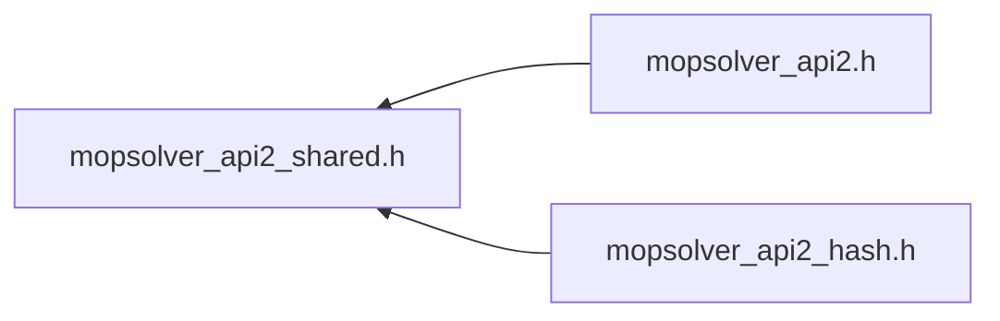

# File mopsolver_api2_shared.h

![][C++]

**Location**: `mopsolver_api2_shared.h`


**version**\
$Rev$

## Includes

* [mopsolver_api_shared.h](mopsolver__api__shared_8h.md#mopsolver__api__shared_8h)


## Included by

* [mopsolver_api2.h](mopsolver__api2_8h.md#mopsolver__api2_8h)
* [mopsolver_api2_hash.h](mopsolver__api2__hash_8h.md#mopsolver__api2__hash_8h)





## Enumeration types

<a id="mopsolver__api2__shared_8h_1a9d02108e77fa0ce32247bd4478fa2b0b"></a>
### Enumeration type DMOP2_SOLVE_FLAG

![][public]

**Definition**: `mopsolver_api2_shared.h` (line 13)


```cpp
enum DMOP2_SOLVE_FLAG {
  SOLVE_EXTRAPOLATE = 1,
  SOLVE_RESPONSES = 2,
  SOLVE_CRITERIA = 4,
  SOLVE_DENSITIES = 8,
  SOLVE_ERRORS = 16
}
```


Enum containing the flags to control the behaviour of the solve method


<a id="mopsolver__api2__shared_8h_1a9d02108e77fa0ce32247bd4478fa2b0babdf84129bd1eddedb34a7cb60847a038"></a>
#### Enumerator SOLVE_EXTRAPOLATE

if set, extrapolation is activated


<a id="mopsolver__api2__shared_8h_1a9d02108e77fa0ce32247bd4478fa2b0bab5ca18a75197776540aecf4572c1d5fe"></a>
#### Enumerator SOLVE_RESPONSES

if set, the response values are written to the output array


<a id="mopsolver__api2__shared_8h_1a9d02108e77fa0ce32247bd4478fa2b0bae833c1cfeacab058c7651d5f52a331a3"></a>
#### Enumerator SOLVE_CRITERIA

if set, the criteria values are written to the output array


<a id="mopsolver__api2__shared_8h_1a9d02108e77fa0ce32247bd4478fa2b0ba0f075abe0480ae5dba49361542105e93"></a>
#### Enumerator SOLVE_DENSITIES

if set, the density values are written to the output array


<a id="mopsolver__api2__shared_8h_1a9d02108e77fa0ce32247bd4478fa2b0ba4d0e54817eeefe0b4d3c80da29954879"></a>
#### Enumerator SOLVE_ERRORS

if set, the error values (CoP, RMSE, error, absolute error) are written to the output array


<a id="mopsolver__api2__shared_8h_1ae71ebc38d8f28e122d564249414ea519"></a>
### Enumeration type DMOP2_DIMENSION_FLAG

![][public]

**Definition**: `mopsolver_api2_shared.h` (line 28)


```cpp
enum DMOP2_DIMENSION_FLAG {
  DIM_INPUTS = 1,
  DIM_RESPONSES = 2,
  DIM_CRITERIA = 4
}
```


Enum containing the flags to control the behaviour of the getDimensions method


<a id="mopsolver__api2__shared_8h_1ae71ebc38d8f28e122d564249414ea519adb23389bbc1ccb64fa2bfda339aa782d"></a>
#### Enumerator DIM_INPUTS

if set, the number of inputs is written to the output array


<a id="mopsolver__api2__shared_8h_1ae71ebc38d8f28e122d564249414ea519a4cbae4944616299dfcc52ddf1e490b61"></a>
#### Enumerator DIM_RESPONSES

if set, the number of responses is written to the output array


<a id="mopsolver__api2__shared_8h_1ae71ebc38d8f28e122d564249414ea519a205872b5445eefc8aab6dfd4588ddd52"></a>
#### Enumerator DIM_CRITERIA

if set, the number of criteria is written to the output array


<a id="mopsolver__api2__shared_8h_1a919e4b2e211e2d3c06a2cd81f75a5993"></a>
### Enumeration type DMOP2_NAME_FLAG

![][public]

**Definition**: `mopsolver_api2_shared.h` (line 39)


```cpp
enum DMOP2_NAME_FLAG {
  NAME_INPUTS = 1,
  NAME_RESPONSES = 2,
  NAME_CRITERIA = 4
}
```


Enum containing the flags to control the behaviour of the getNames method


<a id="mopsolver__api2__shared_8h_1a919e4b2e211e2d3c06a2cd81f75a5993a79c10bd78049e47bfed6b564d27b62ad"></a>
#### Enumerator NAME_INPUTS

if set, the names of the inputs are returned


<a id="mopsolver__api2__shared_8h_1a919e4b2e211e2d3c06a2cd81f75a5993a7b78423d9c98ddad4e690a2c3b9f8f47"></a>
#### Enumerator NAME_RESPONSES

if set, the names of the outputs are returned


<a id="mopsolver__api2__shared_8h_1a919e4b2e211e2d3c06a2cd81f75a5993a3d616f3b9eac8bbf7945fce33b42d0d8"></a>
#### Enumerator NAME_CRITERIA

if set, the names of the criteria are returned


<a id="mopsolver__api2__shared_8h_1a5d50d64a9e5bf93f7e479f274f39a2e8"></a>
### Enumeration type DMOP2_PER_RESPONSE_FLAG

![][public]

**Definition**: `mopsolver_api2_shared.h` (line 50)


```cpp
enum DMOP2_PER_RESPONSE_FLAG {
  RESP_EXTRAPOLATE = 1,
  RESP_GRADIENTS = 2,
  RESP_DENSITIES = 4,
  RESP_ERRORS = 8
}
```


Enum containing the flags to control the behaviour of the get_per_response method


<a id="mopsolver__api2__shared_8h_1a5d50d64a9e5bf93f7e479f274f39a2e8a2bf0649346449ad52f658321010a4356"></a>
#### Enumerator RESP_EXTRAPOLATE

if set, extrapolation is activated


<a id="mopsolver__api2__shared_8h_1a5d50d64a9e5bf93f7e479f274f39a2e8a7acef09112df0227f429ceacc6d64b34"></a>
#### Enumerator RESP_GRADIENTS

if set, the gradient values of the response are written to the output array


<a id="mopsolver__api2__shared_8h_1a5d50d64a9e5bf93f7e479f274f39a2e8afb1a9998534e839d59740c5d98655f57"></a>
#### Enumerator RESP_DENSITIES

if set, the density value of the response is written to the output array


<a id="mopsolver__api2__shared_8h_1a5d50d64a9e5bf93f7e479f274f39a2e8ac7007812a879e80f3b9e14d93e715dea"></a>
#### Enumerator RESP_ERRORS

if set, the errors of the response are written to the output array


<a id="mopsolver__api2__shared_8h_1afc0920966340b6d1cc6122f8c44b689f"></a>
### Enumeration type DMOP2_RETURN_CODES

![][public]

**Definition**: `mopsolver_api2_shared.h` (line 63)


```cpp
enum DMOP2_RETURN_CODES {
  dmop2_success = 0,
  dmop2_error = 1,
  dmop2_exception_occured = 2,
  dmop2_custom_interface_not_enabled = 4,
  dmop2_wrong_input_argument = 41
}
```


Enum containing the return codes used by the dmop2 methods, similar to the mop_api.h codes


<a id="mopsolver__api2__shared_8h_1afc0920966340b6d1cc6122f8c44b689facfba8e56f39398ccadc2b2a8d1db2a8e"></a>
#### Enumerator dmop2_success


<a id="mopsolver__api2__shared_8h_1afc0920966340b6d1cc6122f8c44b689fa00555fcc07f262400fc44e8e2438140a"></a>
#### Enumerator dmop2_error


<a id="mopsolver__api2__shared_8h_1afc0920966340b6d1cc6122f8c44b689fa72e28da48cbaeb44c40f51a78be00317"></a>
#### Enumerator dmop2_exception_occured


<a id="mopsolver__api2__shared_8h_1afc0920966340b6d1cc6122f8c44b689fa804da28b825cdd5a7ccd869542a9d749"></a>
#### Enumerator dmop2_custom_interface_not_enabled


<a id="mopsolver__api2__shared_8h_1afc0920966340b6d1cc6122f8c44b689fa75b6d5d3ced1b9b9ec0ee9f96d67b4aa"></a>
#### Enumerator dmop2_wrong_input_argument


## Functions

<a id="mopsolver__api2__shared_8h_1abd7972e7a1687d4b1708bc9fac570aa1"></a>
### Function dmop2_getLastError

![][public]


```cpp
DYNARDO_MOPSOLVER_API const char * dmop2_getLastError()
```


Calling a solver API function will reset the string, so you'll need to check for errors immediately after the function call. 
**Returns**:

String describing last error or <code>nullptr</code> if no error occured.


**Return type**: DYNARDO_MOPSOLVER_API const char *

<a id="mopsolver__api2__shared_8h_1a932cf054e78fd8f1069a1ea8d9a88cbe"></a>
### Function dmop2_free

![][public]


```cpp
DYNARDO_MOPSOLVER_API int dmop2_free(void *_pointer)
```


Frees the memory allocated at the specified pointer 
**Parameters**:

* **_pointer**: Pointer to the memory that should be freed


**Returns**:

zero if the memory was successfully freed


**Parameters**:

* void * **_pointer**

**Return type**: DYNARDO_MOPSOLVER_API int

<a id="mopsolver__api2__shared_8h_1a3de6521ea7642d7979ad944643edea2b"></a>
### Function dmop2_get_version_str

![][public]


```cpp
DYNARDO_MOPSOLVER_API const char * dmop2_get_version_str()
```


Retrieves the current OptiSLang version and returns it as a string 
**Returns**:

String containing the current OptiSLang version


**Return type**: DYNARDO_MOPSOLVER_API const char *

<a id="mopsolver__api2__shared_8h_1abaaf6eb148aeb3e5368597475f6b7a75"></a>
### Function dmop2_cleanup

![][public]


```cpp
DYNARDO_MOPSOLVER_API int dmop2_cleanup()
```


cleans-up all the memory allocated by the API, use this after you've finished using the API. Objects pointing to memory provided by this API are going to be invalidated. 
**Returns**:

zero


**Return type**: DYNARDO_MOPSOLVER_API int

<a id="mopsolver__api2__shared_8h_1a3b7b35bbecdf38a33b2eb150e61add8f"></a>
### Function dmop2_set_paths_for_custom_interface

![][public]


```cpp
DYNARDO_MOPSOLVER_API int dmop2_set_paths_for_custom_interface(const char *_program_path, const char *_python_home, const char *const *_python_paths, unsigned int _num_python_paths, const char *const *_script_paths, unsigned int _num_script_paths, const char *_oop_path)
```


set up custom interface application-wide


**Parameters**:

* const char * **_program_path**
* const char * **_python_home**
* const char *const * **_python_paths**
* unsigned int **_num_python_paths**
* const char *const * **_script_paths**
* unsigned int **_num_script_paths**
* const char * **_oop_path**

**Return type**: DYNARDO_MOPSOLVER_API int

## Source


```cpp


#ifndef DYNARDO_MOPSOLVERAPI2_SHARED_H
#define DYNARDO_MOPSOLVERAPI2_SHARED_H

#include "mopsolver_api_shared.h"


enum DMOP2_SOLVE_FLAG {
    SOLVE_EXTRAPOLATE = 1,
    SOLVE_RESPONSES = 2,
    SOLVE_CRITERIA = 4,
    SOLVE_DENSITIES = 8,
    SOLVE_ERRORS = 16
};

enum DMOP2_DIMENSION_FLAG {
    DIM_INPUTS = 1,
    DIM_RESPONSES = 2,
    DIM_CRITERIA = 4
};

enum DMOP2_NAME_FLAG {
    NAME_INPUTS = 1,
    NAME_RESPONSES = 2,
    NAME_CRITERIA = 4
};

enum DMOP2_PER_RESPONSE_FLAG {
    RESP_EXTRAPOLATE = 1,
    RESP_GRADIENTS = 2,
    RESP_DENSITIES = 4,
    RESP_ERRORS = 8
};

enum DMOP2_RETURN_CODES {
    dmop2_success = 0,

    dmop2_error = 1,
    dmop2_exception_occured = 2,
    dmop2_custom_interface_not_enabled = 4,

    dmop2_wrong_input_argument = 41
};


DYNARDO_MOPSOLVER_API
const char* dmop2_getLastError();

DYNARDO_MOPSOLVER_API
int dmop2_free(void* _pointer);

DYNARDO_MOPSOLVER_API
const char* dmop2_get_version_str();

DYNARDO_MOPSOLVER_API
int dmop2_cleanup();

DYNARDO_MOPSOLVER_API
int dmop2_set_paths_for_custom_interface(const char* _program_path,
    const char* _python_home,
    const char* const* _python_paths,
    unsigned int _num_python_paths,
    const char* const* _script_paths,
    unsigned int _num_script_paths,
    const char* _oop_path);

#endif
```


[public]: https://img.shields.io/badge/-public-brightgreen (public)
[C++]: https://img.shields.io/badge/language-C%2B%2B-blue (C++)