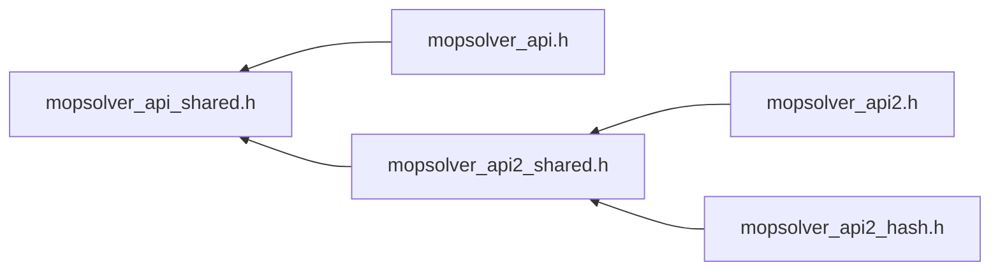

# File mopsolver_api_shared.h

![][C++]

**Location**: `mopsolver_api_shared.h`


## Included by

* [mopsolver_api.h](mopsolver__api_8h.md#mopsolver__api_8h)
* [mopsolver_api2_shared.h](mopsolver__api2__shared_8h.md#mopsolver__api2__shared_8h)





## Macros

<a id="mopsolver__api__shared_8h_1ae979a0ff1bc860330a2fa37a6a14ea0c"></a>
### Macro DYNARDO_DLPUBLIC_SHARED_EXPORT

![][public]


```cpp
#define DYNARDO_DLPUBLIC_SHARED_EXPORT
```


<a id="mopsolver__api__shared_8h_1ab8539bb97d05941714dca90767399a6f"></a>
### Macro DYNARDO_DLPUBLIC_SHARED_IMPORT

![][public]


```cpp
#define DYNARDO_DLPUBLIC_SHARED_IMPORT
```


<a id="mopsolver__api__shared_8h_1a773ff27005f9085333e0c17ea06c55ec"></a>
### Macro DYNARDO_MOPSOLVER_DLPUBLIC

![][public]


```cpp
#define DYNARDO_MOPSOLVER_DLPUBLIC
```


<a id="mopsolver__api__shared_8h_1a79ee3a37f5ec39e0aea4b02170bee65f"></a>
### Macro DYNARDO_MOPSOLVER_API

![][public]


```cpp
#define DYNARDO_MOPSOLVER_API extern DYNARDO_MOPSOLVER_DLPUBLIC
```


## Source


```cpp
#ifndef DYNARDO_MOPSOLVERAPI2_SHARED_H_
#define DYNARDO_MOPSOLVERAPI2_SHARED_H_

#if defined _WIN32 || defined __CYGWIN__
#define DYNARDO_DLPUBLIC_SHARED_EXPORT     __declspec(dllexport)
#define DYNARDO_DLPUBLIC_SHARED_IMPORT     __declspec(dllimport)
#else
#if __GNUC__ >= 4
#define DYNARDO_DLPUBLIC_SHARED_EXPORT   __attribute__ ((visibility("default")))
#define DYNARDO_DLPUBLIC_SHARED_IMPORT
#else
#define DYNARDO_DLPUBLIC_SHARED_EXPORT
#define DYNARDO_DLPUBLIC_SHARED_IMPORT
#endif
#endif

#ifdef DYNARDO_MOPSOLVER_SHARED
#ifdef DYNARDO_MOPSOLVER_BUILD
#define DYNARDO_MOPSOLVER_DLPUBLIC DYNARDO_DLPUBLIC_SHARED_EXPORT
#else
#define DYNARDO_MOPSOLVER_DLPUBLIC DYNARDO_DLPUBLIC_SHARED_IMPORT
#endif
#else
#define DYNARDO_MOPSOLVER_DLPUBLIC
#endif

#ifdef __cplusplus
#define DYNARDO_MOPSOLVER_API   extern "C" DYNARDO_MOPSOLVER_DLPUBLIC
#else
#define DYNARDO_MOPSOLVER_API   extern DYNARDO_MOPSOLVER_DLPUBLIC
#endif

#endif // DYNARDO_MOPSOLVERAPI2_SHARED_H_
```


[public]: https://img.shields.io/badge/-public-brightgreen (public)
[C++]: https://img.shields.io/badge/language-C%2B%2B-blue (C++)