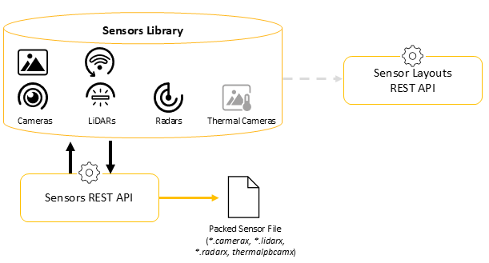

# Sensors REST API Description

## Introduction

The Sensors REST API allows you to manage your Sensor Library.

This API offers the same capabilities as the Sensor Modeler section of the Sensor Labs desktop application, namely:

-   Upload multiple packed sensors and add them to the library
-   Create a new sensor with default values for each of its properties
-   Update the definition of a sensor:
    -   with the information in the body
    -   by deleting an external file
    -   by uploading an external file
-   Download the sensor to a file with the specified name
-   Download all the sensors in a zip file
-   Download the external file
-   List all sensors available in the library, or list specific sensors using filters
-   Read the definition of a sensor
-   Delete a sensor from the library
-   Delete all the sensors from the library
-   Protect a section of a sensor with a password:
    -   For radars - Antenna and Mode Configuration
    -   For cameras and fisheye cameras - Imager
-   Unprotect a section for a given sensor using its password
    -   For radars - Antenna and Mode Configuration
    -   For cameras and fisheye cameras - Imager

**Important note:** Thermal camera sensors are not fully supported, they cannot be created, updated or read.

For more details about the parameters for each type of sensor refer to the following sections of the AVxcelerate Sensors Simulator User's Guide:

-   Physics-Based Camera
-   Physics-Based LiDAR
-   Physics-Based Radar

Sensors is a REST API. Built on a client-to-server response logic, this API allows you to easily communicate with the Sensor Modeler application's backends by performing simple API calls in the form of HTTP requests.

To operate Sensors REST API and Sensor Layouts REST API use TCP ports.

-   Sensors API: TCP 5128
-   Sensor Layouts API: TCP 5127
-   Sensor Layout Library: TCP 5101
-   Sensor Library: TCP 5102
-   Sensor Foundry: TCP 5103
-   Sensor Editor: TCP 5104
-   Sensor Layout Editor: TCP 5105

To use Sensors REST API, you have to select the **AVxcelerate Sensor Labs** feature when you install the AVxcelerate Sensors package.

To access the Sensors REST API, start the server using the script provided in the *Sensor\_Labs\_API* folder:

-   on Windows: `sensor-labs-api.ps1`
-   on Linux: `sensor-labs-api.sh`

An interactive version of the API documentation, with a Swagger interface, is available when running the script with the \`start-doc\` argument.

The **REFERENCE DOCUMENTATION** provided on the Developer Portal is not testable.

## Resources

The endpoints of this API allow you to handle the following resources:

-   sensor models \(cameras, fisheye cameras, LiDARs, radars and thermal cameras\)
-   external files, for example:
    -   for radars: .fdd, .txt for chirp or pulse sequence
    -   for cameras: .specturm, .OPTdistortion, .txt \(fragment shader\)
    -   for LiDARs: .ies, .intensity or .xmp file \(pattern table for beam spatial shape\), .txt \(firing sequence file\)

## Platform overview

Creating sensor models is one of the steps needed to prepare a sensor simulation in AVxcelerate Sensors Simulator.

The sensor models created using Sensors REST API are the inputs for the creation and edition of Sensor Layouts using the Sensor Layouts REST API.



Sensor models can also be downloaded as packed sensor files \(.camerax, .lidarx, .radarx and .thermalpbcamx\) so that they can be shared.

Using Sensors REST API, you can develop applications for batch creation of sensor models or Sensor Library management automation.

Each sensor model has a unique identifier which is automatically generated and not editable.

To read or update a sensor model, the sensor's identifier is a required input parameter. To get the identifier \(ID\) of all the sensors in your library, you can use the method **GET /avx-sensorlabs/v7/sensors**. When creating a new sensor, the identifier of the created sensor is provided in the response.

The sensor identifiers are also needed when updating a Sensor Layout in Sensor Layouts REST API.

Both Sensors and Sensor Layouts REST APIs rely on the same server and micro-services.

## Requests

The easiest way to send API requests is using the Swagger UI interactive documentation, however you can also use Curl or Postman.

Here are some request examples.

**GET request**

To list all the sensors available in the library:

Curl

```
curl -X 'GET' \
'http://localhost:5128/avx-sensorlabs/v7/sensors?sortByType=true&sortByName=true' \
-H 'accept: application/json'
```

Postman

**GET** `http://localhost:5128/avx-sensorlabs/v7/sensors?sortByType=true&sortByName=true`

**POST request**

To create a rotating LiDAR sensor with a name and a default value for each of its properties:

Curl

```
curl -X 'POST' \
  'http://localhost:5128/avx-sensorlabs/v7/sensors' \
  -H 'accept: application/json' \
  -H 'Content-Type: application/json' \
  -d '{
  "type": "RotatingLidar",
  "name": "myRotatingLidar"
}'
```

Postman

**POST** `http://localhost:5128/avx-sensorlabs/v7/sensors`

In the request body, select **Raw \> json**, then define the type and name of the sensor to create, for example:

```
{
"type": "RotatingLidar",
"name": "myRotatingLidar"
}
```

**PUT request**

To protect the modes of a radar sensor with a password:

Curl

```
curl -X 'PUT' \
'http://localhost:5128/avx-sensorlabs/v7/4e4627da-1e93-480d-8d4e-8787b4fbe595/protect' \
-H 'accept: */*' \
-H 'Content-Type: multipart/form-data' \
-F 'password=TeSt1n$plm' \
-F 'section=RadarMode'
```

Postman

**PUT** `http://localhost:5128/avx-sensorlabs/v7/46fffdb1-04ae-4abc-a503-006320ae2932/protect`

In the request body, select **form-data** then define the section and the password, for example:

|Key|Value|
|---|-----|
|`section`|`RadarMode`|
|`password`|`TeSt1n$plm`|

**DELETE request**

To delete a sensor from the library:

Curl

```
curl -X 'DELETE' \
'http://localhost:5128/avx-sensorlabs/v7/sensors/4e4627da-1e93-480d-8d4e-8787b4fbe595' \
-H 'accept: application/json'
```

Postman

**DELETE** `http://localhost:5128/avx-sensorlabs/v7/sensors/4e4627da-1e93-480d-8d4e-8787b4fbe595`

## Responses

The **REFERENCE DOCUMENTATION** provides response samples in json format for each endpoint.

Here are the possible response types:

|Response|Description|
|--------|-----------|
|`200 Success`|Success with or without response body.|
|`204 Success`|Success without response body.|
|`400 Bad Request`| |
|`404 Not Found`| |

