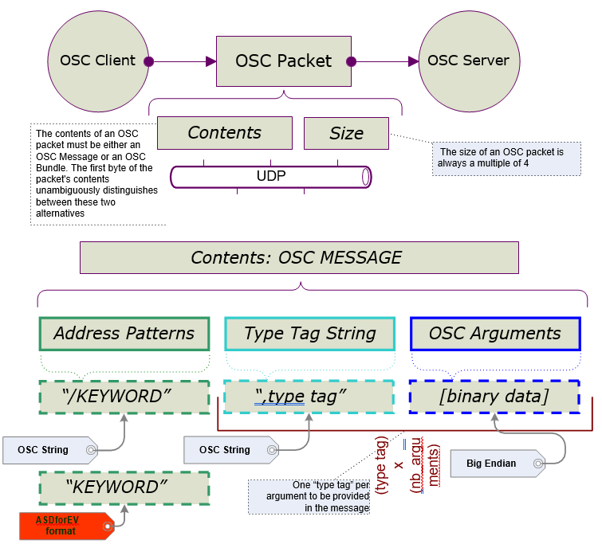

# OSC Protocol

## OSC Standard

Open Sound Control \(OSC - [opensoundcontrol.org](http://opensoundcontrol.org)\) is a protocol for communication among computers, sound synthesizers, and other multimedia devices that is optimized for modern networking technology and has been used in many application areas. OSC was defined and is supported by CNMAT of Berkeley University \([cnmat.berkeley.edu/](http://cnmat.berkeley.edu/)\)

The unit of transmission of OSC is an OSC Packet. Any application that sends OSC Packets is an OSC Client. Any application that receives OSC Packets is an OSC Server.

## OSC for Ansys Sound: ASDforEV

Ansys Sound: ASDforEV communication uses **OSC Messages** only. Refer to [open source control documentation](http://opensoundcontrol.org) for more details.

**Ansys Sound: ASDforEV** is the OSC server.

The API describes the UDP messages to use for building an OSC client. This client will send messages to **Ansys Sound: ASDforEV** \(the server\).

OSC packets are sent from one application to the other using UDP protocol. An OSC packet consists of its content \(a contiguous block of binary data\), and its size \(the number of bytes \(8-bit\) that comprise the content\).

**Important:** The size of an OSC packet is always a multiple of 4.

Under Windows operating system, OSC data endianness must be in BIG ENDIAN.

*OSC STRING is a sequence of non-null ASCII characters followed by a null, followed by 0-3 additional null characters to make the total number of bits a multiple of 32.*

Example 1: the string 'OSC' is coded as follows:

```
[O]+[S]+[C]+[\0]
```

Example 2: the string 'DATA' is coded as follows:

```
[D]+[A]+[T]+[A]+[\0]+[\0]+[\0]+[\0]
```

Example 3: the string 'SPEED' is coded as follows:

```
[S]+[P]+[E]+[E]+[D]+[\0]+[\0]+[\0]
```

An "OSC MESSAGE" contains:

\{ADDRESS\_PATTERN\}\{TYPE\_TAG\_STRING\}\{OSC arguments\}

**\{ADDRESS\_PATTERN\}** is an OSC STRING that starts with the character slash "/". Following the slash character, you use a KEYWORD explaining the type of audio processing applied on the data passed in argument.

Example: \{\[‘/’\]KEYWORD\}

**Important:** For Ansys Sound: ASDforEV , the slash \("/"\) character must **NOT** appear.

**\{TYPE\_TAG\_STRING\}** is an OSC STRING beginning with a comma "," and followed by as many "type tags" as the following data count.

A TYPE TAG is a set of letters coding the binary data type following.

These types used by Car Sound Simulator are \{'i','f','s'\} as follows:

- **i** : integer 32 bits
- **f** : for single precision floating point values \(32 bits\)
- **s** : OSC String

Example: \{","\[TYPE\_TAG\]\}

**\{OSC arguments\}** is a sequence of OSC Arguments is represented by a contiguous sequence of the binary representations of each argument.



## References

Original OSC documentation: [opensoundcontrol.org](http://opensoundcontrol.org)

OSCpack is a suitable library for C++ implementation of OSC messages: [www.rossbencina.com/code/oscpack](http://www.rossbencina.com/code/oscpack)
