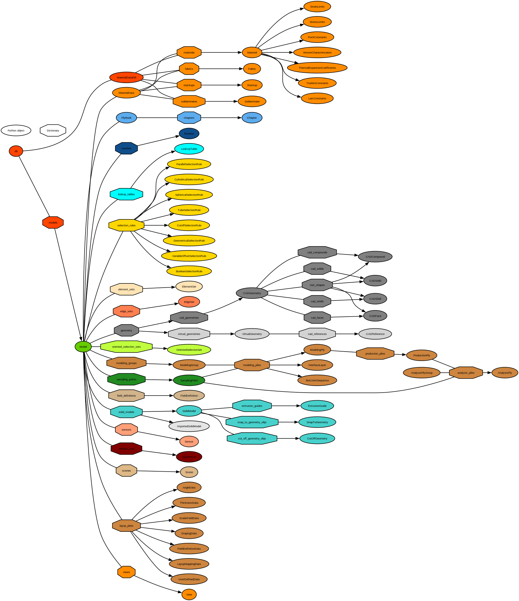

# The Python object tree

The ACP scripting interface is organized as a static Python object tree.
This tree includes all loaded models, solutions, definitions, views, and scenes.

You can access the currently loaded object tree through the root object [`compolyx.DB`](_autosummary/compolyx.DB.md#compolyx.DB) in the embedded Python shell.

