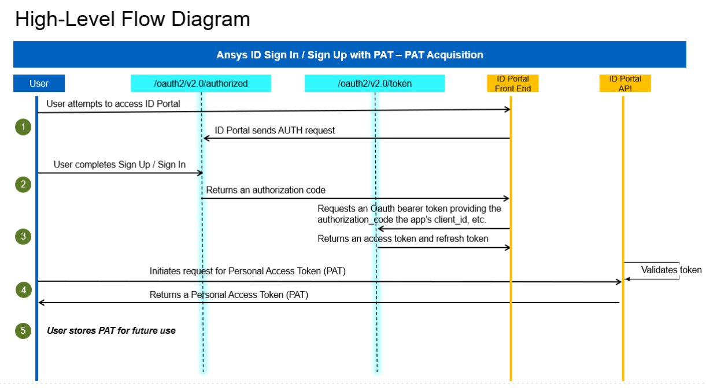
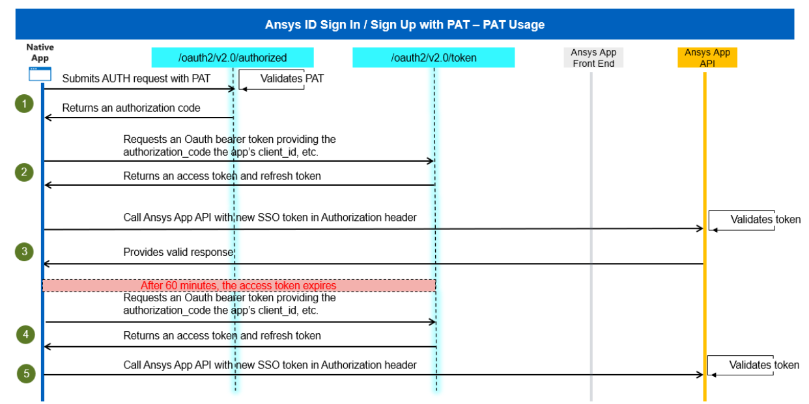

# Overview

## What is PAT authentication?

A **Personal Access Token (PAT)** is a secure, long-lived authentication token that allows a user or application to access Ansys services and APIs without requiring an interactive sign-in each time. Instead of entering a username and password for every sign in workflow, the PAT acts as a “portable credential” that can be used programmatically.

PATs are typically used when: 
* Automation scripts or tools need to authenticate without a browser 
* Applications require secure, non-interactive access to Ansys APIs 
* Users need a token to use command-line tools or scheduled jobs 

PATs are associated with: 
* A specific user, and 
* A specific Ansys account, and 
* A defined set of scopes/permissions. 

PATs also support configurable expiration dates and can be revoked anytime through the Ansys ID Portal. 

---

## Where is PAT authentication used? 

PAT authentication is enabled in Ansys ID SSO, which is integrated into Ansys products and internal/external systems. 

* **Automation**: Scripts or tools running on servers, or cron jobs often cannot perform browser-based login. PATs enable: 
    - Automated API calls
    - Nightly batch jobs
    - Backend service integrations 

* **End-User Tools and Command-Line Utilities**: Customers who use command-line utilities or local automation can authenticate using a PAT instead of logging in through a browser each time. 

* **Partner & Customer Integrations**: External partners or enterprise customers integrating their systems with Ansys-managed services use PATs when their applications need secure programmatic access. 

---

## High-level flow diagram

Below is a simplified representation of the PAT Authentication process with summary of flow:

1. PAT is created interactively through Ansys ID Portal 
2. User or application passes the PAT to a helper script or authentication flow 
3. PAT is validated by Ansys ID SSO 
4. Ansys ID SSO returns an Access Token, which is used for API calls 

---

## Key terminology

* **Personal Access Token (PAT)**: A long-lived token generated through the AnsysID Portal. 

    - Represents a user’s permissions under given account. 
    - Has configurable expiration 
    - Is used to obtain an Ansys ID SSO Access Token 
    - Can be revoked anytime 

 

* **AnsysID SSO**: The identity platform used by Ansys internal/external app for authentication: 

    - Authenticating users 
    - Supports OpenID Connect (OIDC) 
    - Validating PATs
    - Providing Access, ID, and Refresh tokens 

    When a PAT is used, Ansys ID SSO performs the actual authentication and token issuance  

* **Access Token**: A short-lived JWT (JSON Web Token) returned by Ansys ID SSO after validating a PAT. It contains: 

    - User identity 
    - Allowed scopes 
    - Expiration time 
    - Permissions to access Ansys API 
    
    Most API calls require the Access Token in the Authorization: Bearer <token> header. 

* **Ansys ID Portal**: This is the user interface where customers and internal staff can: 

    - Sign into Ansys ID 
    - Manage user profiles 
    - View or request account membership 
    - Generate, view, or revoke Personal Access Tokens (PATs) 
    
    The portal is the primary method for end users to obtain PATs. 

 

* **Scopes**: Determine what kind of Ansys ID SSO tokens are granted. Examples include: 

    - openid 
    - offline_access 
    - Product or resource-specific scopes 

* **Account**: An Ansys ID Account represents an organization, business entity, or project space. PATs are always associated with a specific account, and all API access is performed in the context of that account. 

 
---

