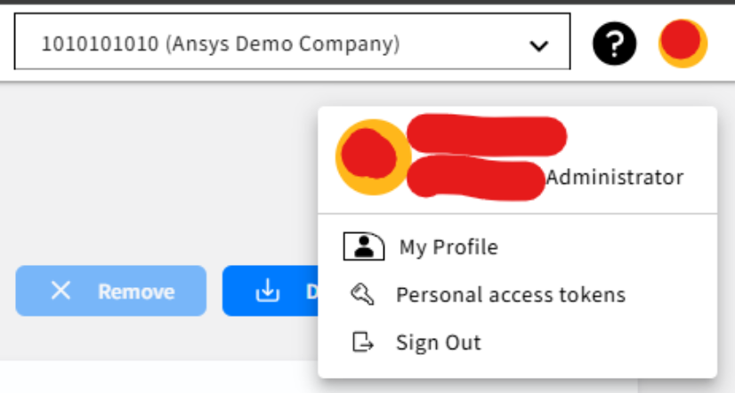
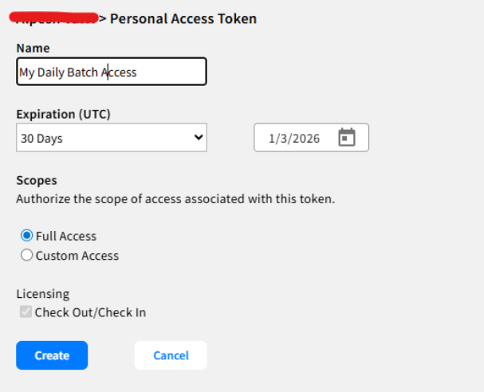
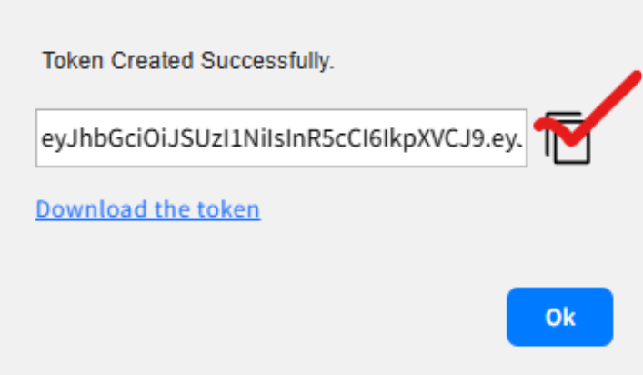
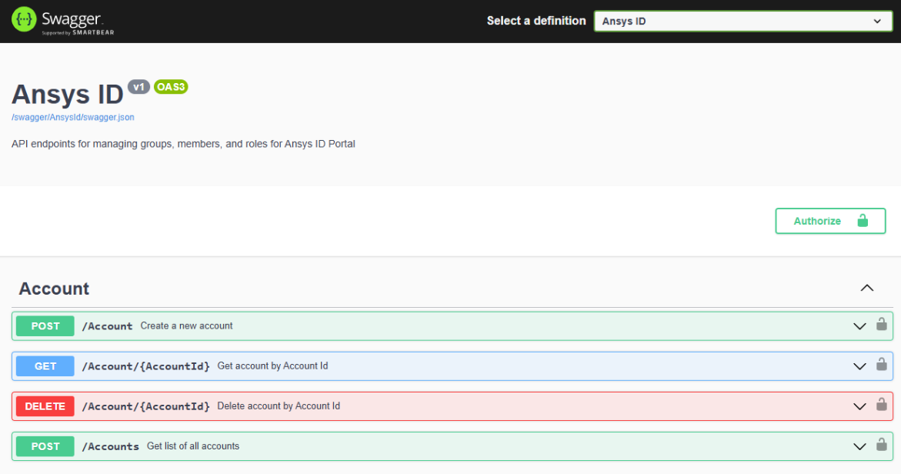

# Instructions for end users and customers

This section is written for external users who need to obtain and use Personal Access Tokens (PATs) in their applications, scripts, or integrations.

## Overview

**What is a Personal Access Token (PAT)?**

A Personal Access Token (PAT) is a secure, time-limited token used to authenticate to Ansys APIs or tools without requiring your username and password every time.

A PAT is:

* A secure alternative to using your password
* Unique for each user
* Time-limited (you choose expiration)
* Sometimes required by automation tools or scripts

**Note**: A PAT represents your identity. Treat it like a password.

You will need a PAT if:
* You are using an Ansys tool or automation script that calls Ansys APIs
* Your application (or your team) was instructed to use PAT authentication
* You are following a developer guide that requires PAT usage

## How to generate a PAT

* **Requirements**

    Before you can generate a PAT:
    * You must have an Ansys ID SSO user
    * You must be associated with a customer account number in salesforce
    * If you do not see an account listed > contact your Ansys Support Coordinator

* **Step-by-Step Guide**

1. Go to the Ansys ID Portal:

   ```
   https://id.ansys.com/
   ```

2. Sign in with your Ansys ID SSO credentials

3. If linked to multiple accounts, select the appropriate account (optional)

4. Click on profile icon and select the **Personal access token**



5. Click on **Create Token** button

6. Provide:

   * Token Name
   * Expiration Date
   * Scopes → Select **Full Access** under Scope for SSO authentication using a PAT

7. Click **Create** button



8. Copy the generated PAT



Provide the PAT to your application or to the helper script for Ansys ID SSO token generation.

---

* **Best Practices**

    - Treat your PAT like a password
    - Store it securely
    - Rotate it regularly
    - Never share it wih others
    - Delete unused tokens

---

## Using the Python Helper Script

The Python helper script simplifies exchanging the PAT for an Ansys ID SSO Access Token.

Reference script: [get_auth_code_with_access_token.py](https://github.com/ansys/DevRelPublic/blob/main/Downloads/Ansys-ID/get_auth_code_with_access_token.py)

---

* **Install Dependencies**

**Run Once**
```bash
pip install msal httpx requests
```

---

**Windows Usage Example**

```bash
py get_auth_code_with_access_token.py "<PAT_VALUE>"
```

---

**Linux / macOS Usage Example**

```bash
python3 get_auth_code_with_access_token.py "<PAT_VALUE>"
```

---
## Using the PowerShell Helper Script

The PowerShell helper script simplifies exchanging the PAT for an Ansys ID SSO Access Token.

Reference script: [Get-AccessTokenAndCallApi.ps1](https://github.com/ansys/DevRelPublic/raw/main/Downloads/Ansys-ID/Get-AccessTokenAndCallApi.ps1)

---

* **Install Dependencies**

**Run Once**

```bash
Install-Module MSAL.PS -Scope CurrentUser
```

---

**Windows Usage Example**

```bash
Call-Api
```

---

* **Script Behavior**

* Authenticates using your PAT
* Calls the Ansys ID SSO token endpoint
* Returns:

  * `access_token`
  * `id_token`
  * `refresh_token`

Applications use the `access_token` to call Ansys APIs.

---

## Ansys ID Portal API – Quick reference

The Ansys ID Portal API allows developers and users to manage accounts, users, and groups programmatically. This is helpful for automation and integrations operations.



---

* **Authentication Requirements**

**Most API calls require:**

```
Authorization: Bearer <Ansys ID SSO Access Token>
Content-Type: application/json
```

---

**Example API Call**

```bash
curl -X GET https://<portal-url>/api/accounts \
  -H "Authorization: Bearer <your-Access-Token>" \
  -H "Content-Type: application/json"
```

---

* **Environments**

**Production**

```
https://iam.ansys.com/swagger/index.html
```
