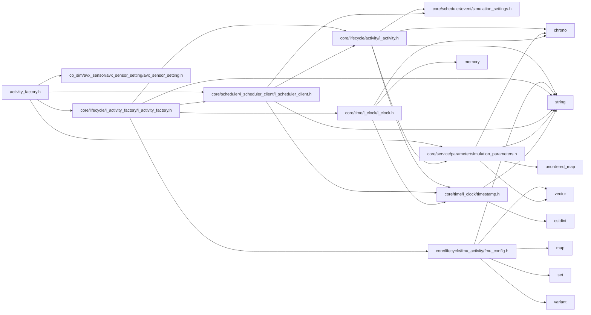

<a id="activity__factory_8h"></a>
# File activity\_factory.h

![][C++]

**Location**: `autonomy/simulation/activity\_factory/activity\_factory.h`


## Classes

* [simulation\_framework::autonomy::ActivityFactory](classsimulation__framework_1_1autonomy_1_1ActivityFactory.md#classsimulation__framework_1_1autonomy_1_1ActivityFactory)

## Namespaces

* [simulation\_framework](namespacesimulation__framework.md#namespacesimulation__framework)
* [autonomy](namespaceautonomy.md#namespaceautonomy)
* [simulation\_framework::autonomy](namespacesimulation__framework_1_1autonomy.md#namespacesimulation__framework_1_1autonomy)

## Includes

* co_sim/avx_sensor/avx_sensor_setting/avx_sensor_setting.h
* [core/lifecycle/i_activity_factory/i_activity_factory.h](i__activity__factory_8h.md#i__activity__factory_8h)
* [core/scheduler/i_scheduler_client/i_scheduler_client.h](i__scheduler__client_8h.md#i__scheduler__client_8h)
* [core/service/parameter/simulation_parameters.h](simulation__parameters_8h.md#simulation__parameters_8h)





## Source


```cpp


#pragma once

#include "co_sim/avx_sensor/avx_sensor_setting/avx_sensor_setting.h"
#include "core/lifecycle/i_activity_factory/i_activity_factory.h"
#include "core/scheduler/i_scheduler_client/i_scheduler_client.h"
#include "core/service/parameter/simulation_parameters.h"

namespace simulation_framework
{

namespace autonomy
{

using namespace simulation_framework::core;
using namespace simulation_framework::core::lifecycle;

class ActivityFactory : public IActivityFactory
{
  public:
    explicit ActivityFactory(const core::SimulationParameters& sim_params,
                             const time::milliseconds& base_cycle_time = time::milliseconds{50});

    std::unique_ptr<core::lifecycle::IActivity> Create(
        const std::string& activity_name,
        const core::scheduling::SchedulerClientType type = core::scheduling::SchedulerClientType::kDUMMY) override;

    std::unique_ptr<IActivity> CreateFmuActivity(
        const std::string& activity_name,
        const core::lifecycle::FmuConfig& fmu_config,
        const scheduling::SchedulerClientType type = scheduling::SchedulerClientType::kDUMMY) override;

    time::milliseconds GetSimulationBaseCycleTime() const override;

    void SetSimulationBaseCycleTime(const time::milliseconds& time) override;

  private:
    bool IfAvxSensorSettingsDefined(const std::string& activity_name,
                                    const std::vector<avx_sensor_cosim::AvxSensorSetting>& avx_sensor_settings) const;

    core::SimulationParameters sim_params_;

    time::milliseconds base_cycle_time_;
};

}  // namespace autonomy
}  // namespace simulation_framework
```


[public]: https://img.shields.io/badge/-public-brightgreen (public)
[C++]: https://img.shields.io/badge/language-C%2B%2B-blue (C++)
[private]: https://img.shields.io/badge/-private-red (private)
[const]: https://img.shields.io/badge/-const-lightblue (const)
[static]: https://img.shields.io/badge/-static-lightgrey (static)
[protected]: https://img.shields.io/badge/-protected-yellow (protected)