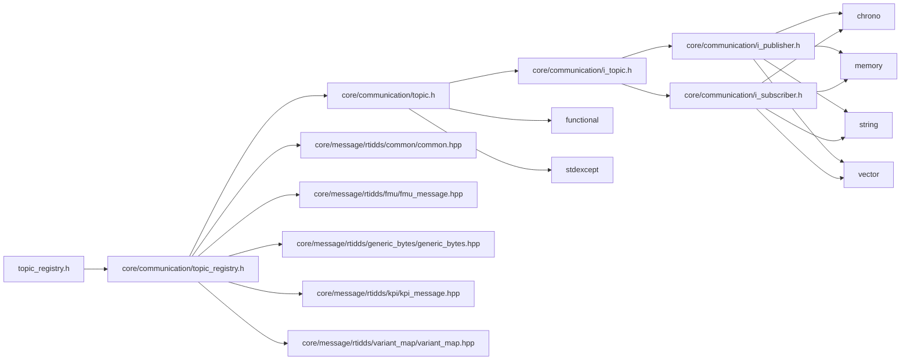

<a id="autonomy_2communication_2topic__registry_2topic__registry_8h"></a>
# File autonomy/communication/topic\_registry/topic\_registry.h

![][C++]

**Location**: `autonomy/communication/topic\_registry/topic\_registry.h`

© 2025 ANSYS, Inc. Unauthorized use, distribution, or duplication is prohibited.

Autonomy Topic Registry mapping and RTI-DDS usage guidance


This header documents how Autonomy Topic IDs map to concrete Topic types from <code>simulation_framework::core::topic_registry</code>, and shows how the underlying RTI-DDS messages can be published/subscribed in Activities.


See also:
* <code>[core/communication/topic\_registry.h](core_2communication_2topic__registry_8h_source.md#core_2communication_2topic__registry_8h_source)</code> for canonical Topic type aliases and examples

* <code>documentation/markdown/communication.md</code> for concepts and protobuf-bytes walkthrough

## Namespaces

* [simulation\_framework](namespacesimulation__framework.md#namespacesimulation__framework)
* [simulation\_framework::autonomy](namespacesimulation__framework_1_1autonomy.md#namespacesimulation__framework_1_1autonomy)
* [topic\_registry](namespacetopic__registry.md#namespacetopic__registry)
* [simulation\_framework::autonomy::topic\_registry](namespacesimulation__framework_1_1autonomy_1_1topic__registry.md#namespacesimulation__framework_1_1autonomy_1_1topic__registry)

## Includes

* [core/communication/topic_registry.h](core_2communication_2topic__registry_8h.md#core_2communication_2topic__registry_8h)





## Source


```cpp


#ifndef AUTONOMY_COMMUNICATION_TOPIC_REGISTRY_TOPIC_REGISTRY_H
#define AUTONOMY_COMMUNICATION_TOPIC_REGISTRY_TOPIC_REGISTRY_H

#include "core/communication/topic_registry.h"

namespace simulation_framework
{
namespace autonomy
{
namespace topic_registry
{

using ScenarioVariableTopicType = simulation_framework::core::topic_registry::VariantMapTopicType;

std::shared_ptr<core::ITopic> GetExistingTopicById(const std::string& topic_id);

}  // namespace topic_registry
}  // namespace autonomy
}  // namespace simulation_framework
#endif  // AUTONOMY_COMMUNICATION_TOPIC_REGISTRY_TOPIC_REGISTRY_H
```


[public]: https://img.shields.io/badge/-public-brightgreen (public)
[C++]: https://img.shields.io/badge/language-C%2B%2B-blue (C++)
[private]: https://img.shields.io/badge/-private-red (private)
[const]: https://img.shields.io/badge/-const-lightblue (const)
[static]: https://img.shields.io/badge/-static-lightgrey (static)
[protected]: https://img.shields.io/badge/-protected-yellow (protected)