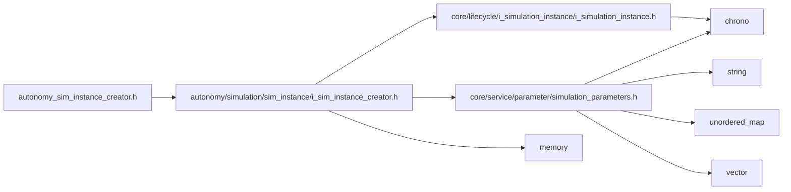

<a id="autonomy__sim__instance__creator_8h"></a>
# File autonomy\_sim\_instance\_creator.h

![][C++]

**Location**: `autonomy/simulation/sim\_instance/autonomy\_sim\_instance\_creator.h`


## Classes

* [simulation\_framework::autonomy::AutonomySimInstanceCreator](classsimulation__framework_1_1autonomy_1_1AutonomySimInstanceCreator.md#classsimulation__framework_1_1autonomy_1_1AutonomySimInstanceCreator)

## Namespaces

* [simulation\_framework](namespacesimulation__framework.md#namespacesimulation__framework)
* [autonomy](namespaceautonomy.md#namespaceautonomy)
* [simulation\_framework::autonomy](namespacesimulation__framework_1_1autonomy.md#namespacesimulation__framework_1_1autonomy)

## Includes

* [autonomy/simulation/sim_instance/i_sim_instance_creator.h](i__sim__instance__creator_8h.md#i__sim__instance__creator_8h)





## Source


```cpp


#pragma once

#include "autonomy/simulation/sim_instance/i_sim_instance_creator.h"

namespace simulation_framework
{

namespace autonomy
{

class AutonomySimInstanceCreator : public ISimInstanceCreator
{
  public:
    AutonomySimInstanceCreator() = default;
    ~AutonomySimInstanceCreator() = default;

    std::unique_ptr<core::lifecycle::ISimulationInstance> Create(
        const core::SimulationParameters& core_parameters) override;
};

}  // namespace autonomy
}  // namespace simulation_framework
```


[public]: https://img.shields.io/badge/-public-brightgreen (public)
[C++]: https://img.shields.io/badge/language-C%2B%2B-blue (C++)
[private]: https://img.shields.io/badge/-private-red (private)
[const]: https://img.shields.io/badge/-const-lightblue (const)
[static]: https://img.shields.io/badge/-static-lightgrey (static)
[protected]: https://img.shields.io/badge/-protected-yellow (protected)