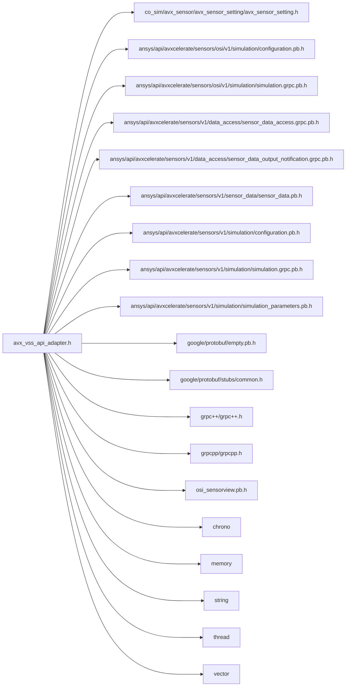

<a id="avx__vss__api__adapter_8h"></a>
# File avx\_vss\_api\_adapter.h

![][C++]

**Location**: `co\_sim/avx\_sensor/avx\_vss\_api\_adapter/avx\_vss\_api\_adapter.h`


## Classes

* [simulation\_framework::avx\_sensor\_cosim::AvxVssApiAdapter](classsimulation__framework_1_1avx__sensor__cosim_1_1AvxVssApiAdapter.md#classsimulation__framework_1_1avx__sensor__cosim_1_1AvxVssApiAdapter)

## Namespaces

* [simulation\_framework](namespacesimulation__framework.md#namespacesimulation__framework)
* [simulation\_framework::avx\_sensor\_cosim](namespacesimulation__framework_1_1avx__sensor__cosim.md#namespacesimulation__framework_1_1avx__sensor__cosim)

## Includes

* co_sim/avx_sensor/avx_sensor_setting/avx_sensor_setting.h
* <ansys/api/avxcelerate/sensors/osi/v1/simulation/configuration.pb.h>
* <ansys/api/avxcelerate/sensors/osi/v1/simulation/simulation.grpc.pb.h>
* <ansys/api/avxcelerate/sensors/v1/data_access/sensor_data_access.grpc.pb.h>
* <ansys/api/avxcelerate/sensors/v1/data_access/sensor_data_output_notification.grpc.pb.h>
* <ansys/api/avxcelerate/sensors/v1/sensor_data/sensor_data.pb.h>
* <ansys/api/avxcelerate/sensors/v1/simulation/configuration.pb.h>
* <ansys/api/avxcelerate/sensors/v1/simulation/simulation.grpc.pb.h>
* <ansys/api/avxcelerate/sensors/v1/simulation/simulation_parameters.pb.h>
* <google/protobuf/empty.pb.h>
* <google/protobuf/stubs/common.h>
* <grpc++/grpc++.h>
* <grpcpp/grpcpp.h>
* <osi_sensorview.pb.h>
* <chrono>
* <memory>
* <string>
* <thread>
* <vector>





## Source


```cpp


#pragma once

#include "co_sim/avx_sensor/avx_sensor_setting/avx_sensor_setting.h"
#include <ansys/api/avxcelerate/sensors/osi/v1/simulation/configuration.pb.h>
#include <ansys/api/avxcelerate/sensors/osi/v1/simulation/simulation.grpc.pb.h>
#include <ansys/api/avxcelerate/sensors/v1/data_access/sensor_data_access.grpc.pb.h>
#include <ansys/api/avxcelerate/sensors/v1/data_access/sensor_data_output_notification.grpc.pb.h>
#include <ansys/api/avxcelerate/sensors/v1/sensor_data/sensor_data.pb.h>
#include <ansys/api/avxcelerate/sensors/v1/simulation/configuration.pb.h>
#include <ansys/api/avxcelerate/sensors/v1/simulation/simulation.grpc.pb.h>
#include <ansys/api/avxcelerate/sensors/v1/simulation/simulation_parameters.pb.h>
#include <google/protobuf/empty.pb.h>
#include <google/protobuf/stubs/common.h>
#include <grpc++/grpc++.h>
#include <grpcpp/grpcpp.h>
#include <osi_sensorview.pb.h>
#include <chrono>
#include <memory>
#include <string>
#include <thread>
#include <vector>

namespace simulation_framework
{
namespace avx_sensor_cosim
{

class AvxVssApiAdapter
{
  public:
    using SensorDataDescriptions =
        std::vector<ansys::api::avxcelerate::sensors::v1::data_access::SensorDataDescription>;

    AvxVssApiAdapter(const std::string& grpc_endpoint,
                     ApiVariant api_variant = ApiVariant::kUpdateByWorldUpdate,
                     const TransportModeConfig& transport_config = TransportModeConfig{});

    ~AvxVssApiAdapter();

    bool Load(const ansys::api::avxcelerate::sensors::osi::v1::simulation::Configuration& configuration,
              const std::chrono::seconds& timeout_in_seconds = std::chrono::seconds(30));

    bool Load(const ansys::api::avxcelerate::sensors::v1::simulation::Configuration& configuration,
              const std::chrono::seconds& timeout_in_seconds = std::chrono::seconds(30));

    bool Update(const osi3::GroundTruth& ground_truth,
                const std::chrono::seconds& timeout_in_seconds = std::chrono::seconds(5));

    bool Update(const ansys::api::avxcelerate::sensors::v1::simulation::WorldUpdate& world_update,
                const std::chrono::seconds& timeout_in_seconds = std::chrono::seconds(5));

    bool Initialize(const ansys::api::avxcelerate::sensors::v1::simulation::WorldUpdate& world_update,
                    const std::chrono::seconds& timeout_in_seconds = std::chrono::seconds(5));

    bool Stop(const std::chrono::seconds& timeout_in_seconds = std::chrono::seconds(5));

    bool Unload(const std::chrono::seconds& timeout_in_seconds = std::chrono::seconds(5));

    bool Kill(const std::chrono::seconds& timeout_in_seconds = std::chrono::seconds(5));

    SensorDataDescriptions GetLatestSensorDataDescriptions(
        const std::chrono::milliseconds& timeout_in_milliseconds = std::chrono::milliseconds(1000));

    const std::vector<std::string>& GetSensorIdentifiers() const;

    void SetSensorIdentifiers(
        const ansys::api::avxcelerate::sensors::v1::simulation::SimulationParameters& simulation_parameters);

    static std::vector<unsigned char> SerializeSensorDataDescriptions(
        const SensorDataDescriptions& sensor_data_descriptions);

    static SensorDataDescriptions DeserializeSensorDataDescriptions(const std::vector<unsigned char>& bytes_array);

  private:
    bool IsRequestSuccessful(const grpc::Status& grpc_status, const std::string& request_name);

    bool WaitForConnection(const std::chrono::seconds& timeout_in_seconds, const bool silent_info = false);

    bool ReadSensorDataDescription(
        ansys::api::avxcelerate::sensors::v1::data_access::SensorDataDescription& sd_description,
        const std::chrono::milliseconds& timeout_in_milliseconds);

    bool IsAllSensorDataDescriptionsAvailable(const SensorDataDescriptions& sensor_data_descriptions);

    std::unique_ptr<ansys::api::avxcelerate::sensors::osi::v1::simulation::Simulation::Stub>
        vss_simulation_control_osi_;
    std::unique_ptr<ansys::api::avxcelerate::sensors::v1::simulation::Simulation::Stub> vss_simulation_control_v1_;

    std::unique_ptr<ansys::api::avxcelerate::sensors::v1::data_access::SensorDataNotifier::Stub>
        sensor_data_notifier_stub_;

    std::unique_ptr<grpc::ClientReader<ansys::api::avxcelerate::sensors::v1::data_access::SensorDataDescription>>
        sensor_data_description_reader_;

    std::shared_ptr<grpc::Channel> grpc_channel_;

    std::string grpc_endpoint_;

    grpc::ClientContext context_sensor_data_notifier_;

    std::vector<std::string> sensor_identifiers_;

    ApiVariant api_variant_;
};

}  // namespace avx_sensor_cosim
}  // namespace simulation_framework
```


[public]: https://img.shields.io/badge/-public-brightgreen (public)
[C++]: https://img.shields.io/badge/language-C%2B%2B-blue (C++)
[private]: https://img.shields.io/badge/-private-red (private)
[const]: https://img.shields.io/badge/-const-lightblue (const)
[static]: https://img.shields.io/badge/-static-lightgrey (static)
[protected]: https://img.shields.io/badge/-protected-yellow (protected)