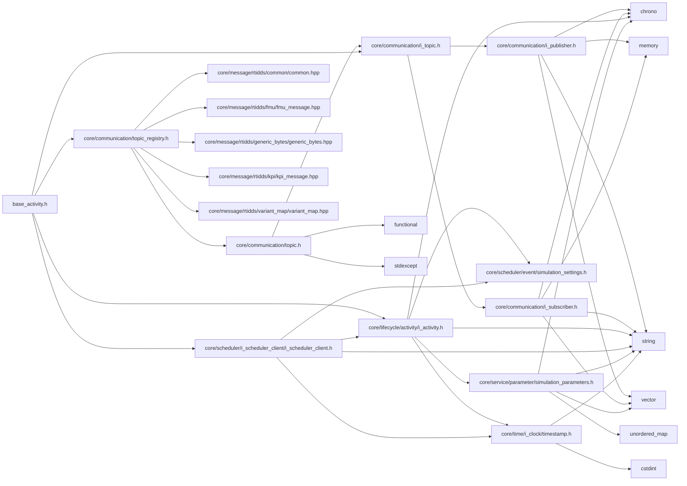
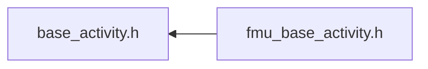

<a id="base__activity_8h"></a>
# File base\_activity.h

![][C++]

**Location**: `core/lifecycle/activity/base\_activity.h`


## Classes

* [simulation\_framework::core::lifecycle::BaseActivity](classsimulation__framework_1_1core_1_1lifecycle_1_1BaseActivity.md#classsimulation__framework_1_1core_1_1lifecycle_1_1BaseActivity)

## Namespaces

* [simulation\_framework](namespacesimulation__framework.md#namespacesimulation__framework)
* [simulation\_framework::core](namespacesimulation__framework_1_1core.md#namespacesimulation__framework_1_1core)
* [simulation\_framework::core::lifecycle](namespacesimulation__framework_1_1core_1_1lifecycle.md#namespacesimulation__framework_1_1core_1_1lifecycle)

## Includes

* [core/communication/i_topic.h](i__topic_8h.md#i__topic_8h)
* [core/communication/topic_registry.h](core_2communication_2topic__registry_8h.md#core_2communication_2topic__registry_8h)
* [core/lifecycle/activity/i_activity.h](i__activity_8h.md#i__activity_8h)
* [core/scheduler/i_scheduler_client/i_scheduler_client.h](i__scheduler__client_8h.md#i__scheduler__client_8h)





## Included by

* [fmu_base_activity.h](fmu__base__activity_8h.md#fmu__base__activity_8h)





## Source


```cpp


#pragma once

#include "core/communication/i_topic.h"
#include "core/communication/topic_registry.h"
#include "core/lifecycle/activity/i_activity.h"
#include "core/scheduler/i_scheduler_client/i_scheduler_client.h"

namespace simulation_framework
{
namespace core
{

class CommunicationManager;

namespace lifecycle
{
// clang-format off
// clang-format on

class BaseActivity : public IActivity
{
  public:
    BaseActivity(const std::string& activity_name,
                 std::shared_ptr<core::CommunicationManager> communication_manager_ptr,
                 std::unique_ptr<scheduling::ISchedulerClient> scheduler_client);

    BaseActivity(const std::string& activity_name,
                 std::shared_ptr<core::CommunicationManager> communication_manager_ptr,
                 std::unique_ptr<scheduling::ISchedulerClient> scheduler_client,
                 std::chrono::milliseconds timeout);

    BaseActivity(const std::string& activity_name, const Topics& topics);

    BaseActivity(const std::string& activity_name, const Topics& topics, std::chrono::milliseconds timeout);

    virtual ~BaseActivity();

    std::string GetName() const override;

    void SetUpCommunication() final;

    void Step() final;

    void Shutdown() final;

    time::Timestamp GetCurrentTimestamp() const final;

    std::chrono::milliseconds GetCycleTime() const final;

    std::string GetSimulationOutputDirectory() const final;

    const SimulationParameters::CustomizedParameters& GetCustomizedParameters() const final;

    void SetSimulationSettings(const scheduling::SimulationSettings& sim_settings) final;

  protected:
    void Init() override {}

    void Finalize() override{};

    virtual void ExecuteStep() = 0;

    virtual void AddPublisherAndSubscriber() = 0;

    template <typename Topic>
    void AddPublisher(const core::TopicId& topic_id, typename Topic::PublisherCallback callback);
    template <typename Topic>
    void AddSubscriber(const core::TopicId& topic_id, typename Topic::SubscriberMessageCallback callback);

  private:
    void WaitForPubSubConnection() override;

    std::string name_;
    std::shared_ptr<core::CommunicationManager> communication_manager_ptr_;
    std::unique_ptr<scheduling::ISchedulerClient> scheduler_client_ptr_;
    std::chrono::milliseconds timeout_;
    bool is_init_step_finished_{false};
};

}  // namespace lifecycle
}  // namespace core
}  // namespace simulation_framework
```


[public]: https://img.shields.io/badge/-public-brightgreen (public)
[C++]: https://img.shields.io/badge/language-C%2B%2B-blue (C++)
[private]: https://img.shields.io/badge/-private-red (private)
[const]: https://img.shields.io/badge/-const-lightblue (const)
[static]: https://img.shields.io/badge/-static-lightgrey (static)
[protected]: https://img.shields.io/badge/-protected-yellow (protected)