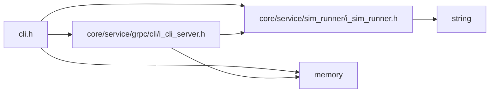

<a id="cli_8h"></a>
# File cli.h

![][C++]

**Location**: `core/service/cli/cli.h`


## Classes

* [simulation\_framework::core::Cli](classsimulation__framework_1_1core_1_1Cli.md#classsimulation__framework_1_1core_1_1Cli)

## Namespaces

* [simulation\_framework](namespacesimulation__framework.md#namespacesimulation__framework)
* [simulation\_framework::core](namespacesimulation__framework_1_1core.md#namespacesimulation__framework_1_1core)

## Includes

* [core/service/grpc/cli/i_cli_server.h](i__cli__server_8h.md#i__cli__server_8h)
* [core/service/sim_runner/i_sim_runner.h](i__sim__runner_8h.md#i__sim__runner_8h)
* <memory>





## Included by

* [cli_provider.h](cli__provider_8h.md#cli__provider_8h)


## Source


```cpp


#pragma once

#include "core/service/grpc/cli/i_cli_server.h"
#include "core/service/sim_runner/i_sim_runner.h"
#include <memory>

namespace simulation_framework
{
namespace core
{

class Cli
{
  public:
    Cli(std::unique_ptr<ISimRunner> sim_runner, std::unique_ptr<ISimfwkCliServer> simfwk_cli_server = nullptr);

    bool Execute();

  private:
    std::unique_ptr<ISimRunner> sim_runner_;

    std::unique_ptr<ISimfwkCliServer> simfwk_cli_server_;
};

}  // namespace core
}  // namespace simulation_framework
```


[public]: https://img.shields.io/badge/-public-brightgreen (public)
[C++]: https://img.shields.io/badge/language-C%2B%2B-blue (C++)
[private]: https://img.shields.io/badge/-private-red (private)
[const]: https://img.shields.io/badge/-const-lightblue (const)
[static]: https://img.shields.io/badge/-static-lightgrey (static)
[protected]: https://img.shields.io/badge/-protected-yellow (protected)