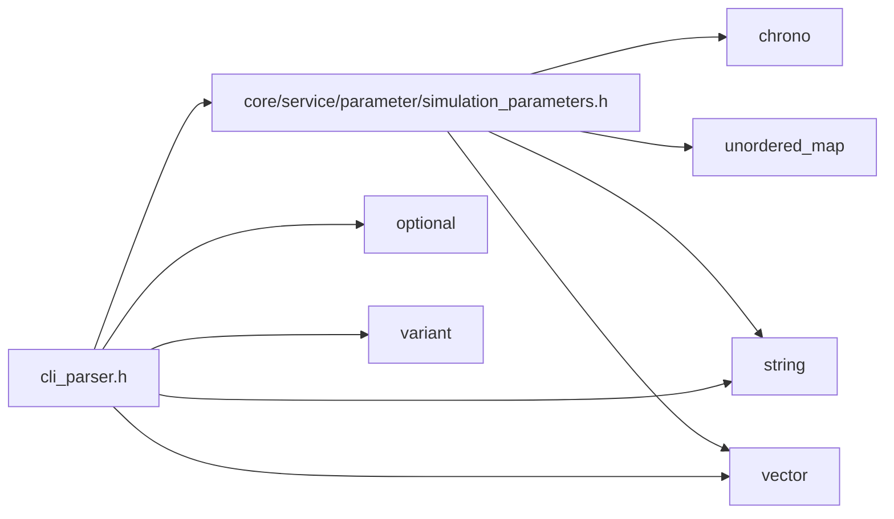

<a id="cli__parser_8h"></a>
# File cli\_parser.h

![][C++]

**Location**: `core/service/cli/cli\_parser.h`


## Classes

* [simulation\_framework::core::CliParser](classsimulation__framework_1_1core_1_1CliParser.md#classsimulation__framework_1_1core_1_1CliParser)

## Namespaces

* [simulation\_framework](namespacesimulation__framework.md#namespacesimulation__framework)
* [simulation\_framework::core](namespacesimulation__framework_1_1core.md#namespacesimulation__framework_1_1core)

## Includes

* [core/service/parameter/simulation_parameters.h](simulation__parameters_8h.md#simulation__parameters_8h)
* <optional>
* <string>
* <variant>
* <vector>





## Source


```cpp


#pragma once

#include "core/service/parameter/simulation_parameters.h"
#include <optional>
#include <string>
#include <variant>
#include <vector>

namespace simulation_framework
{
namespace core
{

class CliParser final
{
  public:
    bool Parse(int argc, const char** argv);

    std::string GetParserMessage() const;

    const SimulationParameters& GetSimulationParameters() const;

    std::string GetSimulationConfig() const;

  private:
    bool ConvertCustomizedParameterFromArgs(const std::vector<std::string>& input_args,
                                            SimulationParameters::CustomizedParameters& customized_parameters);

    SimulationParameters core_parameters_{};

    std::string parser_message_{};
};

}  // namespace core
}  // namespace simulation_framework
```


[public]: https://img.shields.io/badge/-public-brightgreen (public)
[C++]: https://img.shields.io/badge/language-C%2B%2B-blue (C++)
[private]: https://img.shields.io/badge/-private-red (private)
[const]: https://img.shields.io/badge/-const-lightblue (const)
[static]: https://img.shields.io/badge/-static-lightgrey (static)
[protected]: https://img.shields.io/badge/-protected-yellow (protected)