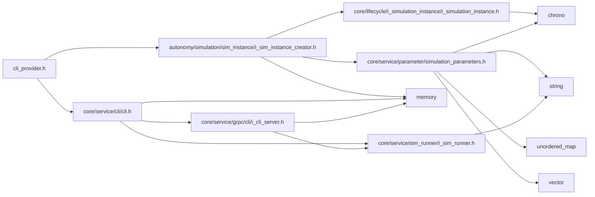

<a id="cli__provider_8h"></a>
# File cli\_provider.h

![][C++]

**Location**: `autonomy/cli/cli\_provider/cli\_provider.h`


## Classes

* [simulation\_framework::autonomy::cli::CliProvider](classsimulation__framework_1_1autonomy_1_1cli_1_1CliProvider.md#classsimulation__framework_1_1autonomy_1_1cli_1_1CliProvider)

## Namespaces

* [simulation\_framework](namespacesimulation__framework.md#namespacesimulation__framework)
* [autonomy](namespaceautonomy.md#namespaceautonomy)
* [simulation\_framework::autonomy](namespacesimulation__framework_1_1autonomy.md#namespacesimulation__framework_1_1autonomy)
* [cli](namespacecli.md#namespacecli)
* [simulation\_framework::autonomy::cli](namespacesimulation__framework_1_1autonomy_1_1cli.md#namespacesimulation__framework_1_1autonomy_1_1cli)

## Includes

* [autonomy/simulation/sim_instance/i_sim_instance_creator.h](i__sim__instance__creator_8h.md#i__sim__instance__creator_8h)
* [core/service/cli/cli.h](cli_8h.md#cli_8h)





## Source


```cpp


#pragma once

#include "autonomy/simulation/sim_instance/i_sim_instance_creator.h"
#include "core/service/cli/cli.h"

namespace simulation_framework
{

namespace autonomy
{

namespace cli
{


class CliProvider final
{
  public:
    CliProvider(std::unique_ptr<ISimInstanceCreator> sim_instance_creator);

    ~CliProvider() = default;

    const std::unique_ptr<core::Cli>& GetCommandLineInterface();

    core::SimulationParameters GetCoreParameters() const;

    bool Parse(int argc, const char** argv);

  private:
    core::SimulationParameters core_parameters_{};
    std::unique_ptr<core::Cli> cli_;
    std::unique_ptr<ISimInstanceCreator> sim_instance_creator_;
};

}  // namespace cli
}  // namespace autonomy
}  // namespace simulation_framework
```


[public]: https://img.shields.io/badge/-public-brightgreen (public)
[C++]: https://img.shields.io/badge/language-C%2B%2B-blue (C++)
[private]: https://img.shields.io/badge/-private-red (private)
[const]: https://img.shields.io/badge/-const-lightblue (const)
[static]: https://img.shields.io/badge/-static-lightgrey (static)
[protected]: https://img.shields.io/badge/-protected-yellow (protected)