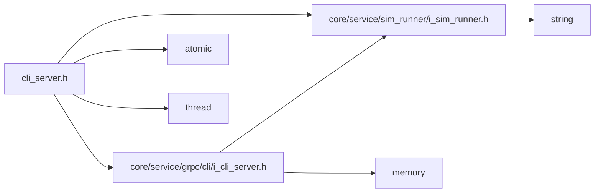

<a id="cli__server_8h"></a>
# File cli\_server.h

![][C++]

**Location**: `core/service/grpc/cli/cli\_server.h`


## Classes

* [simulation\_framework::core::SimfwkCliServer](classsimulation__framework_1_1core_1_1SimfwkCliServer.md#classsimulation__framework_1_1core_1_1SimfwkCliServer)

## Namespaces

* [simulation\_framework](namespacesimulation__framework.md#namespacesimulation__framework)
* [simulation\_framework::core](namespacesimulation__framework_1_1core.md#namespacesimulation__framework_1_1core)

## Includes

* [core/service/grpc/cli/i_cli_server.h](i__cli__server_8h.md#i__cli__server_8h)
* [core/service/sim_runner/i_sim_runner.h](i__sim__runner_8h.md#i__sim__runner_8h)
* <atomic>
* <thread>





## Source


```cpp


#pragma once

#include "core/service/grpc/cli/i_cli_server.h"
#include "core/service/sim_runner/i_sim_runner.h"
#include <atomic>
#include <thread>

namespace simulation_framework
{
namespace core
{


class SimfwkCliServer : public ISimfwkCliServer
{
  public:
    SimfwkCliServer(const std::string& server_address);

    ~SimfwkCliServer();

    void WaitForCommand();

    std::string GetServerAddress();

    void BindSimRunner(std::unique_ptr<simulation_framework::core::ISimRunner> sim_runner);

  private:
    std::string server_address_;
    std::atomic_bool sim_runner_binded_{false};
    std::thread grpc_server_thread_;
};

}  // namespace core
}  // namespace simulation_framework
```


[public]: https://img.shields.io/badge/-public-brightgreen (public)
[C++]: https://img.shields.io/badge/language-C%2B%2B-blue (C++)
[private]: https://img.shields.io/badge/-private-red (private)
[const]: https://img.shields.io/badge/-const-lightblue (const)
[static]: https://img.shields.io/badge/-static-lightgrey (static)
[protected]: https://img.shields.io/badge/-protected-yellow (protected)