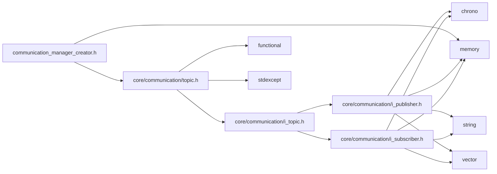

<a id="communication__manager__creator_8h"></a>
# File communication\_manager\_creator.h

![][C++]

**Location**: `core/communication/communication\_manager\_creator.h`


## Namespaces

* [simulation\_framework](namespacesimulation__framework.md#namespacesimulation__framework)
* [simulation\_framework::core](namespacesimulation__framework_1_1core.md#namespacesimulation__framework_1_1core)
* [simulation\_framework::core::communication\_manager\_creator](namespacesimulation__framework_1_1core_1_1communication__manager__creator.md#namespacesimulation__framework_1_1core_1_1communication__manager__creator)

## Includes

* [core/communication/topic.h](topic_8h.md#topic_8h)
* <memory>





## Source


```cpp


#pragma once

#include "core/communication/topic.h"
#include <memory>

namespace simulation_framework
{
namespace core
{

class CommunicationManager;


namespace communication_manager_creator
{

enum class Type
{
    kRTIDDS = 0,
    kMOCK,
};

std::shared_ptr<CommunicationManager> Create(const Type type, const Topics& topics = Topics{});

}  // namespace communication_manager_creator
}  // namespace core
}  // namespace simulation_framework
```


[public]: https://img.shields.io/badge/-public-brightgreen (public)
[C++]: https://img.shields.io/badge/language-C%2B%2B-blue (C++)
[private]: https://img.shields.io/badge/-private-red (private)
[const]: https://img.shields.io/badge/-const-lightblue (const)
[static]: https://img.shields.io/badge/-static-lightgrey (static)
[protected]: https://img.shields.io/badge/-protected-yellow (protected)