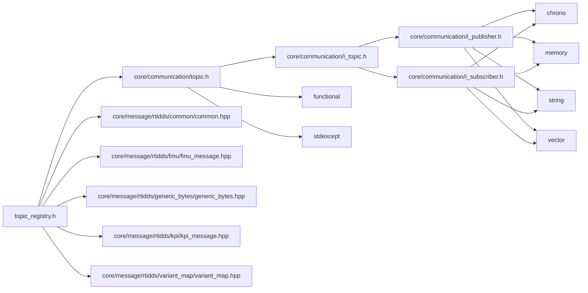
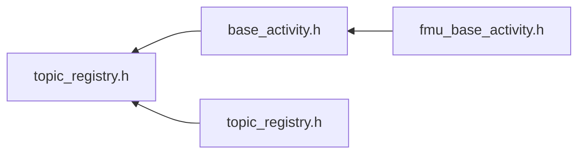

<a id="core_2communication_2topic__registry_8h"></a>
# File core/communication/topic\_registry.h

![][C++]

**Location**: `core/communication/topic\_registry.h`


## Namespaces

* [rtidds](namespacertidds.md#namespacertidds)
* [simulation\_framework](namespacesimulation__framework.md#namespacesimulation__framework)
* [simulation\_framework::core](namespacesimulation__framework_1_1core.md#namespacesimulation__framework_1_1core)
* [topic\_registry](namespacetopic__registry.md#namespacetopic__registry)
* [simulation\_framework::core::topic\_registry](namespacesimulation__framework_1_1core_1_1topic__registry.md#namespacesimulation__framework_1_1core_1_1topic__registry)

## Includes

* [core/communication/topic.h](topic_8h.md#topic_8h)
* core/message/rtidds/common/common.hpp
* core/message/rtidds/fmu/fmu_message.hpp
* core/message/rtidds/generic_bytes/generic_bytes.hpp
* core/message/rtidds/kpi/kpi_message.hpp
* core/message/rtidds/variant_map/variant_map.hpp





## Included by

* [base_activity.h](base__activity_8h.md#base__activity_8h)
* [topic_registry.h](autonomy_2communication_2topic__registry_2topic__registry_8h.md#autonomy_2communication_2topic__registry_2topic__registry_8h)





## Source


```cpp


#pragma once

#include "core/communication/topic.h"
#include "core/message/rtidds/common/common.hpp"
#include "core/message/rtidds/fmu/fmu_message.hpp"
#include "core/message/rtidds/generic_bytes/generic_bytes.hpp"
#include "core/message/rtidds/kpi/kpi_message.hpp"
#include "core/message/rtidds/variant_map/variant_map.hpp"

namespace rtidds
{
using VariantMessage = FmuMessage;

using VariantData = FmuData;

using VariantDatatype = FmuDatatype;
}  // namespace rtidds

namespace simulation_framework
{
namespace core
{
namespace topic_registry
{


using StringTopicType = Topic<rtidds::CommonString>;

using KpiMessageTopicType = Topic<rtidds::KpiMessage>;

using GenericBytesTopicType = Topic<rtidds::GenericBytesMessage>;

using FmuMessageTopicType = Topic<rtidds::FmuMessage>;

using VariantDataTopicType = Topic<rtidds::VariantMessage>;

using VariantMapTopicType = Topic<rtidds::VariantMap>;

}  // namespace topic_registry
}  // namespace core
}  // namespace simulation_framework
```


[public]: https://img.shields.io/badge/-public-brightgreen (public)
[C++]: https://img.shields.io/badge/language-C%2B%2B-blue (C++)
[private]: https://img.shields.io/badge/-private-red (private)
[const]: https://img.shields.io/badge/-const-lightblue (const)
[static]: https://img.shields.io/badge/-static-lightgrey (static)
[protected]: https://img.shields.io/badge/-protected-yellow (protected)